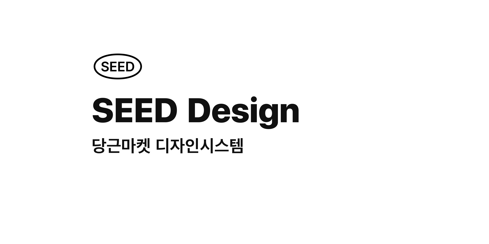

**Foundations**

- [@seed-design/design-token](https://github.com/daangn/seed-design/tree/main/packages/design-token) (Foundations)
- [@seed-design/stylesheet](https://github.com/daangn/seed-design/tree/main/packages/stylesheet) (StyleSheet)
- [@seed-design/icon](https://github.com/daangn/seed-design/tree/main/packages/icon) (Icon)

**Convenience Libraries**

- [@seed-design/react-theming](https://github.com/daangn/seed-design/tree/main/packages/react-theming) (React Seed Design)
- [gatsby-plugin-seed-design](https://github.com/daangn/seed-design/tree/main/packages/gatsby-plugin-seed-design) (Gatsby Seed Design)

**Document**

- [@seed-design/docs](https://github.com/daangn/seed-design/tree/main/docs) (Web Document)
  - [contributing guide](https://github.com/daangn/seed-design/tree/main/docs/CONTRIBUTING.md)
