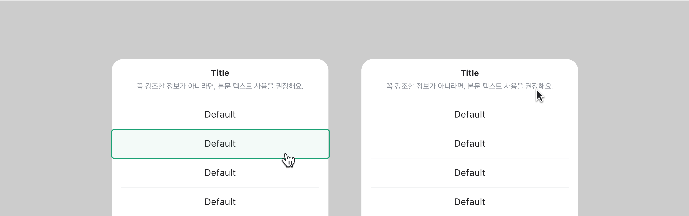

## 구조도

<Anatomy></Anatomy>

1. Backdrop
2. Container
3. Header
4. Title
5. Description
6. Action Group
7. Action
8. Action Label

## 옵션

<HalfCard>
  <HalfCardImageCell>
    
  </HalfCardImageCell>
  <HalfCardDescriptionCell>
    <HalfCardDescriptionTitle>Title / Description</HalfCardDescriptionTitle>
    <HalfCardDescription>
      Title은 Action Sheet의 내용의 목적이나 핵심 메시지를 강조, 요약하여
      전달합니다. Description은 유저에게 추가적인 컨텍스트와 부가 설명을
      제공합니다.
    </HalfCardDescription>
  </HalfCardDescriptionCell>
</HalfCard>

<HalfCard>
  <HalfCardImageCell>
    
  </HalfCardImageCell>
  <HalfCardDescriptionCell>
    <HalfCardDescriptionTitle>Action Label</HalfCardDescriptionTitle>
    <HalfCardDescription>
      Action의 Label은 유저가 어떤 동작을 수행하게 될지 이해하고 선택할 수
      있도록 설명합니다. Label은 유저가 명확하게 이해할 수 있도록 직관적으로
      간결하게 제공합니다.
    </HalfCardDescription>
  </HalfCardDescriptionCell>
</HalfCard>

<HalfCard>
  <HalfCardImageCell>
    
  </HalfCardImageCell>
  <HalfCardDescriptionCell>
    <HalfCardDescriptionTitle>Action Variant</HalfCardDescriptionTitle>
    <HalfCardDescription>
      Default는 주로 일반적이거나 중립적인 상황일 때 사용되는 옵션입니다.
      Destructive는 유저가 주의해야 할 액션이거나, 데이터를 삭제 혹은 변경하는
      작업일 경우에 사용합니다. Destructive는 데이터나 설정에 영향을 줄 수
      있으므로, 유저가 명확히 인지할 수 있는 레이블을 제공합니다.
    </HalfCardDescription>
  </HalfCardDescriptionCell>
</HalfCard>
 

### 옵션 테이블 (Action Sheet)

| 속성        | 값          | 기본값 | 설명 |
| ----------- | ----------- | ------ | ---- |
| is open     | false, true | false  |      |
| title       | text        |        |      |
| description | text        |        |      |

### 옵션 테이블 (Action)

| 속성    | 값                   | 기본값  | 설명 |
| ------- | -------------------- | ------- | ---- |
| label   | text                 |         |      |
| variant | default, destructive | default |      |

## 상호작용

### 터치 / 마우스

<FullCard>
  <FullCardImageCell>
    
  </FullCardImageCell>
  <FullCardDescription>
    마우스 클릭 또는 터치로 Action Sheet와 상호작용할 수 있습니다. Title과
    Description 영역은 클릭이나 터치할 수 없습니다.
  </FullCardDescription>
</FullCard>

### 키보드

<HalfCard>
  <HalfCardImageCell>
    
  </HalfCardImageCell>
  <HalfCardDescriptionCell>
    <HalfCardDescriptionTitle>Focus</HalfCardDescriptionTitle>
    <HalfCardDescription>
      <Keyboard>tab</Keyboard>키를 통해 Action간 Focus 이동이 가능합니다.
    </HalfCardDescription>
  </HalfCardDescriptionCell>
</HalfCard>

<HalfCard>
  <HalfCardImageCell>
    
  </HalfCardImageCell>
  <HalfCardDescriptionCell>
    <HalfCardDescriptionTitle>Action</HalfCardDescriptionTitle>
    <HalfCardDescription>
      Action에 Focus된 상태에서 <Keyboard>Enter</Keyboard>키를 통해 Action을
      실행 시킬 수 있습니다.
    </HalfCardDescription>
  </HalfCardDescriptionCell>
</HalfCard>

## 가이드라인

Working In Progress
