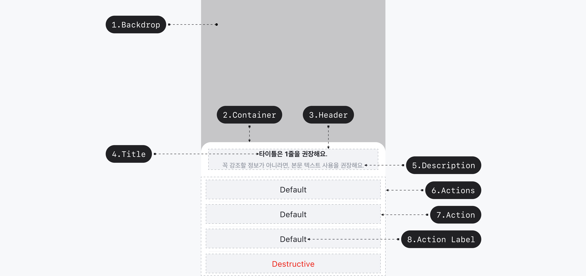

## 구조도

1. Backdrop
2. Container
3. Header
4. Title
5. Description
6. Action Group
7. Action
8. Action Label

## 옵션

### 옵션 테이블 (Action Sheet)

| 속성        | 값          | 기본값 | 설명 |
| ----------- | ----------- | ------ | ---- |
| is open     | false, true | false  |      |
| title       | text        |        |      |
| description | text        |        |      |

### 옵션 테이블 (Action)

| 속성    | 값                   | 기본값  | 설명 |
| ------- | -------------------- | ------- | ---- |
| label   | text                 |         |      |
| variant | default, destructive | default |      |

## 상호작용

Working In Progress

## 가이드라인

Working In Progress
