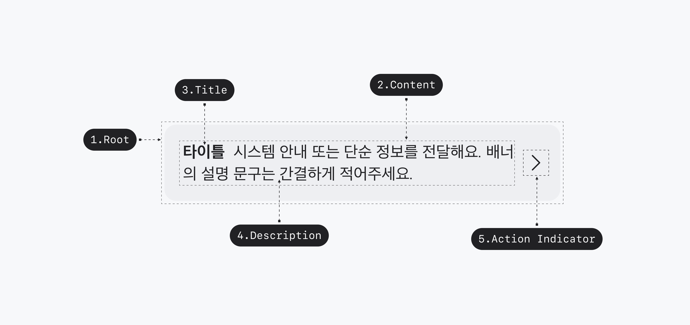

## 구조도

<Anatomy></Anatomy>

1. Root
2. Title
3. Description
4. Action Indicator

## 옵션

### 옵션 테이블

| 속성        | 값                            | 기본값 |
| ----------- | ----------------------------- | ------ |
| variant     | normal, info, warning, danger | normal |
| title       | text                          |        |
| description | text                          |        |

## 상호작용

Working In Progress

## 가이드라인

Working In Progress
