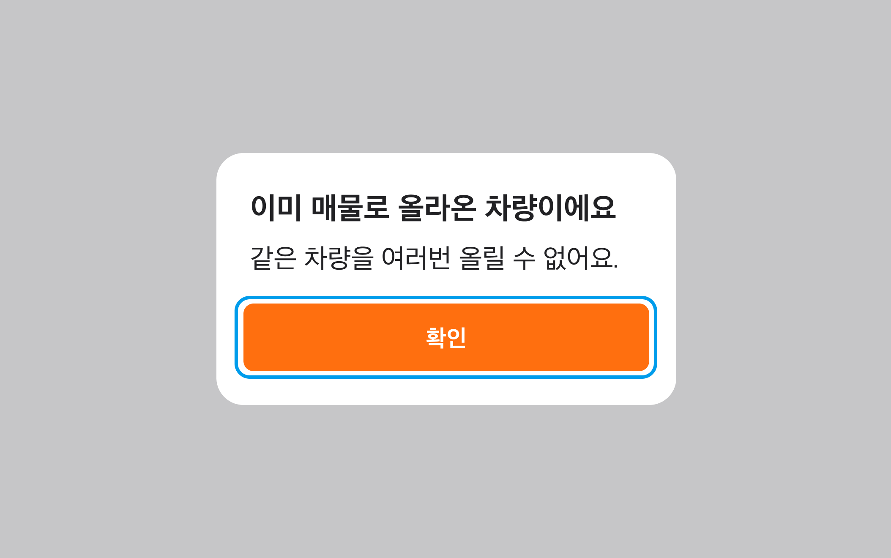
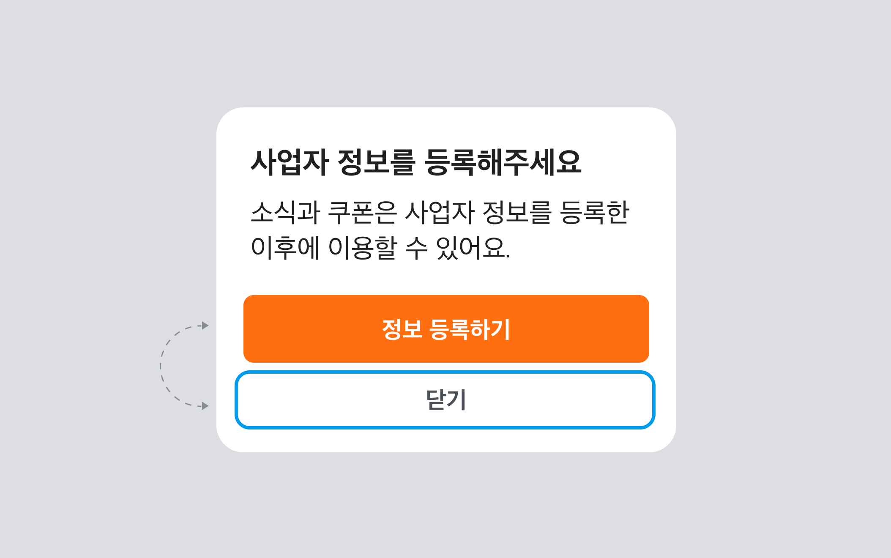
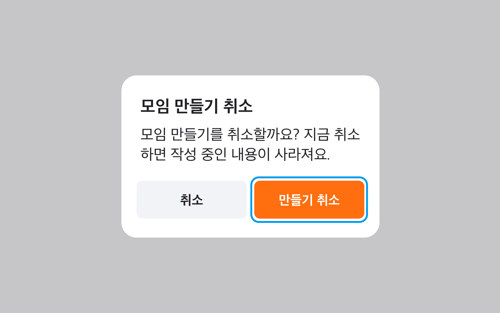
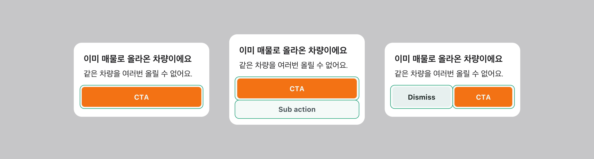

## 옵션

### 옵션 테이블

| 속성                   | 값                           | 기본값 | 설명                                                                 |
| ---------------------- | ---------------------------- | ------ | -------------------------------------------------------------------- |
| is open                | true, false                  | false  | True일 경우, Alert Dialog를 표시하는 상태                            |
| button align           | single, vertical, horizontal | single |                                                                      |
| title                  | string, null                 | null   |                                                                      |
| cancel action label    | string, null                 | null   |                                                                      |
| close on outside click | true, false                  | false  | True일 경우, Container 외 영역을 클릭/탭 했을 시 Alert Dialog가 닫힘 |
| close on esc           | true, false                  | false  | (키보드 동작에만 해당) True일 경우, ESC를 통해 Alert Dialog가 닫힘   |

## 상호작용

### 키보드 상호작용

<HalfCard>
  <HalfCardImageCell>
    
  </HalfCardImageCell>
  <HalfCardDescriptionCell>
    <HalfCardDescriptionTitle>Focus</HalfCardDescriptionTitle>
    <HalfCardDescription>
      <Keyboard>tab</Keyboard>키를 통해 Action에 Focus할 수 있습니다.
    </HalfCardDescription>
  </HalfCardDescriptionCell>
</HalfCard>

<HalfCard>
  <HalfCardImageCell>
    
  </HalfCardImageCell>
  <HalfCardDescriptionCell>
    <HalfCardDescriptionTitle>Focus</HalfCardDescriptionTitle>
    <HalfCardDescription>
      <Keyboard>tab</Keyboard>키를 통해 Action간 Focus 이동이 가능합니다
    </HalfCardDescription>
  </HalfCardDescriptionCell>
</HalfCard>

<HalfCard>
  <HalfCardImageCell>
    
  </HalfCardImageCell>
  <HalfCardDescriptionCell>
    <HalfCardDescriptionTitle>Action</HalfCardDescriptionTitle>
    <HalfCardDescription>
      Action에 Focus된 상태에서 <Keyboard>Enter</Keyboard>키를 통해 Action을 실행 시킬 수 있습니다.
    </HalfCardDescription>
  </HalfCardDescriptionCell>
</HalfCard>

### 터치 / 마우스 상호작용

<FullCard>
  <FullCardImageCell>
    
  </FullCardImageCell>
</FullCard>

## 가이드라인
