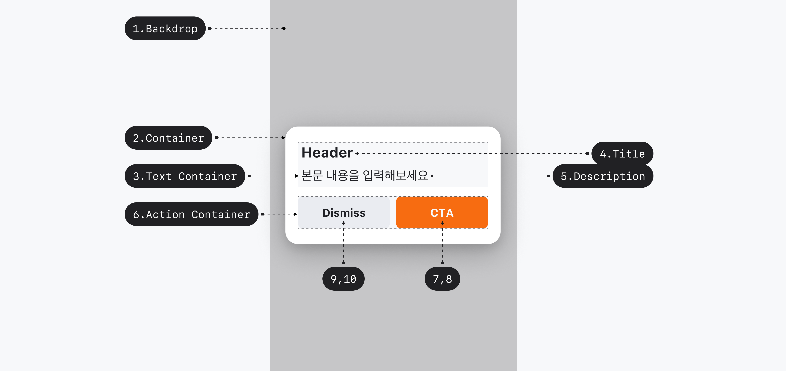
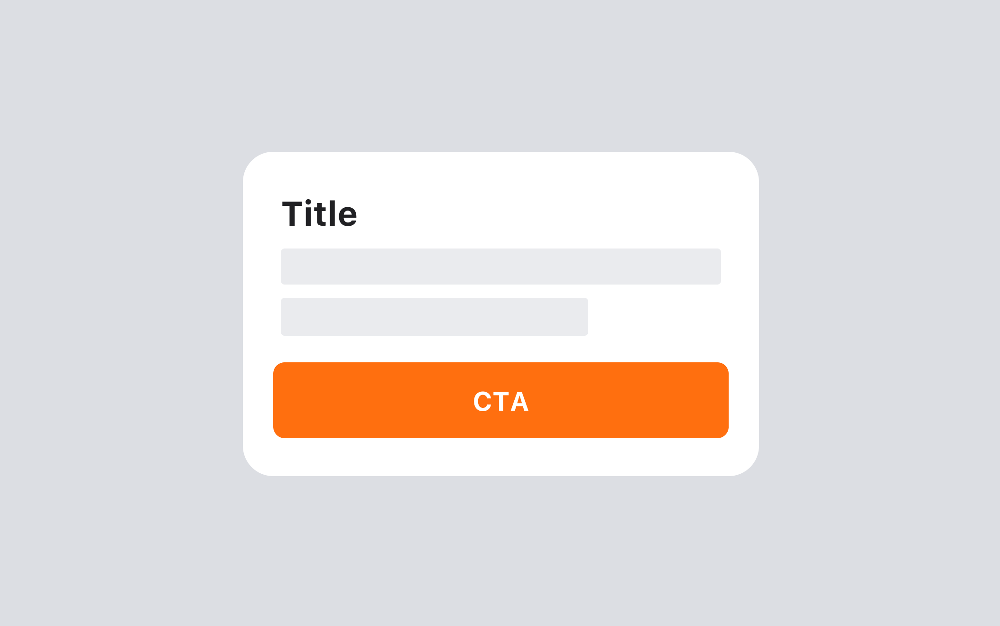
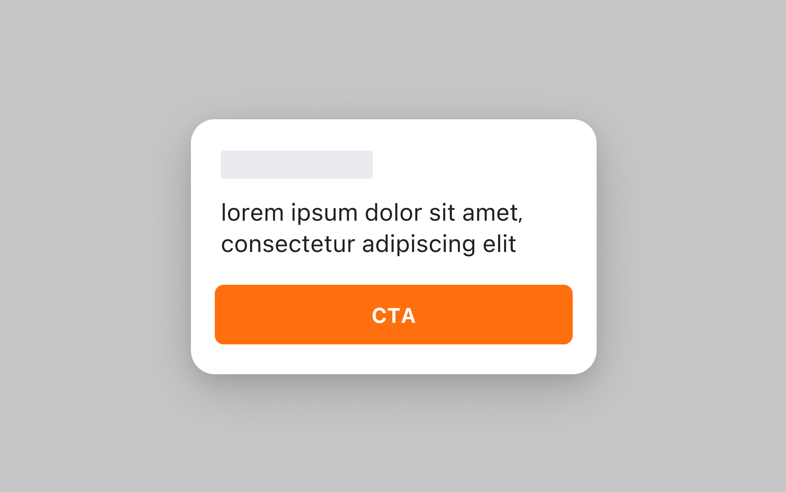
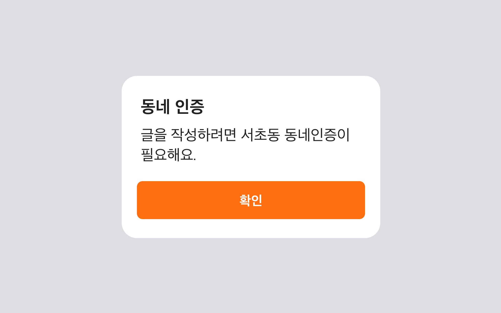
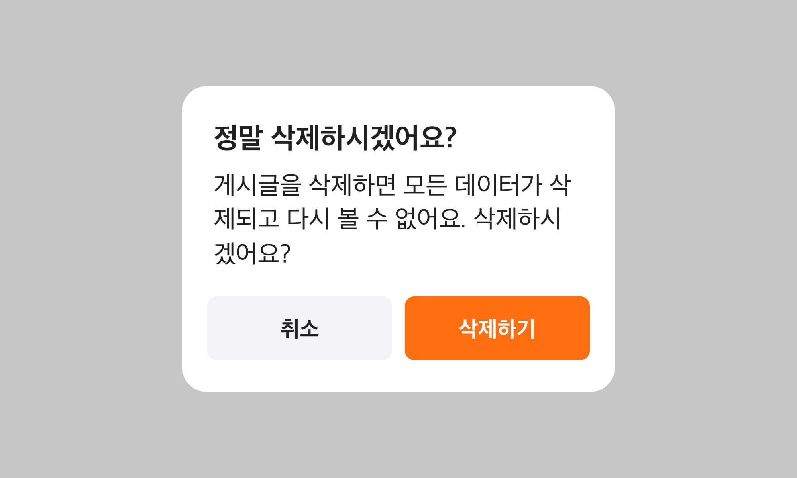
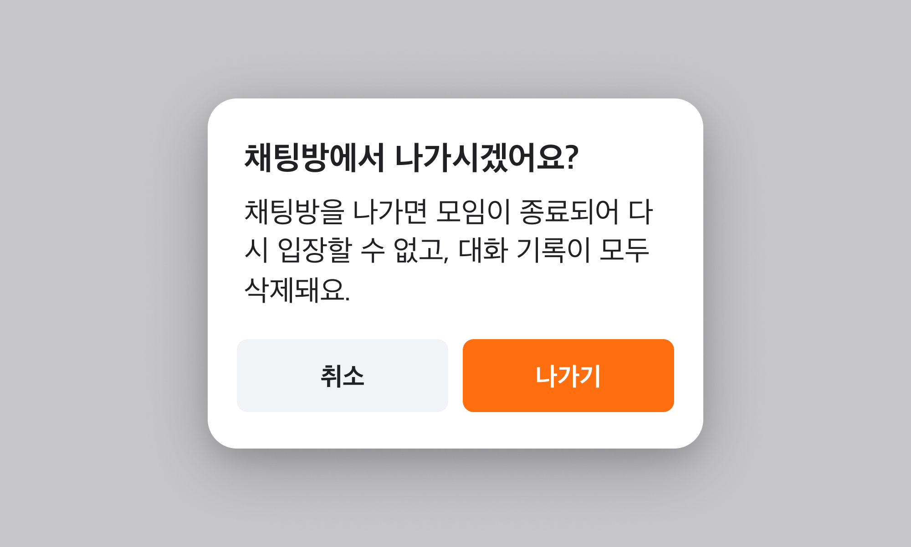
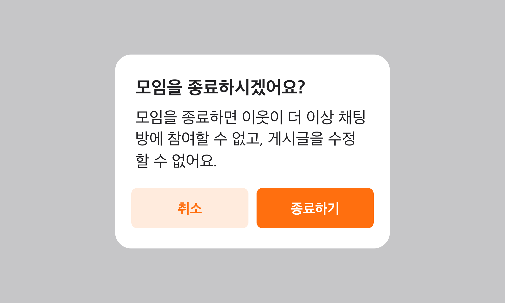
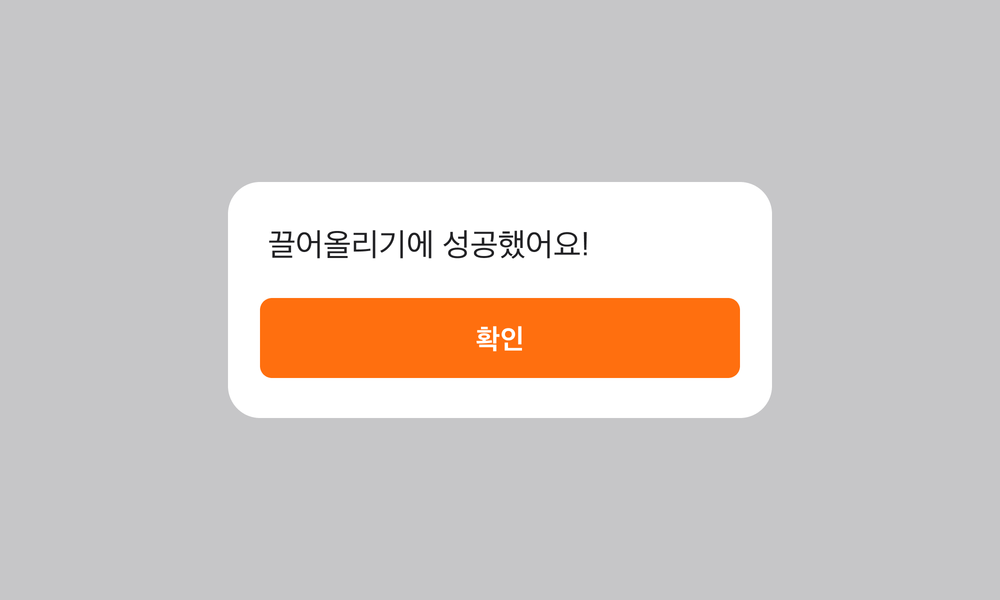

## 구조도

<Anatomy></Anatomy>

1. Backdrop
2. Container
3. Text Container
4. Title
5. Description
6. Action Container
7. Primary Action
8. Primary Action Label
9. Secondary Action
10. Secondary Action Label

## 옵션

<HalfCard>
  <HalfCardImageCell>
    
  </HalfCardImageCell>
  <HalfCardDescriptionCell>
    <HalfCardDescriptionTitle>Title</HalfCardDescriptionTitle>
    <HalfCardDescription>
      Title은 Alert Dialog가 어떤 정보를 담고 있는지 요약된 내용으로 제공합니다.
      유저에게 경고의 원인 또는 맥락을 명확하게 전달함으로써, Alert Dialog의
      목적과 중요성을 전달합니다. 또한 Bold 스타일을 적용하여, Description 보다
      주목도를 높여 중요한 정보를 빨리 인지할 수 있도록 합니다.
    </HalfCardDescription>
  </HalfCardDescriptionCell>
</HalfCard>

<HalfCard>
  <HalfCardImageCell>
    
  </HalfCardImageCell>
  <HalfCardDescriptionCell>
    <HalfCardDescriptionTitle>Description</HalfCardDescriptionTitle>
    <HalfCardDescription>
      Alert Dialog는 Description을 항상 제공해야 합니다. 사용자가 Action을
      실행하기 위해 알아야 하는 추가 정보나 컨텍스트를 전달합니다. 이러한
      컨텍스트를 통하여 유저가 의사결정을 내릴 수 있도록 도와줍니다.
    </HalfCardDescription>
  </HalfCardDescriptionCell>
</HalfCard>

<HalfCard>
  <HalfCardImageCell>
    
  </HalfCardImageCell>
  <HalfCardDescriptionCell>
    <HalfCardDescriptionTitle>Primary Action</HalfCardDescriptionTitle>
    <HalfCardDescription>
      가장 중요한 Action이 한 가지만 존재하는 경우, Primary Action을 사용합니다.
      불필요한 선택지를 제외하고 주요 Action만 제공하여, 유저가 쉽게 수행할 수
      있도록 합니다.
    </HalfCardDescription>
  </HalfCardDescriptionCell>
</HalfCard>

<HalfCard>
  <HalfCardImageCell>
    
  </HalfCardImageCell>
  <HalfCardDescriptionCell>
    <HalfCardDescriptionTitle>Alternative</HalfCardDescriptionTitle>
    <HalfCardDescription>
      Primary Action 외 Action이 dismiss의 성격을 가지는 경우 Alternative 옵션을
      사용합니다.
    </HalfCardDescription>
  </HalfCardDescriptionCell>
</HalfCard>

<HalfCard>
  <HalfCardImageCell>
    
  </HalfCardImageCell>
  <HalfCardDescriptionCell>
    <HalfCardDescriptionTitle>Neutral</HalfCardDescriptionTitle>
    <HalfCardDescription>
      두 개의 Action의 레벨이 유사하거나, 모든 Action이 Dismiss 외 동작을
      실행하는 경우 Neutral 옵션을 사용합니다.
    </HalfCardDescription>
  </HalfCardDescriptionCell>
</HalfCard>

<HalfCard>
  <HalfCardImageCell>
    
  </HalfCardImageCell>
  <HalfCardDescriptionCell>
    <HalfCardDescriptionTitle>Nonpreferred</HalfCardDescriptionTitle>
    <HalfCardDescription>
      Primary Action과 Secondary Action의 중요도 차이가 큰 경우 Nonpreferred
      옵션을 사용합니다. 혹은 Action Label이 길어지는 경우 사용합니다.
    </HalfCardDescription>
  </HalfCardDescriptionCell>
</HalfCard>

### 옵션 테이블

| 속성                    | 값                                 | 기본값  | 설명 |
| ----------------------- | ---------------------------------- | ------- | ---- |
| title                   | string                             |         |      |
| description             | string                             |         |      |
| primary action label    | string                             |         |      |
| secondary action label  | string                             |         |      |
| secondary action intent | alternative, neutral, nonpreferred | neutral |      |

## 상호작용

### 터치 / 마우스

<FullCard>
  <FullCardImageCell>
    
  </FullCardImageCell>
</FullCard>

### 키보드

<HalfCard>
  <HalfCardImageCell>
    
  </HalfCardImageCell>
  <HalfCardDescriptionCell>
    <HalfCardDescriptionTitle>Focus</HalfCardDescriptionTitle>
    <HalfCardDescription>
      <Keyboard>tab</Keyboard>키를 통해 Action에 Focus할 수 있습니다.
    </HalfCardDescription>
  </HalfCardDescriptionCell>
</HalfCard>

<HalfCard>
  <HalfCardImageCell>
    
  </HalfCardImageCell>
  <HalfCardDescriptionCell>
    <HalfCardDescriptionTitle>Focus</HalfCardDescriptionTitle>
    <HalfCardDescription>
      <Keyboard>tab</Keyboard>키를 통해 Action간 Focus 이동이 가능합니다
    </HalfCardDescription>
  </HalfCardDescriptionCell>
</HalfCard>

<HalfCard>
  <HalfCardImageCell>
    
  </HalfCardImageCell>
  <HalfCardDescriptionCell>
    <HalfCardDescriptionTitle>Action</HalfCardDescriptionTitle>
    <HalfCardDescription>
      Action에 Focus된 상태에서 <Keyboard>Enter</Keyboard>키를 통해 Action을
      실행 시킬 수 있습니다.
    </HalfCardDescription>
  </HalfCardDescriptionCell>
</HalfCard>

## 가이드라인

<HalfCard>
  <HalfCardImageCell>
    
  </HalfCardImageCell>
  <HalfCardDescriptionCell>
    <HalfCardDescriptionTitle>Alert Dialog</HalfCardDescriptionTitle>
    <HalfCardDescription>
      Alert Dialog는 유저에게 중요한 알림, 확인, 경고 등의 메시지를 전달합니다.
      유저의 여정을 방해하는 속성을 지니므로 내용을 간결하게 작성하고, 신중하게
      사용합니다.
    </HalfCardDescription>
  </HalfCardDescriptionCell>
</HalfCard>

<HalfCard>
  <HalfCardImageCell>
    
  </HalfCardImageCell>
  <HalfCardDescriptionCell>
    <HalfCardDescriptionTitle>설정 변경</HalfCardDescriptionTitle>
    <HalfCardDescription>
      Alert Dialog는 사용자에게 경고나 주의 사항을 강조하는 역할을 합니다.
      돌이킬 수 없는 데이터 유실이 발생하는 경우, 유저에게 경고의 메시지를
      전달합니다.
    </HalfCardDescription>
  </HalfCardDescriptionCell>
</HalfCard>

 

### Do / Don't

 

<DoDontLayout>
  <DoBox>
    <DoImage>
      
    </DoImage>
    <DoText>
      Description은 명확하고 간결하게 작성하여 유저가 쉽게 인지할 수 있도록
      합니다.
    </DoText>
  </DoBox>
  <DontBox>
    <DontImage>
      
    </DontImage>
    <DontText>Description은 3줄 이내로 작성할 것을 권장합니다.</DontText>
  </DontBox>
</DoDontLayout>

 

<DoDontLayout>
  <DontBox>
    <DontImage>
      
    </DontImage>
    <DontText>
      취소, 닫기 등 변경사항 없이 단순 dismiss 역할을 하는 Action에는 Secondary
      버튼을 사용합니다.
    </DontText>
  </DontBox>
  <DontBox>
    <DontImage>
      
    </DontImage>
    <DontText>
      위와 같이 가벼운 피드백은 Alert Dialog로 제공하기에 적절하지 않습니다.
      Snackbar 사용을 권장합니다.
    </DontText>
  </DontBox>
</DoDontLayout>

 
