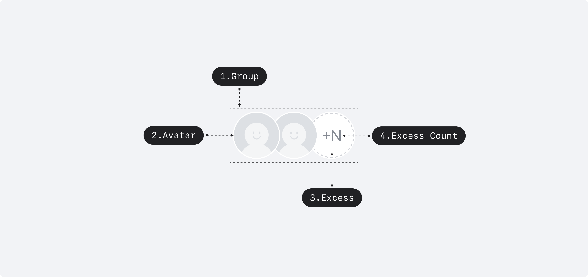
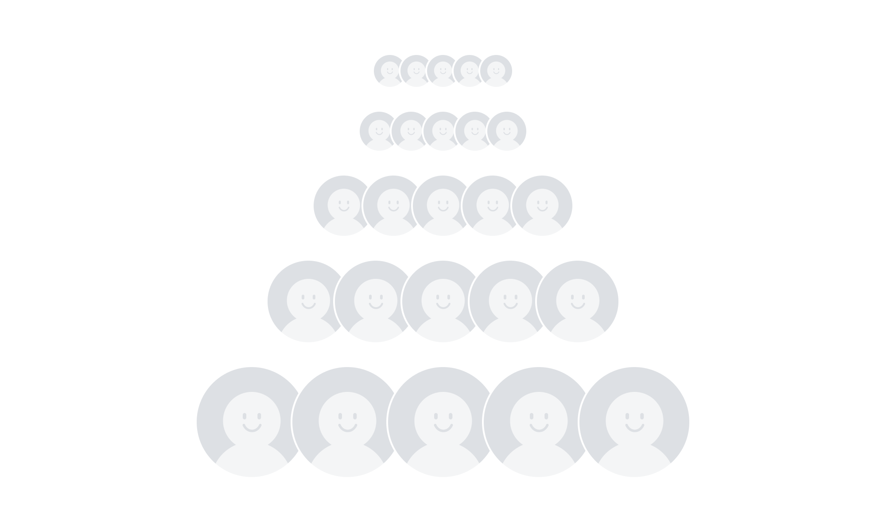
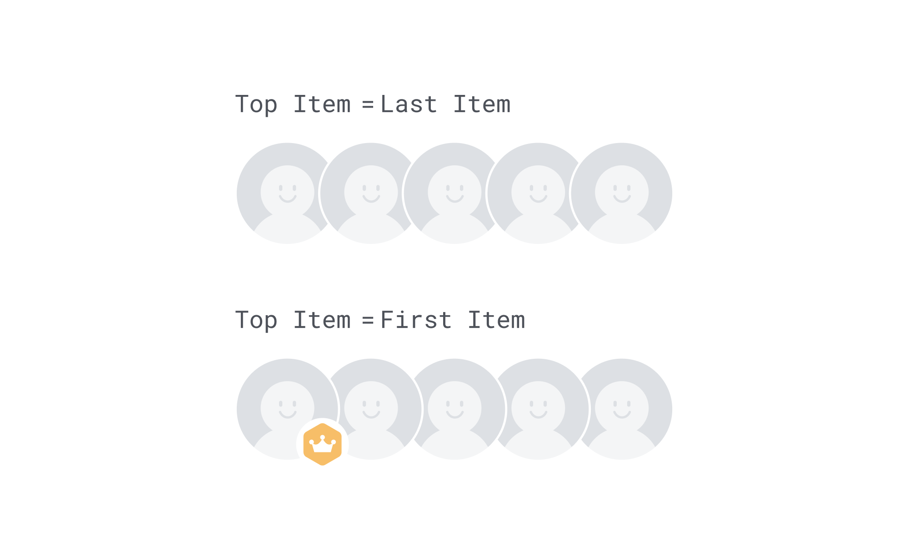
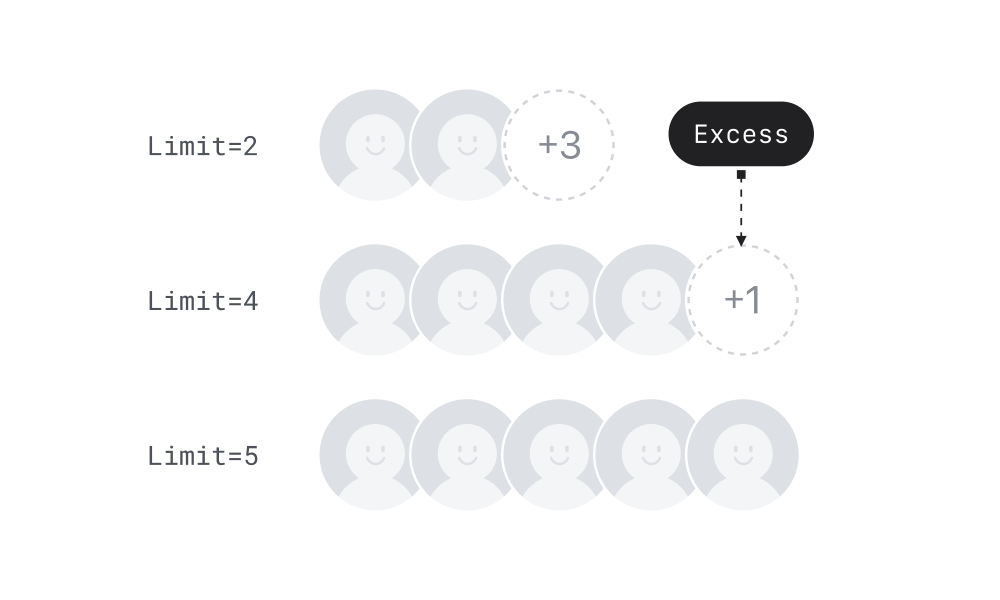

## 구조도

<Anatomy></Anatomy>

1. Group
2. Avatar
3. Excess
4. Excess Count

## 컴포넌트 미리보기

<Iframe
  src="https://sprout-storybook.vercel.app/iframe.html?args=&id=components-avatars-avatargroup--basic&viewMode=story"
  height="100px"
/>

## 옵션

<HalfCard>
  <HalfCardImageCell>
    
  </HalfCardImageCell>
  <HalfCardDescriptionCell>
    <HalfCardDescriptionTitle>Size</HalfCardDescriptionTitle>
    <HalfCardDescription>
      Avatar Group은 xxsmall, xsmall, small, medium, large 5개의 사이즈를 가질
      수 있습니다. Medium이 가장 보편적으로 사용되며, 페이지 내의 아바타 그룹이
      가진 중요도와 시각적 균형에 맞게 적절하게 사용합니다.
    </HalfCardDescription>
  </HalfCardDescriptionCell>
</HalfCard>
<HalfCard>
  <HalfCardImageCell>
    
  </HalfCardImageCell>
  <HalfCardDescriptionCell>
    <HalfCardDescriptionTitle>Top Item</HalfCardDescriptionTitle>
    <HalfCardDescription>
      Avatar가 쌓이는 방향을 설정할 수 있습니다. 마지막 Avatar가 가장 위에
      위치하는 Last Item 옵션을 기본값으로 사용합니다. 첫번째 Avatar를 강조하고
      싶을 때는 First Item 옵션을 사용합니다.
    </HalfCardDescription>
  </HalfCardDescriptionCell>
</HalfCard>
<HalfCard>
  <HalfCardImageCell>
    
  </HalfCardImageCell>
  <HalfCardDescriptionCell>
    <HalfCardDescriptionTitle>Limit</HalfCardDescriptionTitle>
    <HalfCardDescription>
      Avatar의 개수를 설정할 수 있습니다. 설정한 개수를 초과하는 Avatar의 개수는
      Excess 영역에 표시됩니다.
    </HalfCardDescription>
  </HalfCardDescriptionCell>
</HalfCard>

### 옵션 테이블

| 속성  | 값                                                     | 기본값 |
| ----- | ------------------------------------------------------ | ------ |
| size  | xxsmall, xsmall, small, medium, large, xlarge, xxlarge | medium |
| limit | number                                                 |        |

## 상호작용

Working In Progress

## 가이드라인

Working In Progress
