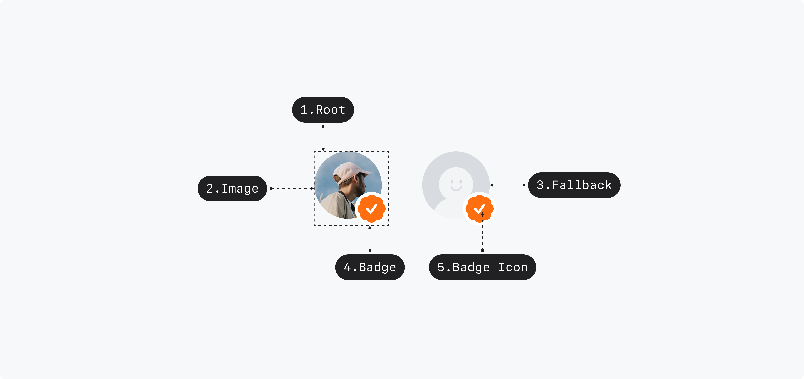

## Anatomy

1. Root - Primitive.Root
2. Image - Primitive.Image
3. Fallback - Primitive.Fallback
4. Badge
5. Badge Icon

test

## Visual Options

| Property   | Value                                                  | Description |
| ---------- | ------------------------------------------------------ | ----------- |
| size       | xxsmall, xsmall, small, medium, large, xlarge, xxlarge |             |
| image      | Image                                                  |             |
| fallback   | Image                                                  |             |
| badge icon | Image                                                  |             |

## Visually Representated States

| State    | Condition                       |
| -------- | ------------------------------- |
| loading  | load = loading                  |
| loaded   | load = loaded                   |
| fallback | load = fallback OR load = error |

## 디자인 결정 (Color)

| Part  | Attribute     | Value                      |
| ----- | ------------- | -------------------------- |
| Root  | Outline Color | $scale.color.gray-alpha-50 |
| Badge | Color         | $scale.color.gray-00       |

## 디자인 결정 (Layout)

### Size=Xxlarge

| Part  | Attribute     | Value |
| ----- | ------------- | ----- |
| Root  | Size          | 96pt  |
|       | Corner Radius | 100%  |
| Badge | Size          | 32pt  |

### Size=Xlarge

| Part  | Attribute     | Value |
| ----- | ------------- | ----- |
| Root  | Size          | 80pt  |
|       | Corner Radius | 100%  |
| Badge | Size          | 24pt  |

### Size=Large

| Part  | Attribute     | Value |
| ----- | ------------- | ----- |
| Root  | Size          | 64pt  |
|       | Corner Radius | 100%  |
| Badge | Size          | 24pt  |

### Size=Medium

| Part  | Attribute     | Value |
| ----- | ------------- | ----- |
| Root  | Size          | 48pt  |
|       | Corner Radius | 100%  |
| Badge | Size          | 24pt  |

### Size=Small

| Part  | Attribute     | Value |
| ----- | ------------- | ----- |
| Root  | Size          | 36pt  |
|       | Corner Radius | 100%  |
| Badge | Size          | 20pt  |

### Size=Xsmall

| Part  | Attribute     | Value |
| ----- | ------------- | ----- |
| Root  | Size          | 24pt  |
|       | Corner Radius | 100%  |
| Badge | Size          | 12pt  |

### Size=Xxsmall

| Part  | Attribute     | Value |
| ----- | ------------- | ----- |
| Root  | Size          | 20pt  |
|       | Corner Radius | 100%  |
| Badge | Size          | 10pt  |
