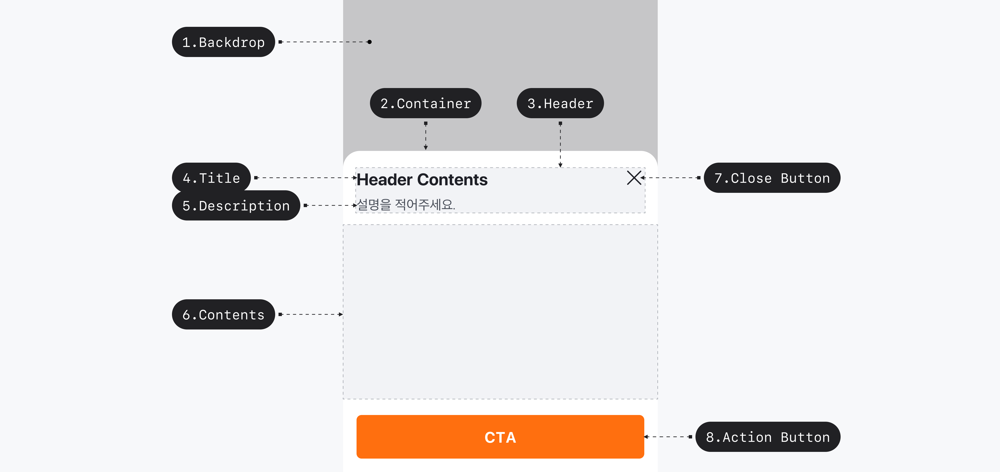

## 구조도

1. Backdrop
2. Container
3. Header
4. Title
5. Description
6. Content
7. Close Button
8. Action Button

## 옵션

### 옵션 테이블

| 속성         | 값            | 기본값 | 설명 |
| ------------ | ------------- | ------ | ---- |
| is open      | false, true   | false  |      |
| header align | start, center | start  |      |

## 상호작용

Working In Progress

## 가이드라인

Working In Progress
