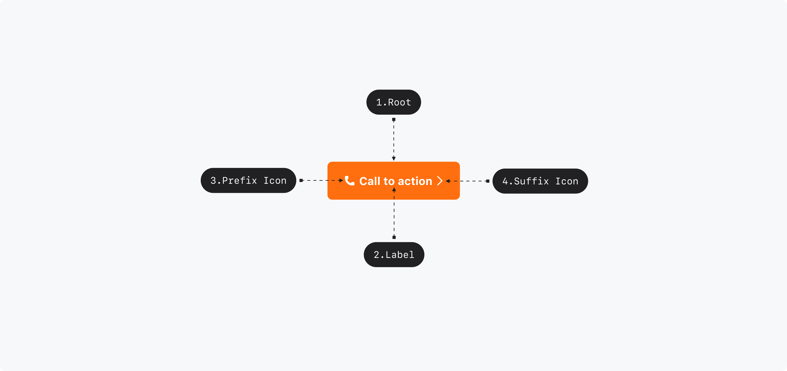

## Anatomy

1. Root : Button 컴포넌트를 감싸는 컨테이너 영역 - Primitive.Root
2. Label : Button에 대한 정보를 전달하는 라벨 - Primitive.Label
3. Prefix Icon : Button에 대한 정보를 전달하는 아이콘
4. Suffix Icon

## Visual Options

| Property    | Value                                   |
| ----------- | --------------------------------------- |
| size        | xsmall, small, medium, large, xlarge    |
| variant     | primary, primary-low, secondary, danger |
| prefix icon | Icon                                    |
| suffix icon | Icon                                    |

## Visually Representated States

| State    | Condition                                                                   |
| -------- | --------------------------------------------------------------------------- |
| enabled  | isDisabled = False, isHovered = False, isFocused = False, isPressed = False |
| hovered  | isDisabled = False, isPressed = False, isHovered = True                     |
| focused  | isDisabled = False, isPressed = False, isFocused = True                     |
| pressed  | isDisabled = False, isPressed = True                                        |
| disabled | isDisabled = True                                                           |

## 디자인 결정 (Color)

### Variant=Primary

| State    | Part        | Attribute | Value                           |
| -------- | ----------- | --------- | ------------------------------- |
| Enabled  | Root        | Color     | $semantic.color.primary         |
|          | Label, Icon | Color     | $semantic.color.on-primary      |
| Hovered  | Root        | Color     | $semantic.color.primary-hover   |
|          | Label, Icon | Color     | $semantic.color.on-primary      |
| Pressed  | Root        | Color     | $semantic.color.primary-pressed |
|          | Label, Icon | Color     | $semantic.color.on-primary      |
| Disabled | Root        | Color     | $scale.color.gray-300           |
|          | Label, Icon | Color     | $scale.color.gray-500           |

### Variant=Primary Low

| State    | Part        | Attribute | Value                               |
| -------- | ----------- | --------- | ----------------------------------- |
| Enabled  | Root        | Color     | $semantic.color.primary-low         |
|          | Label, Icon | Color     | $semantic.color.primary             |
| Hovered  | Root        | Color     | $semantic.color.primary-low-hover   |
|          | Label, Icon | Color     | $semantic.color.primary             |
| Pressed  | Root        | Color     | $semantic.color.primary-low-pressed |
|          | Label, Icon | Color     | $semantic.color.primary             |
| Disabled | Root        | Color     | $scale.color.gray-300               |
|          | Label, Icon | Color     | $scale.color.gray-500               |

### Variant=Secondary

| State    | Part        | Attribute | Value                 |
| -------- | ----------- | --------- | --------------------- |
| Enabled  | Root        | Color     | $scale.color.gray-100 |
|          | Label, Icon | Color     | $scale.color.gray-900 |
| Hovered  | Root        | Color     | $scale.color.gray-300 |
|          | Label, Icon | Color     | $scale.color.gray-900 |
| Pressed  | Root        | Color     | $scale.color.gray-300 |
|          | Label, Icon | Color     | $scale.color.gray-900 |
| Disabled | Root        | Color     | $scale.color.gray-300 |
|          | Label, Icon | Color     | $scale.color.gray-500 |

### Variant=Danger

| State    | Part        | Attribute | Value                      |
| -------- | ----------- | --------- | -------------------------- |
| Enabled  | Root        | Color     | $semantic.color.danger     |
|          | Label, Icon | Color     | $static.color.static-white |
| Hovered  | Root        | Color     | $scale.color.red-400       |
|          | Label, Icon | Color     | $static.color.static-white |
| Pressed  | Root        | Color     | $scale.color.red-400       |
|          | Label, Icon | Color     | $static.color.static-white |
| Disabled | Root        | Color     | $scale.color.gray-300      |
|          | Label, Icon | Color     | $scale.color.gray-500      |

## 디자인 결정 (Typography)

### Size=Xlarge

| Part  | Attribute  | Value                            |
| ----- | ---------- | -------------------------------- |
| Label | Typography | $semantic.typography.label1-bold |

### Size=Large

| Part  | Attribute  | Value                            |
| ----- | ---------- | -------------------------------- |
| Label | Typography | $semantic.typography.label3-bold |

### Size=Medium

| Part  | Attribute  | Value                            |
| ----- | ---------- | -------------------------------- |
| Label | Typography | $semantic.typography.label3-bold |

### Size=Small

| Part  | Attribute  | Value                            |
| ----- | ---------- | -------------------------------- |
| Label | Typography | $semantic.typography.label3-bold |

### Size=Xsmall

| Part  | Attribute  | Value                            |
| ----- | ---------- | -------------------------------- |
| Label | Typography | $semantic.typography.label5-bold |

## 디자인 결정 (Layout)

### Size=Xlarge

| Part         | Attribute          | Value  |
| ------------ | ------------------ | ------ |
| Root         | Min Width          | 72pt   |
|              | Height             | 52pt   |
|              | Horizontal Padding | 22pt   |
|              | Corner Radius      | 6pt    |
| Label        | Text Align         | Center |
| Prefix Icon  | Size               | 18pt   |
| Suffix Icon  | Size               | 16pt   |
| Label / Icon | Padding            | 4pt    |

### Size=Large

| Part         | Attribute          | Value  |
| ------------ | ------------------ | ------ |
| Root         | Min Width          | 66pt   |
|              | Height             | 48pt   |
|              | Horizontal Padding | 20pt   |
|              | Corner Radius      | 6pt    |
| Label        | Text Align         | Center |
| Prefix Icon  | Size               | 16pt   |
| Suffix Icon  | Size               | 16pt   |
| Label / Icon | Padding            | 4pt    |

### Size=Medium

| Part         | Attribute          | Value  |
| ------------ | ------------------ | ------ |
| Root         | Min Width          | 58pt   |
|              | Height             | 40pt   |
|              | Horizontal Padding | 16pt   |
|              | Corner Radius      | 6pt    |
| Label        | Text Align         | Center |
| Prefix Icon  | Size               | 16pt   |
| Suffix Icon  | Size               | 14pt   |
| Label / Icon | Padding            | 4pt    |

### Size=Small

| Part         | Attribute          | Value  |
| ------------ | ------------------ | ------ |
| Root         | Min Width          | 54pt   |
|              | Height             | 36pt   |
|              | Horizontal Padding | 14pt   |
|              | Corner Radius      | 4pt    |
| Label        | Text Align         | Center |
| Prefix Icon  | Size               | 16pt   |
| Suffix Icon  | Size               | 14pt   |
| Label / Icon | Padding            | 4pt    |

### Size=Xsmall

| Part         | Attribute          | Value  |
| ------------ | ------------------ | ------ |
| Root         | Min Width          | 40pt   |
|              | Height             | 32pt   |
|              | Horizontal Padding | 10pt   |
|              | Corner Radius      | 4pt    |
| Label        | Text Align         | Center |
| Prefix Icon  | Size               | 12pt   |
| Suffix Icon  | Size               | 12pt   |
| Label / Icon | Padding            | 2pt    |

## 디자인 결정 (Focus)

| State   | Part | Attribute     | Value                 |
| ------- | ---- | ------------- | --------------------- |
| Focused | Root | Outline Color | $scale.color.blue-600 |
|         |      | Outline Width | 2pt                   |

## 디자인 결정 (Motion)

| State       | Part | Property | Attribute       | Value                                  |
| ----------- | ---- | -------- | --------------- | -------------------------------------- |
| Pressed In  | Root | Scale    | Duration        | 100ms                                  |
|             |      |          | Timing Function | $scale.timing-function.standard-easing |
| Pressed Out | Root | Scale    | Duration        | 100ms                                  |
|             |      |          | Timing Function | $scale.timing-function.standard-easing |

### State=Pressed In

| Part | Attribute | Value |
| ---- | --------- | ----- |
| Root | Scale     | 0.95  |
