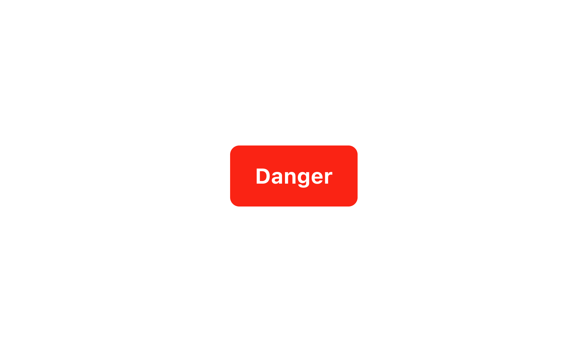
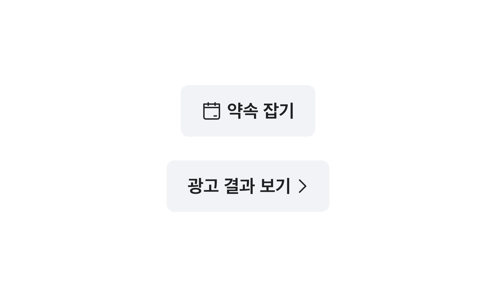
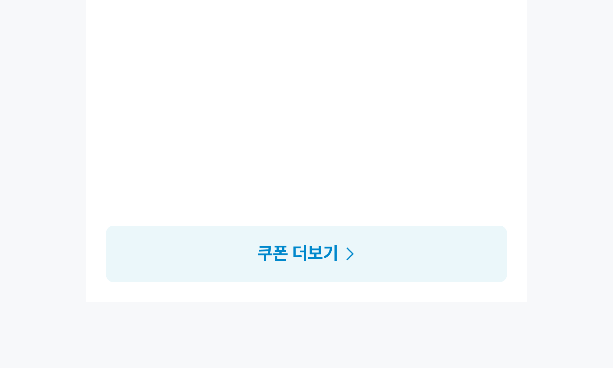
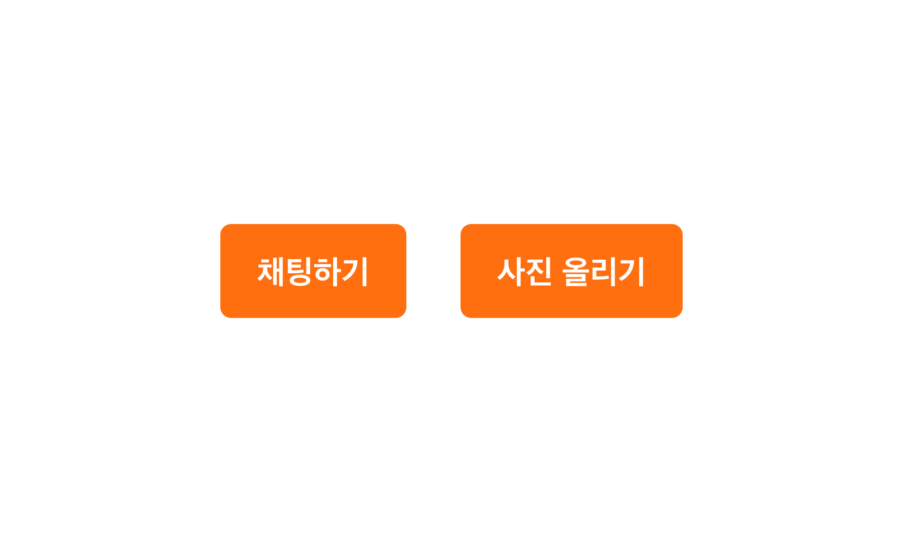
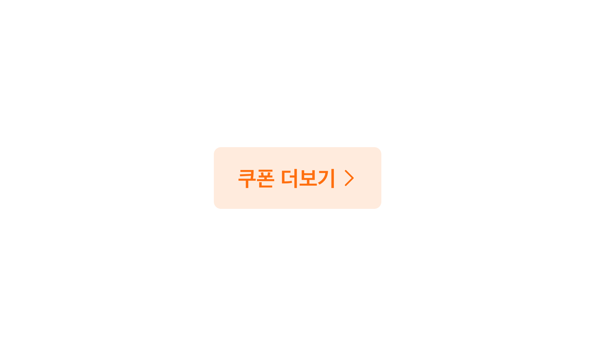
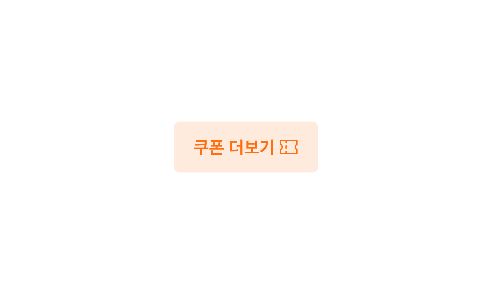

## 구조도

<Anatomy></Anatomy>

1. Root : Button 컴포넌트를 감싸는 컨테이너 영역
2. Label : Button에 대한 정보를 전달하는 라벨
3. Prefix Icon : Button에 대한 정보를 전달하는 아이콘
4. Suffix Icon

## 컴포넌트 미리보기

<Iframe
  src="https://sprout-storybook.vercel.app/iframe.html?args=&id=components-buttons-boxbutton--basic&viewMode=story"
  height="85px"
/>

## 옵션

<HalfCard>
  <HalfCardImageCell>
    
  </HalfCardImageCell>
  <HalfCardDescriptionCell>
    <HalfCardDescriptionTitle>Size</HalfCardDescriptionTitle>
    <HalfCardDescription>
      Box Button은 xsmall, small, medium, large, xlarge 5개의 사이즈를 가질 수
      있습니다. medium이 가장 보편적으로 사용되며, 페이지 내의 중요도와 시각적
      균형에 맞게 적절하게 사용합니다.
    </HalfCardDescription>
  </HalfCardDescriptionCell>
</HalfCard>

<HalfCard>
  <HalfCardImageCell>
    
  </HalfCardImageCell>
  <HalfCardDescriptionCell>
    <HalfCardDescriptionTitle>Variant</HalfCardDescriptionTitle>
    <HalfCardDescription>
      Variant의 중요도는 Primary로 갈수록 높아지며, Secondary로 갈수록
      낮아집니다. 화면 내에서 액션의 중요도에 따라 버튼의 variant를 다르게
      사용합니다.
    </HalfCardDescription>
  </HalfCardDescriptionCell>
</HalfCard>

<HalfCard>
  <HalfCardImageCell>
    
  </HalfCardImageCell>
  <HalfCardDescriptionCell>
    <HalfCardDescriptionTitle>Primary variant</HalfCardDescriptionTitle>
    <HalfCardDescription>
      Primary variant는 강한 강조나 중요한 역할을 하는 버튼일 경우에 사용합니다.
      Primary 버튼은 한 화면에서 너무 많이 사용되지 않도록 제한적으로
      사용해야합니다. 또한, Primary 버튼은 단독으로 하단에 고정하여 사용할 수
      있습니다.
    </HalfCardDescription>
  </HalfCardDescriptionCell>
</HalfCard>

<HalfCard>
  <HalfCardImageCell>
    
  </HalfCardImageCell>
  <HalfCardDescriptionCell>
    <HalfCardDescriptionTitle>Danger variant</HalfCardDescriptionTitle>
    <HalfCardDescription>
      Danger variant는 유저에게 위험 요소에 대한 경고를 전달할 때 사용합니다. 이
      버튼으로 인해 파괴적 변화나 부정적인 행동이 일어날 수 있다는 시각적 인지를
      제공합니다.
    </HalfCardDescription>
  </HalfCardDescriptionCell>
</HalfCard>

<HalfCard>
  <HalfCardImageCell>
    
  </HalfCardImageCell>
  <HalfCardDescriptionCell>
    <HalfCardDescriptionTitle>Disabled</HalfCardDescriptionTitle>
    <HalfCardDescription>
      Disabled 상태는 Box Button이 존재하지만 지금은 사용할 수 없는 상태를
      나타냅니다. 이 옵션은 레이아웃 일관성을 유지하고 이후 상호작용이 가능할
      수도 있음을 사용자에게 알려줍니다.
    </HalfCardDescription>
  </HalfCardDescriptionCell>
</HalfCard>

<HalfCard>
  <HalfCardImageCell>
    
  </HalfCardImageCell>
  <HalfCardDescriptionCell>
    <HalfCardDescriptionTitle>Icon</HalfCardDescriptionTitle>
    <HalfCardDescription>
      Prefix Icon으로 Label을 보조하기 위한 모노크롬 아이콘을 사용할 수
      있습니다. Suffix Icon으로 Chevron을 사용해 버튼의 상호작용을 강조할 수
      있습니다. 동시 사용은 권장하지 않습니다.
    </HalfCardDescription>
  </HalfCardDescriptionCell>
</HalfCard>

### 옵션 테이블

| 속성        | 값                                      | 기본값  |
| ----------- | --------------------------------------- | ------- |
| size        | xsmall, small, medium, large, xlarge    | medium  |
| variant     | primary, primary-low, secondary, danger | primary |
| is disabled | true, false                             | false   |
| prefix icon | Icon                                    |         |
| suffix icon | Icon                                    |         |

## 상호작용

### 터치 / 마우스

<FullCard>
  <FullCardImageCell>
    
  </FullCardImageCell>
  <FullCardDescription>
    마우스 클릭 또는 터치로 Button과 상호작용할 수 있습니다.
  </FullCardDescription>
</FullCard>

<FullCard>
  <FullCardImageCell>
    
  </FullCardImageCell>
  <FullCardDescription>
    PC 환경에서 버튼에 Hover 할 경우 커서가 포인터 모양으로 바뀝니다.
  </FullCardDescription>
</FullCard>

### 키보드

<FullCard>
  <FullCardImageCell>
    
  </FullCardImageCell>
  <FullCardDescription>
    <Keyboard>Space</Keyboard> 또는 <Keyboard>Enter</Keyboard> 키를 통해
    Button의 액션을 실행시킬 수 있습니다.
  </FullCardDescription>
</FullCard>

### Max Width

<FullCard>
  <FullCardImageCell>
    
  </FullCardImageCell>
  <FullCardDescription>
    Box Button은 모바일 해상도 내에서 좌우 16px 영역을 침범하지 않아야 합니다.
  </FullCardDescription>
</FullCard>

### Overflow

<FullCard>
  <FullCardImageCell>
    
  </FullCardImageCell>
  <FullCardDescription>
    Box Button의 Label은 1줄을 초과하지 않도록 작성되어야 합니다.
  </FullCardDescription>
</FullCard>

## 가이드라인

<HalfCard>
  <HalfCardImageCell>
    
  </HalfCardImageCell>
  <HalfCardDescriptionCell>
    <HalfCardDescriptionTitle>Primary, Primary-low</HalfCardDescriptionTitle>
    <HalfCardDescription>
      Box Button이 나란히 나열되는 경우, 액션 버튼의 우선순위를 고려하여
      배치합니다. Primary는 현재 페이지에서 가장 중요한 액션을 수행하는
      버튼이며, Primary low는 주로 서브 액션을 수행하는 버튼입니다.
    </HalfCardDescription>
  </HalfCardDescriptionCell>
</HalfCard>

<HalfCard>
  <HalfCardImageCell>
    
  </HalfCardImageCell>
  <HalfCardDescriptionCell>
    <HalfCardDescriptionTitle>Secondary, Primary</HalfCardDescriptionTitle>
    <HalfCardDescription>
      Box Button이 나란히 나열되는 경우, 액션 버튼의 우선순위를 고려하여
      배치합니다.
    </HalfCardDescription>
  </HalfCardDescriptionCell>
</HalfCard>

<HalfCard>
  <HalfCardImageCell>
    
  </HalfCardImageCell>
  <HalfCardDescriptionCell>
    <HalfCardDescriptionTitle>Secondary, Primary</HalfCardDescriptionTitle>
    <HalfCardDescription>
      Box Button이 나란히 나열되는 경우, 액션의 중요도 차이가 큰 경우 너비
      비율을 조정하여 사용하기를 권장합니다.
    </HalfCardDescription>
  </HalfCardDescriptionCell>
</HalfCard>

<HalfCard>
  <HalfCardImageCell>
    
  </HalfCardImageCell>
  <HalfCardDescriptionCell>
    <HalfCardDescriptionTitle>Secondary</HalfCardDescriptionTitle>
    <HalfCardDescription>
      동일한 위계의 서브 액션이 나열되는 경우, Secondary 사용을 권장합니다.
    </HalfCardDescription>
  </HalfCardDescriptionCell>
</HalfCard>

<HalfCard>
  <HalfCardImageCell>
    
  </HalfCardImageCell>
  <HalfCardDescriptionCell>
    <HalfCardDescriptionTitle>Prefix Icon</HalfCardDescriptionTitle>
    <HalfCardDescription>
      Label을 보조하는 아이콘을 Prefix에 사용할 수 있습니다. 적절한 아이콘
      배치는 유저가 빠르고 쉽게 Button의 기능을 이해할 수 있도록 돕습니다.
    </HalfCardDescription>
  </HalfCardDescriptionCell>
</HalfCard>

 

### Do / Don't

 

<DoDontLayout>
  <DontBox>
    <DontImage>
      
    </DontImage>
    <DontText>
      Box Button 형태를 임의로 변형하여 Full-Width 타입으로 사용하지 않습니다.
    </DontText>
  </DontBox>
  <DontBox>
    <DontImage>
      
    </DontImage>
    <DontText>
      임의로 버튼의 컬러를 바꾸거나 폰트 사이즈를 조정하여 사용하지 않습니다.
    </DontText>
  </DontBox>
</DoDontLayout>

 

<DoDontLayout>
  <DoBox>
    <DoImage>
      
    </DoImage>
    <DoText>
      테마에 관계없이 Primary 위 Label은 static-white를 사용합니다.
    </DoText>
  </DoBox>
  <DontBox>
    <DontImage>
      
    </DontImage>
    <DontText>
      다크 테마에서 Primary 위 Label의 컬러는 반전되지 않습니다.
    </DontText>
  </DontBox>
</DoDontLayout>

 

<DoDontLayout>
  <DoBox>
    <DoImage>
      
    </DoImage>
    <DoText>Label을 명확하고 간결하게 작성합니다.</DoText>
  </DoBox>
  <DontBox>
    <DontImage>
      
    </DontImage>
    <DontText>
      Box Button에 불필요한 이모지, 아이콘을 사용하지 않습니다. 또는 구어체나
      서술형을 사용하지 않습니다.
    </DontText>
  </DontBox>
</DoDontLayout>

 

<DoDontLayout>
  <DoBox>
    <DoImage>
      
    </DoImage>
    <DoText>Suffix에는 Chevron Icon만 사용할 수 있습니다.</DoText>
  </DoBox>
  <DontBox>
    <DontImage>
      
    </DontImage>
    <DontText>Suffix에는 Chevron이 아닌 Icon을 사용지 않습니다.</DontText>
  </DontBox>
</DoDontLayout>
