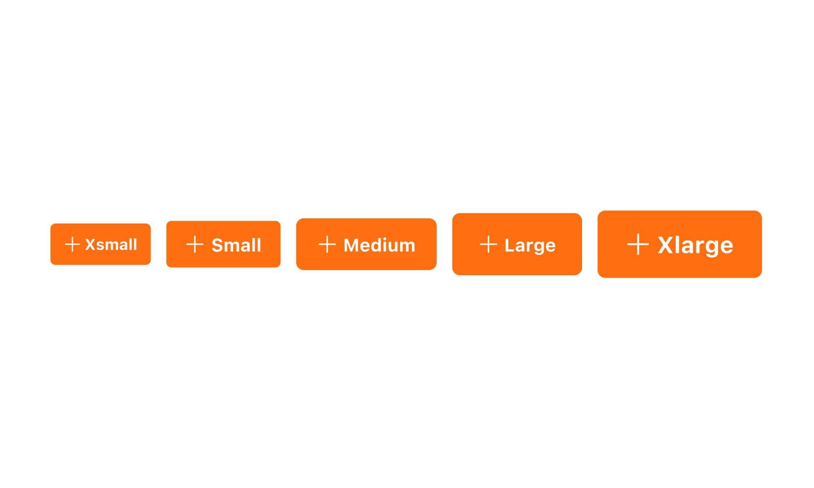
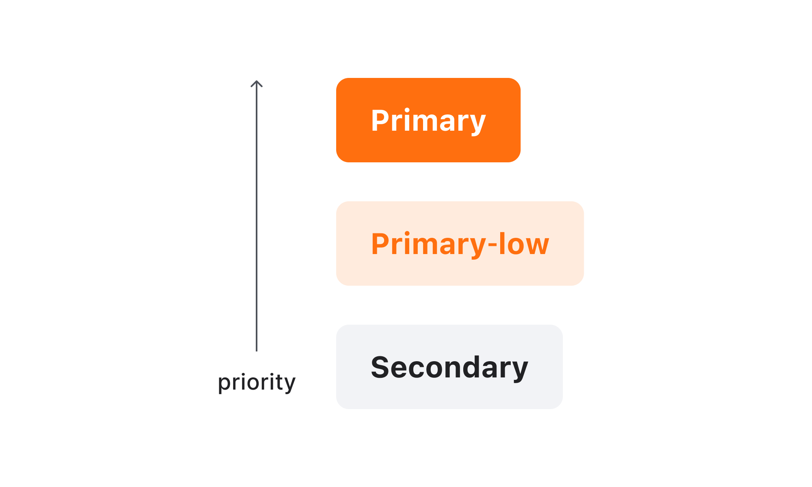
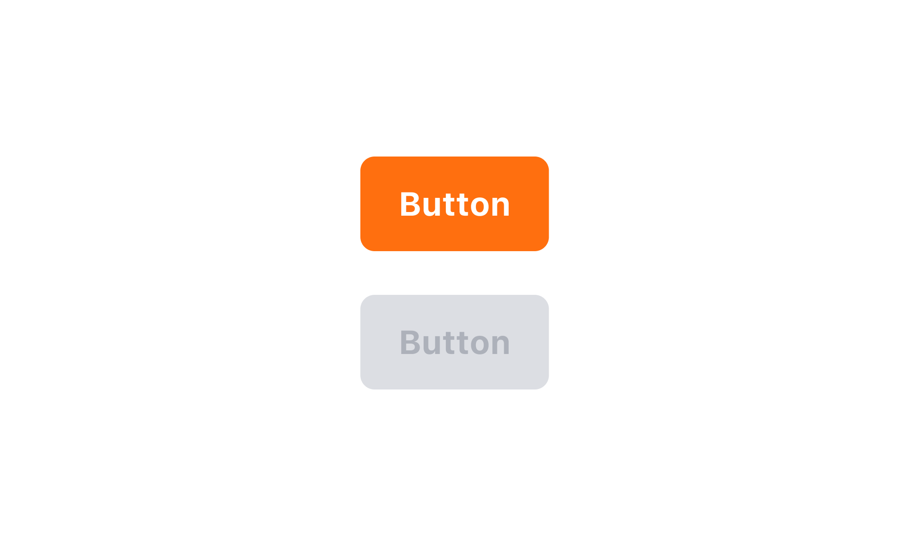

## 구조도

1. Root : Button 컴포넌트를 감싸는 컨테이너 영역
2. Label : Button에 대한 정보를 전달하는 라벨
3. Prefix Icon : Button에 대한 정보를 전달하는 아이콘
4. Suffix Icon

## 옵션

<HalfCard>
  <HalfCardImageCell>
    
  </HalfCardImageCell>
  <HalfCardDescriptionCell>
    <HalfCardDescriptionTitle>Size</HalfCardDescriptionTitle>
    <HalfCardDescription>
      Box Button은 xsmall, small, medium, large, xlarge 5개의 사이즈를 가질 수
      있습니다. medium이 가장 보편적으로 사용되며, 페이지 내의 중요도와 시각적
      균형에 맞게 적절하게 사용합니다.
    </HalfCardDescription>
  </HalfCardDescriptionCell>
</HalfCard>

<HalfCard>
  <HalfCardImageCell>
    
  </HalfCardImageCell>
  <HalfCardDescriptionCell>
    <HalfCardDescriptionTitle>Variant</HalfCardDescriptionTitle>
    <HalfCardDescription>
      Variant의 중요도는 Primary로 갈수록 높아지며, Secondary로 갈수록
      낮아집니다. 화면 내에서 액션의 중요도에 따라 버튼의 variant를 다르게
      사용합니다.
    </HalfCardDescription>
  </HalfCardDescriptionCell>
</HalfCard>

<HalfCard>
  <HalfCardImageCell>
    
  </HalfCardImageCell>
  <HalfCardDescriptionCell>
    <HalfCardDescriptionTitle>Primary variant</HalfCardDescriptionTitle>
    <HalfCardDescription>
      Primary variant는 강한 강조나 중요한 역할을 하는 버튼일 경우에 사용합니다.
      Primary 버튼은 한 화면에서 너무 많이 사용되지 않도록 제한적으로
      사용해야합니다. 또한, Primary 버튼은 단독으로 하단에 고정하여 사용할 수
      있습니다.
    </HalfCardDescription>
  </HalfCardDescriptionCell>
</HalfCard>

<HalfCard>
  <HalfCardImageCell>
    
  </HalfCardImageCell>
  <HalfCardDescriptionCell>
    <HalfCardDescriptionTitle>Danger variant</HalfCardDescriptionTitle>
    <HalfCardDescription>
      Danger variant는 유저에게 위험 요소에 대한 경고를 전달할 때 사용합니다. 이
      버튼으로 인해 파괴적 변화나 부정적인 행동이 일어날 수 있다는 시각적 인지를
      제공합니다.
    </HalfCardDescription>
  </HalfCardDescriptionCell>
</HalfCard>

<HalfCard>
  <HalfCardImageCell>
    
  </HalfCardImageCell>
  <HalfCardDescriptionCell>
    <HalfCardDescriptionTitle>Disabled</HalfCardDescriptionTitle>
    <HalfCardDescription>
      Disabled 상태는 Box Button이 존재하지만 지금은 사용할 수 없는 상태를
      나타냅니다. 이 옵션은 레이아웃 일관성을 유지하고 이후 상호작용이 가능할
      수도 있음을 사용자에게 알려줍니다.
    </HalfCardDescription>
  </HalfCardDescriptionCell>
</HalfCard>

<HalfCard>
  <HalfCardImageCell>
    
  </HalfCardImageCell>
  <HalfCardDescriptionCell>
    <HalfCardDescriptionTitle>Icon</HalfCardDescriptionTitle>
    <HalfCardDescription>
      Prefix icon으로 Label을 보조하기 위한 모노크롬 아이콘을 사용할 수
      있습니다. Suffix icon으로 Chevron을 사용해 버튼의 상호작용을 강조할 수
      있습니다. 동시 사용은 권장하지 않습니다.
    </HalfCardDescription>
  </HalfCardDescriptionCell>
</HalfCard>

### 옵션 테이블

| 속성        | 값                                      | 기본값  |
| ----------- | --------------------------------------- | ------- |
| size        | xsmall, small, medium, large, xlarge    | medium  |
| variant     | primary, primary-low, secondary, danger | primary |
| is disabled | true, false                             | false   |
| prefix icon | Icon                                    |         |
| suffix icon | Icon                                    |         |

## 상호작용

Working In Progress

## 가이드라인

Working In Progress
