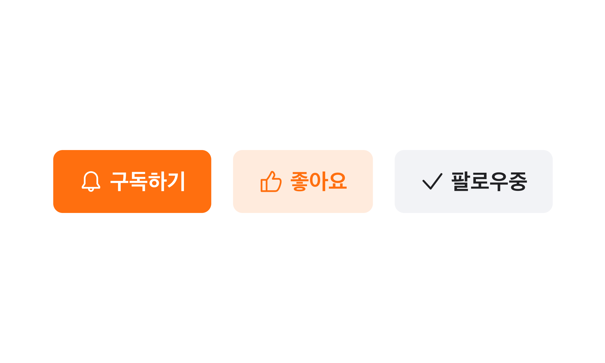

## Anatomy

1. Root : Button 컴포넌트를 감싸는 컨테이너 영역
2. Label : Button에 대한 정보를 전달하는 라벨
3. Icon : Button에 대한 정보를 전달하는 아이콘

## 옵션

<HalfCard>
  <HalfCardImageCell>
    
  </HalfCardImageCell>
  <HalfCardDescriptionCell>
    <HalfCardDescriptionTitle>Size</HalfCardDescriptionTitle>
    <HalfCardDescription>
      Box toggle button은 xsmall, small, medium, large 4개의 사이즈를 가질 수
      있습니다. medium이 가장 보편적으로 사용되며, 페이지 내의 중요도와 시각적
      균형에 맞게 적절하게 사용합니다.
    </HalfCardDescription>
  </HalfCardDescriptionCell>
</HalfCard>

<HalfCard>
  <HalfCardImageCell>
    
  </HalfCardImageCell>
  <HalfCardDescriptionCell>
    <HalfCardDescriptionTitle>Variant</HalfCardDescriptionTitle>
    <HalfCardDescription>
      Boxbutton은 primary, primary-low, secondary 3개의 스타일 옵션을 가질 수
      있습니다. 기본값은 primary입니다.
    </HalfCardDescription>
  </HalfCardDescriptionCell>
</HalfCard>

<HalfCard>
  <HalfCardImageCell>
    
  </HalfCardImageCell>
  <HalfCardDescriptionCell>
    <HalfCardDescriptionTitle>Disabled</HalfCardDescriptionTitle>
    <HalfCardDescription>
      Disabled 상태는 boxbutton이 존재하지만 지금은 사용할 수 없는 상태를
      나타냅니다. 이 옵션은 레이아웃 일관성을 유지하고 이후 상호작용이 가능할
      수도 있음을 사용자에게 알려줍니다.{" "}
    </HalfCardDescription>
  </HalfCardDescriptionCell>
</HalfCard>

### 옵션 테이블

| 속성        | 값                              | 기본값  | 설명                                           |
| ----------- | ------------------------------- | ------- | ---------------------------------------------- |
| size        | xsmall, small, medium, large    | medium  |                                                |
| variant     | primary, primary-low, secondary | primary |                                                |
| is disabled | true, false                     | false   | true일 경우, button이 유저와 상호작용하지 않음 |

## 상호작용

Working In Progress

## 가이드라인

Working In Progress
