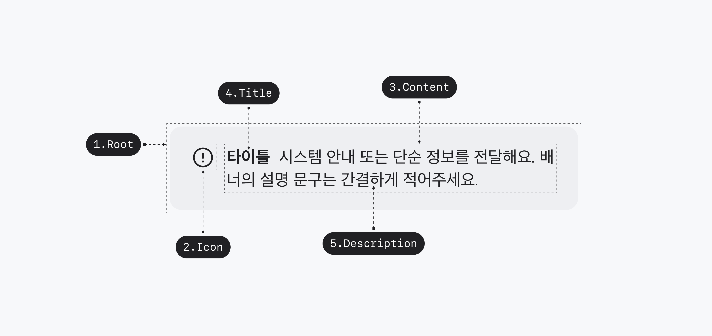
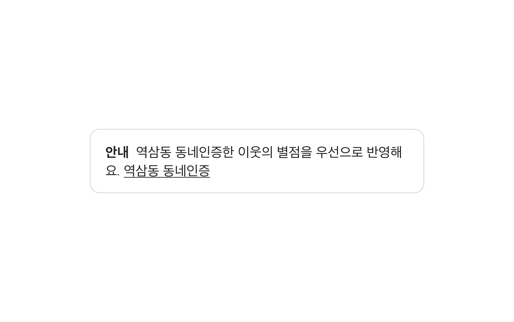
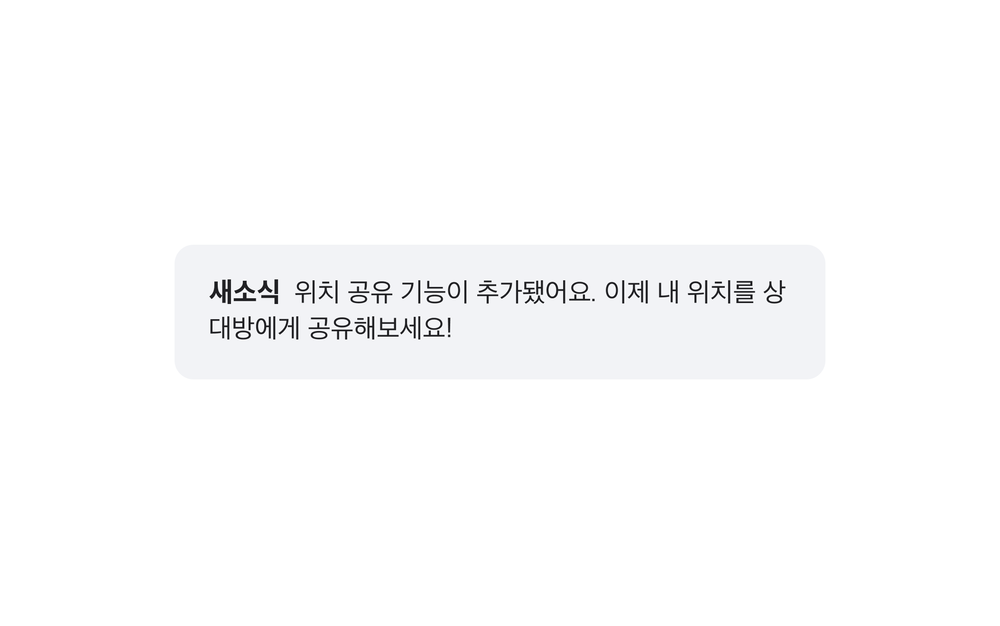
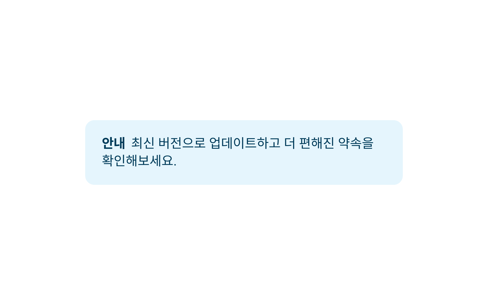
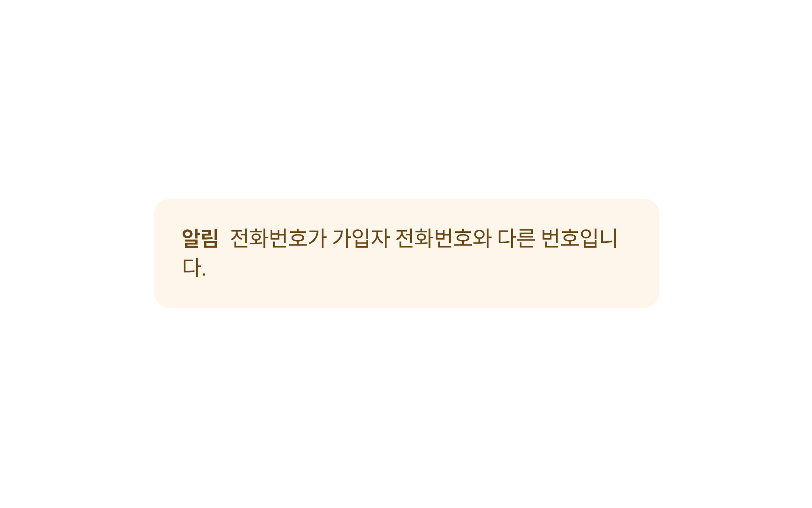
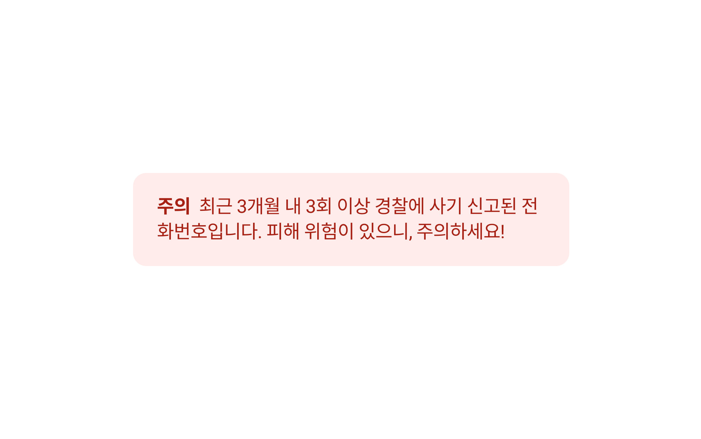
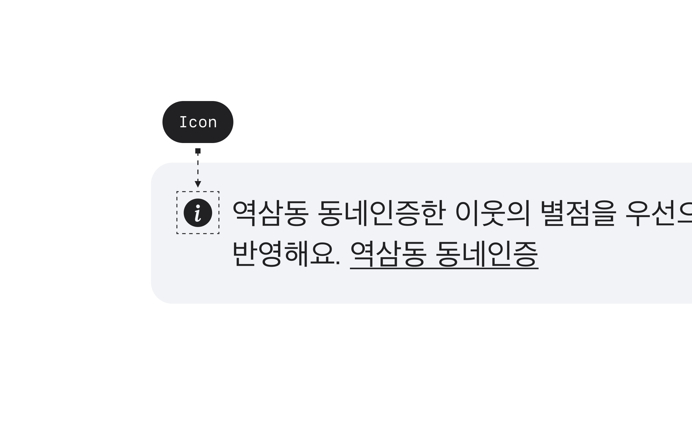

## 구조도

<Anatomy></Anatomy>

1. Root
2. Icon
3. Title
4. Description

## 옵션

<HalfCard>
  <HalfCardImageCell>
    
  </HalfCardImageCell>
  <HalfCardDescriptionCell>
    <HalfCardDescriptionTitle>Outline</HalfCardDescriptionTitle>
    <HalfCardDescription>Outline Variant는</HalfCardDescription>
  </HalfCardDescriptionCell>
</HalfCard>

<HalfCard>
  <HalfCardImageCell>
    
  </HalfCardImageCell>
  <HalfCardDescriptionCell>
    <HalfCardDescriptionTitle>Normal</HalfCardDescriptionTitle>
    <HalfCardDescription>
      Outline Variant는 중요도가 높지 않은 안내 또는 단순 정보를 전달합니다.
      Normal Variant보다 주목도를 낮추고 싶을 때, 혹은 면분할이 많은 화면에서
      사용합니다.
    </HalfCardDescription>
  </HalfCardDescriptionCell>
</HalfCard>

<HalfCard>
  <HalfCardImageCell>
    
  </HalfCardImageCell>
  <HalfCardDescriptionCell>
    <HalfCardDescriptionTitle>Info</HalfCardDescriptionTitle>
    <HalfCardDescription>
      Info variant는 특정 기능이나 서비스의 부가 설명을 제공하는 데 사용합니다.
      이를 통해 유저는 해당 기능에 대한 추가 정보를 얻을 수 있습니다.
    </HalfCardDescription>
  </HalfCardDescriptionCell>
</HalfCard>

<HalfCard>
  <HalfCardImageCell>
    
  </HalfCardImageCell>
  <HalfCardDescriptionCell>
    <HalfCardDescriptionTitle>Warning</HalfCardDescriptionTitle>
    <HalfCardDescription>
      Warning Variant는 주로 경고나 주의사항을 전달합니다. 위험 요소가 낮으며
      즉각적인 변화나 문제가 없는 경우, 조심해야 할 사항을 제공합니다.
    </HalfCardDescription>
  </HalfCardDescriptionCell>
</HalfCard>

<HalfCard>
  <HalfCardImageCell>
    
  </HalfCardImageCell>
  <HalfCardDescriptionCell>
    <HalfCardDescriptionTitle>Danger</HalfCardDescriptionTitle>
    <HalfCardDescription>
      Danger Variant는 심각한 위험 상황이나 조심해야 할 사항을 제공합니다.
      데이터가 삭제될 가능성이 있거나, 오류 상황에도 사용할 수 있습니다.
    </HalfCardDescription>
  </HalfCardDescriptionCell>
</HalfCard>

<HalfCard>
  <HalfCardImageCell>
    
  </HalfCardImageCell>
  <HalfCardDescriptionCell>
    <HalfCardDescriptionTitle>Title / Description</HalfCardDescriptionTitle>
    <HalfCardDescription>
      Title은 Callout의 내용의 목적이나 핵심 메시지를 강조, 요약하여 전달합니다.
      Description은 유저에게 추가적인 컨텍스트와 부가 설명을 제공합니다.
    </HalfCardDescription>
  </HalfCardDescriptionCell>
</HalfCard>

<HalfCard>
  <HalfCardImageCell>
    
  </HalfCardImageCell>
  <HalfCardDescriptionCell>
    <HalfCardDescriptionTitle>Icon</HalfCardDescriptionTitle>
    <HalfCardDescription>
      Icon은 Callout의 내용이나 목적을 시각적으로 나타내고 보조하는 역할을
      합니다. 유저가 Icon을 통해 어떤 유형의 메시지인지 쉽게 인지할 수 있도록
      돕습니다.
    </HalfCardDescription>
  </HalfCardDescriptionCell>
</HalfCard>

### 옵션 테이블

| 속성        | 값                                     | 기본값 |
| ----------- | -------------------------------------- | ------ |
| variant     | outline, normal, info, warning, danger | normal |
| title       | text                                   |        |
| description | text                                   |        |
| icon        | Icon                                   |        |

## 가이드라인

Working In Progress
