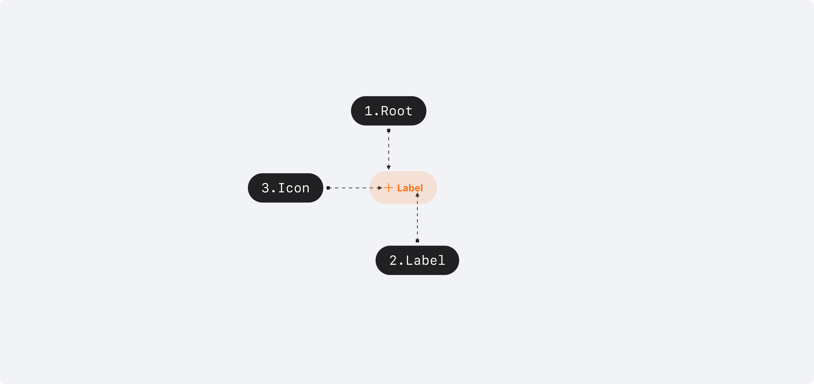
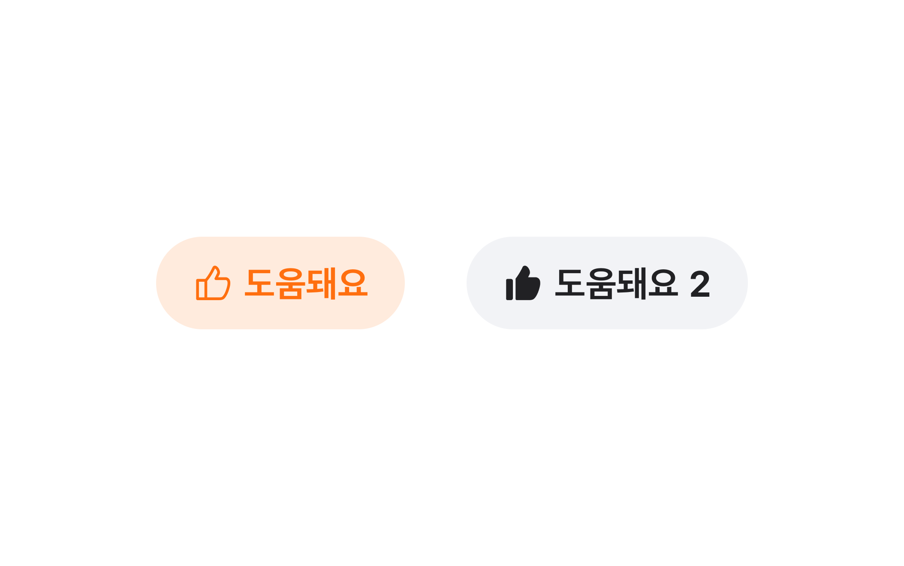

## 구조도

<Anatomy></Anatomy>

1. Root : Button 컴포넌트를 감싸는 컨테이너 영역
2. Label : Button에 대한 정보를 전달하는 라벨
3. Icon : Button에 대한 정보를 전달하는 아이콘

## 컴포넌트 미리보기

<Iframe
  src="https://sprout-storybook.vercel.app/iframe.html?args=&id=components-buttons-capsuletogglebutton--basic&viewMode=story"
  height="70px"
/>

## 옵션

<HalfCard>
  <HalfCardImageCell>
    
  </HalfCardImageCell>
  <HalfCardDescriptionCell>
    <HalfCardDescriptionTitle>Size</HalfCardDescriptionTitle>
    <HalfCardDescription>
      Capsule Toggle Button은 xsmall, small 2개의 사이즈를 가질 수 있습니다.
      Small이 가장 보편적으로 사용되며, 한 화면에 배치되는 요소가 많거나 복잡한
      경우 xsmall 사이즈를 사용하여 시각적 피로도를 낮춥니다.
    </HalfCardDescription>
  </HalfCardDescriptionCell>
</HalfCard>

<HalfCard>
  <HalfCardImageCell>
    
  </HalfCardImageCell>
  <HalfCardDescriptionCell>
    <HalfCardDescriptionTitle>Loading</HalfCardDescriptionTitle>
    <HalfCardDescription>
      네트워크 요청 등의 이유로 유저에게 피드백을 즉시 전달할 수 없는 경우,
      loading 상태를 사용합니다.
    </HalfCardDescription>
  </HalfCardDescriptionCell>
</HalfCard>

<HalfCard>
  <HalfCardImageCell>
    
  </HalfCardImageCell>
  <HalfCardDescriptionCell>
    <HalfCardDescriptionTitle>Disabled</HalfCardDescriptionTitle>
    <HalfCardDescription>
      Disabled 상태는 Capsule Toggle Button이 존재하지만 지금은 사용할 수 없는
      상태를 나타냅니다. 이 옵션은 레이아웃 일관성을 유지하고 이후 상호작용이
      가능할 수도 있음을 사용자에게 알려줍니다.
    </HalfCardDescription>
  </HalfCardDescriptionCell>
</HalfCard>

### 옵션 테이블

| 속성        | 값            | 기본값 |
| ----------- | ------------- | ------ |
| size        | xsmall, small | small  |
| is disabled | true, false   | false  |
| is loading  | true, false   | false  |

## 상호작용

### 터치 / 마우스 상호작용

<FullCard>
  <FullCardImageCell>
    
  </FullCardImageCell>
  <FullCardDescription>
    터치 혹은 마우스 클릭으로 Capsule Toggle Button과 상호작용할 수 있는
    영역입니다.
  </FullCardDescription>
</FullCard>

<FullCard>
  <FullCardImageCell>
    
  </FullCardImageCell>
  <FullCardDescription>
    PC 환경에서 버튼에 Hover 시 커서가 포인터 모양으로 변경됩니다.
  </FullCardDescription>
</FullCard>

<FullCard>
  <FullCardImageCell>
    
  </FullCardImageCell>
  <FullCardDescription>
    Loading / Disabled 상태인 경우 상호작용이 불가능합니다.
  </FullCardDescription>
</FullCard>

### 키보드 상호작용

<FullCard>
  <FullCardImageCell>
    
  </FullCardImageCell>
  <FullCardDescription>
    <Keyboard>Space</Keyboard> 또는 <Keyboard>Enter</Keyboard> 키를 통해
    selected 상태를 전환할 수 있습니다.
  </FullCardDescription>
</FullCard>

<HalfCard>
  <HalfCardImageCell>
    
  </HalfCardImageCell>
  <HalfCardDescriptionCell>
    <HalfCardDescriptionTitle>Loading</HalfCardDescriptionTitle>
    <HalfCardDescription>
      Loading 상태인 경우 Focus는 가능하지만 상호작용할 수 없습니다.
    </HalfCardDescription>
  </HalfCardDescriptionCell>
</HalfCard>

<HalfCard>
  <HalfCardImageCell>
    
  </HalfCardImageCell>
  <HalfCardDescriptionCell>
    <HalfCardDescriptionTitle>Disabled</HalfCardDescriptionTitle>
    <HalfCardDescription>
      Disabled 상태인 경우 상호작용할 수 없습니다.
    </HalfCardDescription>
  </HalfCardDescriptionCell>
</HalfCard>

### 응답없음

<FullCard>
  <FullCardImageCell>
    
  </FullCardImageCell>
  <FullCardDescription>
    Loading 상태로 전환되어 있는 경우, duration은 최대 2초를 초과하지 않아야
    합니다. 로딩 상태가 길어져 응답없음 상태에 진입하는 경우 Toggled - False
    상태로 되돌아갑니다.
  </FullCardDescription>
</FullCard>

## 가이드라인

<HalfCard>
  <HalfCardImageCell>
    
  </HalfCardImageCell>
  <HalfCardDescriptionCell>
    <HalfCardDescriptionTitle>Capsule Toggle Button</HalfCardDescriptionTitle>
    <HalfCardDescription>
      Capsule Toggle Button은 소셜 서비스, 후기와 같은 컨텐츠에서 리액션용
      Toggle Button으로 사용합니다.
    </HalfCardDescription>
  </HalfCardDescriptionCell>
</HalfCard>

### Max Width

<FullCard>
  <FullCardImageCell>
    
  </FullCardImageCell>
  <FullCardDescription>
    모바일 해상도에서 좌우 Margin 16px씩을 유지한 width까지만 확장될 수
    있습니다.
  </FullCardDescription>
  <FullCardImageCell>
    
  </FullCardImageCell>
  <FullCardDescription>
    Label은 1줄을 초과할 수 없으며 좌우 Padding은 각 20px을 유지한 범위 내에서만
    텍스트가 노출될 수 있습니다.
  </FullCardDescription>
</FullCard>

### Min Width

<FullCard>
  <FullCardImageCell>
    
  </FullCardImageCell>
  <FullCardDescription>
    Capsule Toggle Button은 최소 너비값을 가지며 사이즈별로 각 값은 상이합니다.
  </FullCardDescription>
</FullCard>

 

### Do / Don't

 

<DoDontLayout>
  <DontBox>
    <DontImage>
      
    </DontImage>
    <DontText>
      Selected 상태를 유저에게 명확하게 전달하기 위해 Selected 배리언츠를
      올바르게 사용하며, Selected인 경우 icon은 fill 타입 사용을 권장합니다.
    </DontText>
  </DontBox>
  <DontBox>
    <DontImage>
      
    </DontImage>
    <DontText>
      Unselected 와 Selected 배리언츠를 반대로 사용하지 않습니다.{" "}
    </DontText>
  </DontBox>
</DoDontLayout>

 
