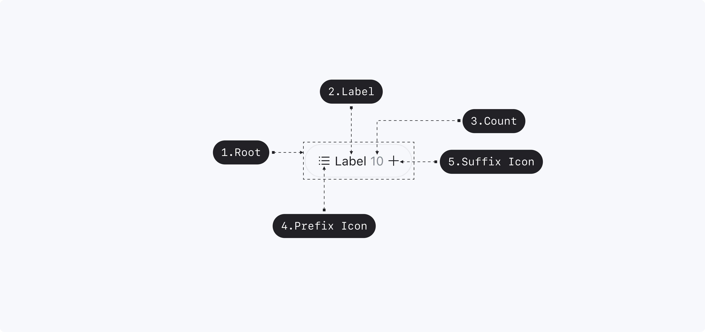
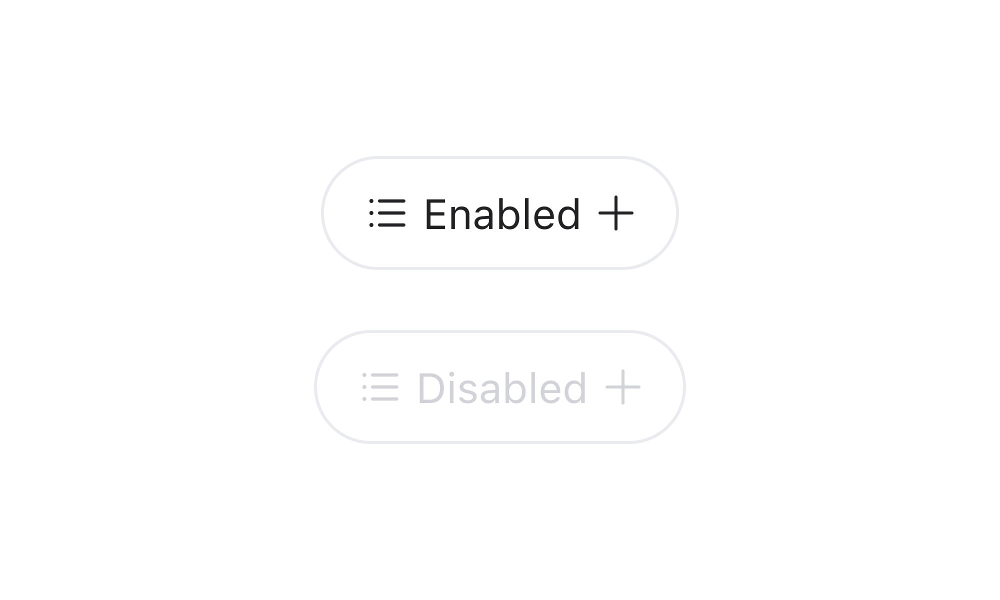
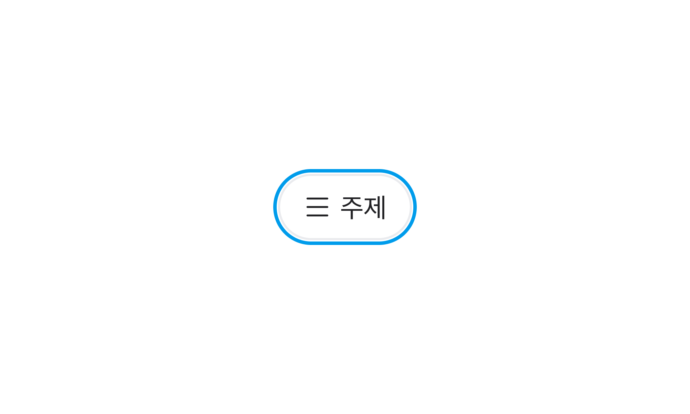
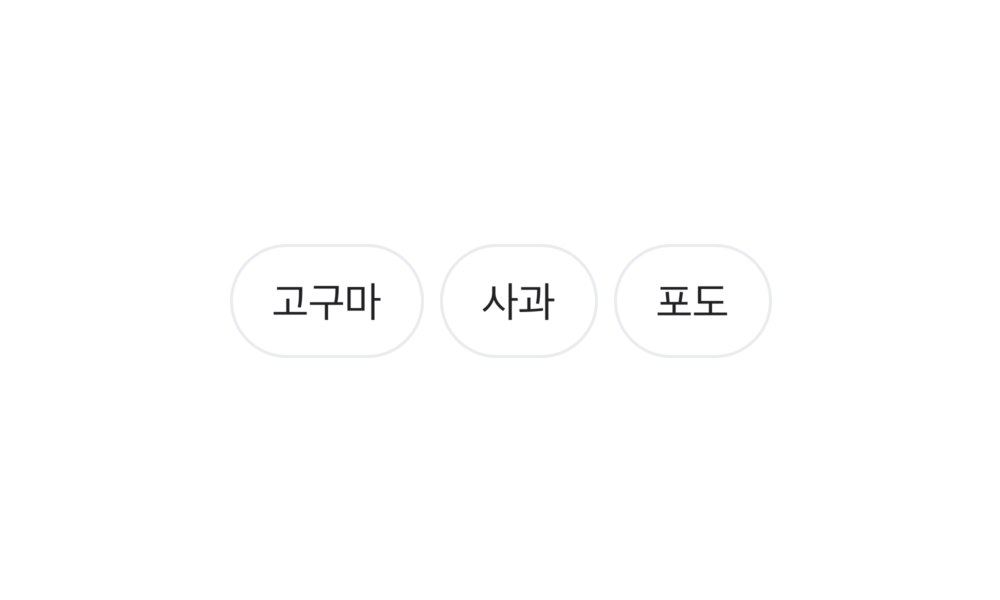

## 구조도

<Anatomy></Anatomy>

1. Root
2. Label
3. Count
4. Prefix Icon
5. Suffix Icon

## 옵션

<HalfCard>
  <HalfCardImageCell>
    
  </HalfCardImageCell>
  <HalfCardDescriptionCell>
    <HalfCardDescriptionTitle>Size</HalfCardDescriptionTitle>
    <HalfCardDescription>
      Chip Button은 small, medium 2개의 사이즈를 가질 수 있습니다. medium이 가장
      보편적으로 사용되며, 페이지 내의 중요도와 시각적 균형에 맞게 적절하게
      사용합니다.
    </HalfCardDescription>
  </HalfCardDescriptionCell>
</HalfCard>

<HalfCard>
  <HalfCardImageCell>
    
  </HalfCardImageCell>
  <HalfCardDescriptionCell>
    <HalfCardDescriptionTitle>Disabled</HalfCardDescriptionTitle>
    <HalfCardDescription>
      Disabled 상태는 Chip Button이 존재하지만 지금은 사용할 수 없는 상태를
      나타냅니다. 이 옵션은 레이아웃 일관성을 유지하고 이후 상호작용이 가능할
      수도 있음을 사용자에게 알려줍니다.
    </HalfCardDescription>
  </HalfCardDescriptionCell>
</HalfCard>

<HalfCard>
  <HalfCardImageCell>
    
  </HalfCardImageCell>
  <HalfCardDescriptionCell>
    <HalfCardDescriptionTitle>Count</HalfCardDescriptionTitle>
    <HalfCardDescription>
      Chip Button이 특정 데이터의 개수 값을 포함하고 있거나, 필터링된 항목 수를
      표시할 때 Count 옵션을 사용할 수 있습니다.
    </HalfCardDescription>
  </HalfCardDescriptionCell>
</HalfCard>

<HalfCard>
  <HalfCardImageCell>
    
  </HalfCardImageCell>
  <HalfCardDescriptionCell>
    <HalfCardDescriptionTitle>Icon</HalfCardDescriptionTitle>
    <HalfCardDescription>
      Prefix Icon으로 Label을 보조하기 위한 모노크롬 아이콘을 사용할 수
      있습니다. Suffix Icon으로 Chevron을 사용해 칩 버튼의 상호작용을 강조할 수
      있습니다. 동시 사용은 권장하지 않습니다.
    </HalfCardDescription>
  </HalfCardDescriptionCell>
</HalfCard>

### 옵션 테이블

| 속성        | 값            | 기본값 |
| ----------- | ------------- | ------ |
| size        | medium, small | medium |
| is disabled | true, false   | false  |
| count       | number        |        |
| prefix icon | icon          |        |
| suffix icon | Icon          |        |

## 상호작용

### 터치 / 마우스

<FullCard>
  <FullCardImageCell>
    
  </FullCardImageCell>
  <FullCardDescription>
    마우스 클릭 또는 터치로 Chip Button과 상호작용할 수 있습니다. Close Button이
    있는 Chip Button의 경우, 터치 영역이 Close Button 영역으로 제한됩니다.
  </FullCardDescription>
</FullCard>

### 키보드

<HalfCard>
  <HalfCardImageCell>
    
  </HalfCardImageCell>
  <HalfCardDescriptionCell>
    <HalfCardDescriptionTitle>Focus</HalfCardDescriptionTitle>
    <HalfCardDescription>
      <Keyboard>Space</Keyboard> 또는 <Keyboard>Enter</Keyboard> 키를 통해 Chip
      Button의 액션을 실행시킬 수 있습니다.
    </HalfCardDescription>
  </HalfCardDescriptionCell>
</HalfCard>

## 가이드라인

### Do / Don't

 

<DoDontLayout>
  <DoBox>
    <DoImage></DoImage>
    <DoText>
      유저가 빠르게 원하는 액션을 선택할 수 있도록 Label을 간결하고 명료하게
      작성합니다.
    </DoText>
  </DoBox>
  <DontBox>
    <DontImage>
      
    </DontImage>
    <DontText>
      불필요한 단어 사용을 지양합니다. Label은 1줄을 초과할 수 없습니다.
    </DontText>
  </DontBox>
</DoDontLayout>
