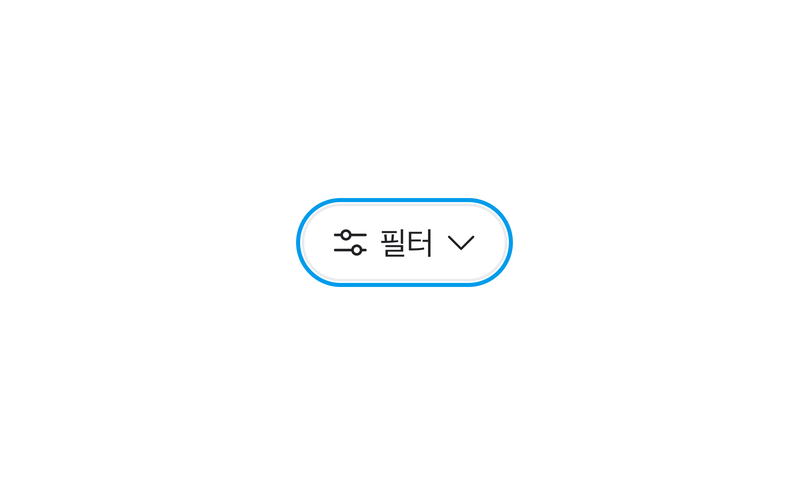

## Chip Filter

in progress

## 상호작용

### 터치 / 마우스

<FullCard>
  <FullCardImageCell>
    
  </FullCardImageCell>
  <FullCardDescription>
    마우스 클릭 또는 터치로 Chip Filter와 상호작용할 수 있습니다.
  </FullCardDescription>
</FullCard>

### 키보드

<HalfCard>
  <HalfCardImageCell>
    
  </HalfCardImageCell>
  <HalfCardDescriptionCell>
    <HalfCardDescriptionTitle>Focus</HalfCardDescriptionTitle>
    <HalfCardDescription>
      <Keyboard>Space</Keyboard> 또는 <Keyboard>Enter</Keyboard> 키를 통해 Chip
      Chip Filter의 액션을 실행시킬 수 있습니다.
    </HalfCardDescription>
  </HalfCardDescriptionCell>
</HalfCard>