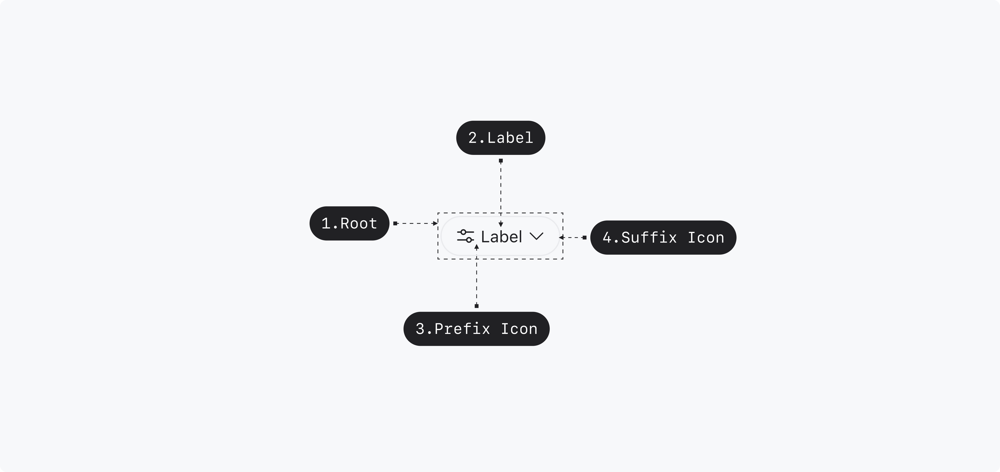
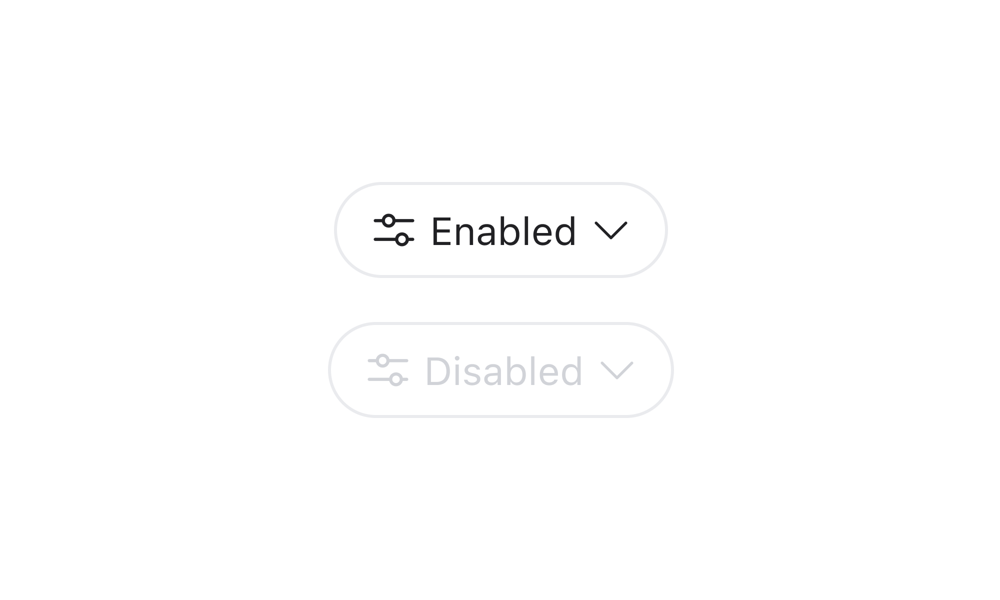
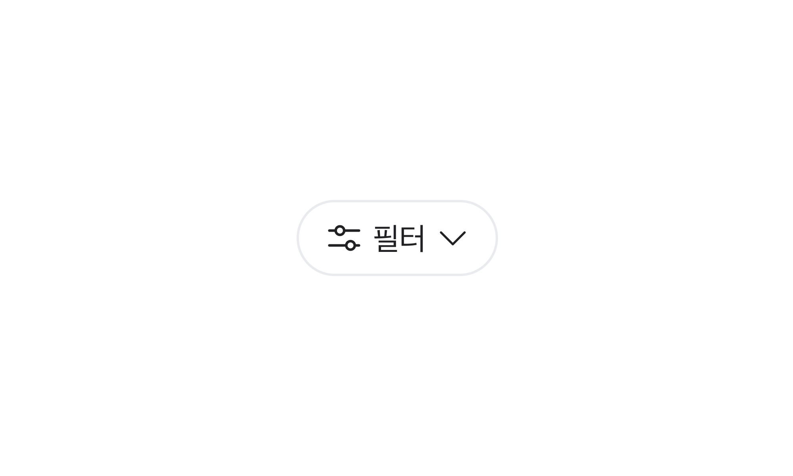

## 구조도

<Anatomy></Anatomy>

1. Root
2. Label
3. Prefix Icon
4. Suffix Icon

## 옵션

<HalfCard>
  <HalfCardImageCell>
    
  </HalfCardImageCell>
  <HalfCardDescriptionCell>
    <HalfCardDescriptionTitle>Selection</HalfCardDescriptionTitle>
    <HalfCardDescription>
      Chip Filter는 selected, unselected 중 하나의 상태를 가질 수 있습니다.
    </HalfCardDescription>
  </HalfCardDescriptionCell>
</HalfCard>

<HalfCard>
  <HalfCardImageCell>
    
  </HalfCardImageCell>
  <HalfCardDescriptionCell>
    <HalfCardDescriptionTitle>Disabled</HalfCardDescriptionTitle>
    <HalfCardDescription>
      Disabled 상태는 Chip Filter가 존재하지만 지금은 사용할 수 없는 상태를
      나타냅니다. 이 옵션은 레이아웃 일관성을 유지하고 이후 상호작용이 가능할
      수도 있음을 사용자에게 알려줍니다.
    </HalfCardDescription>
  </HalfCardDescriptionCell>
</HalfCard>

<HalfCard>
  <HalfCardImageCell>
    
  </HalfCardImageCell>
  <HalfCardDescriptionCell>
    <HalfCardDescriptionTitle>Icon</HalfCardDescriptionTitle>
    <HalfCardDescription>
      Prefix icon으로 Label을 보조하기 위한 모노크롬 아이콘을 사용할 수
      있습니다. Suffix icon으로 Chevron을 사용해 칩 버튼의 상호작용을 강조할 수
      있습니다. 동시 사용은 권장하지 않습니다.
    </HalfCardDescription>
  </HalfCardDescriptionCell>
</HalfCard>

### 옵션 테이블

| 속성        | 값          | 기본값 |
| ----------- | ----------- | ------ |
| is disabled | true, false | false  |
| prefix icon | icon        |        |
| suffix icon | Icon        |        |

## 상호작용

### 터치 / 마우스

<FullCard>
  <FullCardImageCell>
    
  </FullCardImageCell>
  <FullCardDescription>
    마우스 클릭 또는 터치로 Chip Filter와 상호작용할 수 있습니다.
  </FullCardDescription>
</FullCard>

### 키보드

<HalfCard>
  <HalfCardImageCell>
    
  </HalfCardImageCell>
  <HalfCardDescriptionCell>
    <HalfCardDescriptionTitle>Focus</HalfCardDescriptionTitle>
    <HalfCardDescription>
      <Keyboard>Space</Keyboard> 또는 <Keyboard>Enter</Keyboard> 키를 통해 Chip
      Chip Filter의 액션을 실행시킬 수 있습니다.
    </HalfCardDescription>
  </HalfCardDescriptionCell>
</HalfCard>
