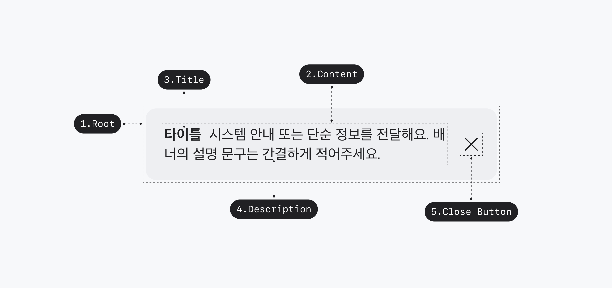

## Anatomy

<Anatomy></Anatomy>

1. Root
2. Title
3. Description
4. Close Button

## Visual Options

| Property    | Value                                 |
| ----------- | ------------------------------------- |
| variant     | outline, normal, tip, warning, danger |
| title       | text                                  |
| description | text                                  |

## 디자인 결정 (Color)

### variant=outline

| Part                             | Attribute     | Value                 |
| -------------------------------- | ------------- | --------------------- |
| Root                             | Outline Color | $scale.color.gray-300 |
| Title, Description, Close Button | Color         | $scale.color.gray-900 |

### variant=normal

| Part                             | Attribute | Value                 |
| -------------------------------- | --------- | --------------------- |
| Root                             | Color     | $scale.color.gray-100 |
| Title, Description, Close Button | Color     | $scale.color.gray-900 |

### variant=tip

| Part                             | Attribute | Value                      |
| -------------------------------- | --------- | -------------------------- |
| Root                             | Color     | $scale.color.blue-alpha-50 |
| Title, Description, Close Button | Color     | $scale.color.blue-950      |

### variant=warning

| Part                             | Attribute | Value                        |
| -------------------------------- | --------- | ---------------------------- |
| Root                             | Color     | $scale.color.yellow-alpha-50 |
| Title, Description, Close Button | Color     | $scale.color.yellow-950      |

### variant=danger

| Part                             | Attribute | Value                     |
| -------------------------------- | --------- | ------------------------- |
| Root                             | Color     | $scale.color.red-alpha-50 |
| Title, Description, Close Button | Color     | $scale.color.red-950      |

## 디자인 결정 (Typography)

| Part  | Attribute  | Value                                |
| ----- | ---------- | ------------------------------------ |
| Title | Typography | $semantic.typography.body-m2-bold    |
| Label | Typography | $semantic.typography.body-m2-regular |

## 디자인 결정 (Layout)

| Part                   | Attribute        | Value |
| ---------------------- | ---------------- | ----- |
| Root                   | Vertical Padding | 14pt  |
|                        | Left Padding     | 16pt  |
|                        | Right Padding    | 14pt  |
|                        | Corner Radius    | 10pt  |
| Content / Close Button | Spacing          | 10pt  |
| Close Button           | Size             | 18pt  |
