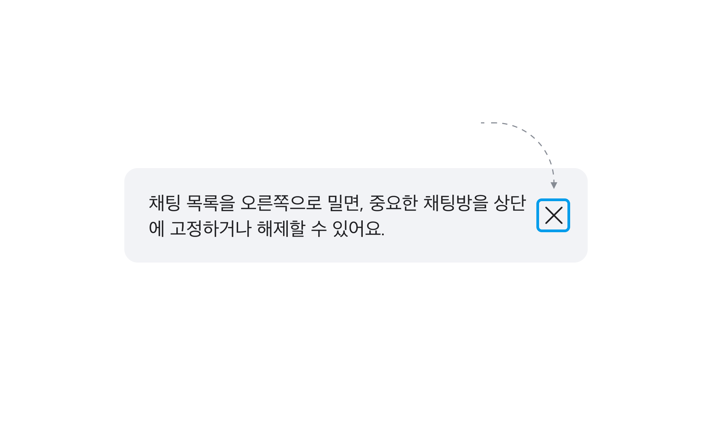
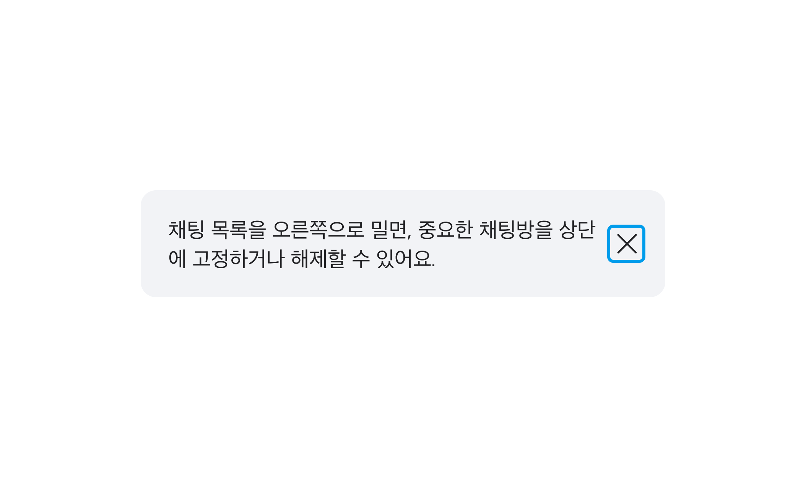

## 구조도

<Anatomy></Anatomy>

1. Root
2. Title
3. Description
4. Close Button

## 옵션

<HalfCard>
  <HalfCardImageCell>
    
  </HalfCardImageCell>
  <HalfCardDescriptionCell>
    <HalfCardDescriptionTitle>Outline</HalfCardDescriptionTitle>
    <HalfCardDescription>
      Outline Variant는 안내 및 단순 정보를 전달합니다. Normal Variant보다
      주목도를 낮추고 싶을 때, 혹은 면분할이 많은 화면에서 다른 gray 토큰과의
      충돌을 방지하고자 할 때 사용합니다.
    </HalfCardDescription>
  </HalfCardDescriptionCell>
</HalfCard>

<HalfCard>
  <HalfCardImageCell>
    
  </HalfCardImageCell>
  <HalfCardDescriptionCell>
    <HalfCardDescriptionTitle>Normal</HalfCardDescriptionTitle>
    <HalfCardDescription>
      Normal Variant는 시스템 안내 및 공지사항을 전달합니다. 특별한 강조나
      경고가 필요하지 않을 때, 혹은 일상적인 상황을 제공합니다.
    </HalfCardDescription>
  </HalfCardDescriptionCell>
</HalfCard>

<HalfCard>
  <HalfCardImageCell>
    
  </HalfCardImageCell>
  <HalfCardDescriptionCell>
    <HalfCardDescriptionTitle>Info</HalfCardDescriptionTitle>
    <HalfCardDescription>
      Info Variant는 특정 기능이나 서비스의 부가 설명을 제공하는 데 사용합니다.
      Normal Variant보다 강조하여 메시지를 전달하고 싶을 때 사용합니다.
    </HalfCardDescription>
  </HalfCardDescriptionCell>
</HalfCard>

<HalfCard>
  <HalfCardImageCell>
    
  </HalfCardImageCell>
  <HalfCardDescriptionCell>
    <HalfCardDescriptionTitle>Warning</HalfCardDescriptionTitle>
    <HalfCardDescription>
      Warning Variant는 주로 경고나 주의사항을 전달합니다. 위험 요소가 낮으며
      즉각적인 변화나 문제가 없는 경우, 조심해야 할 사항을 제공합니다.
    </HalfCardDescription>
  </HalfCardDescriptionCell>
</HalfCard>

<HalfCard>
  <HalfCardImageCell>
    
  </HalfCardImageCell>
  <HalfCardDescriptionCell>
    <HalfCardDescriptionTitle>Danger</HalfCardDescriptionTitle>
    <HalfCardDescription>
      Danger Variant는 심각한 위험 상황이나 조심해야 할 사항을 제공합니다.
      데이터가 삭제될 가능성이 있거나, 오류 상황에도 사용할 수 있습니다.
    </HalfCardDescription>
  </HalfCardDescriptionCell>
</HalfCard>

<HalfCard>
  <HalfCardImageCell>
    
  </HalfCardImageCell>
  <HalfCardDescriptionCell>
    <HalfCardDescriptionTitle>Title / Description</HalfCardDescriptionTitle>
    <HalfCardDescription>
      Title은 Callout의 내용의 목적이나 핵심 메시지를 강조, 요약하여 전달합니다.
      Description은 유저에게 추가적인 컨텍스트와 부가 설명을 제공합니다.
    </HalfCardDescription>
  </HalfCardDescriptionCell>
</HalfCard>

### 옵션 테이블

| 속성        | 값                                     | 기본값 |
| ----------- | -------------------------------------- | ------ |
| variant     | outline, normal, info, warning, danger | normal |
| title       | text                                   |        |
| description | text                                   |        |

## 상호작용

### 터치 / 마우스

<FullCard>
  <FullCardImageCell>
    
  </FullCardImageCell>
  <FullCardDescription>
    마우스 클릭 또는 터치로 Dismissable Callout과 상호작용할 수 있는 영역입니다.
  </FullCardDescription>
</FullCard>

### 키보드

<HalfCard>
  <HalfCardImageCell>
    
  </HalfCardImageCell>
  <HalfCardDescriptionCell>
    <HalfCardDescriptionTitle>Focus</HalfCardDescriptionTitle>
    <HalfCardDescription>
      <Keyboard>Tab</Keyboard>키를 통해 Close Button에 Focus할 수 있습니다.
    </HalfCardDescription>
  </HalfCardDescriptionCell>
</HalfCard>

<HalfCard>
  <HalfCardImageCell>
    
  </HalfCardImageCell>
  <HalfCardDescriptionCell>
    <HalfCardDescriptionTitle>Dismiss</HalfCardDescriptionTitle>
    <HalfCardDescription>
      <Keyboard>Esc</Keyboard>키, 또는 Close Button에 Focus된 상태에서
      <Keyboard>Space</Keyboard> 또는
      <Keyboard>Enter</Keyboard>키를 통해 Dismissable Callout을 닫을 수
      있습니다.
    </HalfCardDescription>
  </HalfCardDescriptionCell>
</HalfCard>

## 가이드라인

<HalfCard>
  <HalfCardImageCell>
    
  </HalfCardImageCell>
  <HalfCardDescriptionCell>
    <HalfCardDescriptionTitle>
      필요할 때만, 아껴서 쓰기
    </HalfCardDescriptionTitle>
    <HalfCardDescription>
      Dismissable Callout은 화면에서 많은 면적을 차지하고, 유저의 주의를 끌기
      때문에 중요한 정보에만 절제하여 사용합니다. 과도한 사용은 Dismissable
      Callout의 강조 효과를 약화시킬 수 있습니다.
    </HalfCardDescription>
  </HalfCardDescriptionCell>
</HalfCard>
<HalfCard>
  <HalfCardImageCell>
    
  </HalfCardImageCell>
  <HalfCardDescriptionCell>
    <HalfCardDescriptionTitle>간결한 문구</HalfCardDescriptionTitle>
    <HalfCardDescription>
      Description은 2줄 이내로 간결하게 작성하여 유저가 빠르게 내용을 파악할 수
      있도록 합니다.
    </HalfCardDescription>
  </HalfCardDescriptionCell>
</HalfCard>

### Do / Don't

 
<DoDontLayout>
  <DoBox>
    <DoImage>
      
    </DoImage>
    <DoText>
      Gray 컬러가 많은 화면에서는 Outline Variant를 사용하여 다른 요소와의
      충돌을 피합니다.
    </DoText>
  </DoBox>
  <DontBox>
    <DontImage>
      
    </DontImage>
    <DontText>
      면분할이 많은 화면에서의 사용을 주의합니다. 화면의 복잡도를 높여 유저에게
      혼란을 줄 수 있습니다.
    </DontText>
  </DontBox>
</DoDontLayout>
 

<DoDontLayout>
  <DoBox>
    <DoImage>
      
    </DoImage>
    <DoText>의미에 맞는 Variant를 사용합니다.</DoText>
  </DoBox>
  <DontBox>
    <DontImage>
      
    </DontImage>
    <DontText>
      시각적인 효과만을 위해 특정 Variant를 사용하지 않습니다. 각 Variant는
      목적에 맞는 컬러를 가지기 때문에, 이를 무시하고 사용할 경우 유저에게
      혼란을 줄 수 있습니다.
    </DontText>
  </DontBox>
</DoDontLayout>
 

<DoDontLayout>
  <DontBox>
    <DontImage>
      
    </DontImage>
    <DontText>
      액션 수행을 위해 반드시 알아야 하는 정보를 전달할 때 사용하지 않습니다.
      특히 위험 사항을 알리는 Warning과 Danger Variant는 유의하여 사용합니다.
    </DontText>
  </DontBox>
  <DontBox>
    <DontImage>
      
    </DontImage>
    <DontText>
      마케팅 및 프로모션 용도로 사용하지 않습니다. 해당 용도에는 Banner를
      사용합니다.
    </DontText>
  </DontBox>
</DoDontLayout>
 
<DoDontLayout>
  <DoBox>
    <DoImage>
      
    </DoImage>
    <DoText>
      Text Field를 보조하는 경우, Text Field와의 시각적 구분이 명확한 Variant를
      사용하거나, 간단한 메시지는 Description으로 대체합니다.
    </DoText>
  </DoBox>
  <DontBox>
    <DontImage>
      
    </DontImage>
    <DontText>
      Text Field와 함께 Outline Variant를 사용하지 않습니다. 유사한 UI로 유저가
      혼란을 느낄 수 있습니다.
    </DontText>
  </DontBox>
</DoDontLayout>
 
