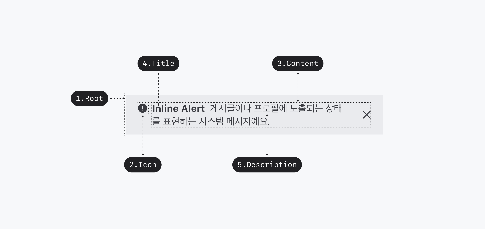
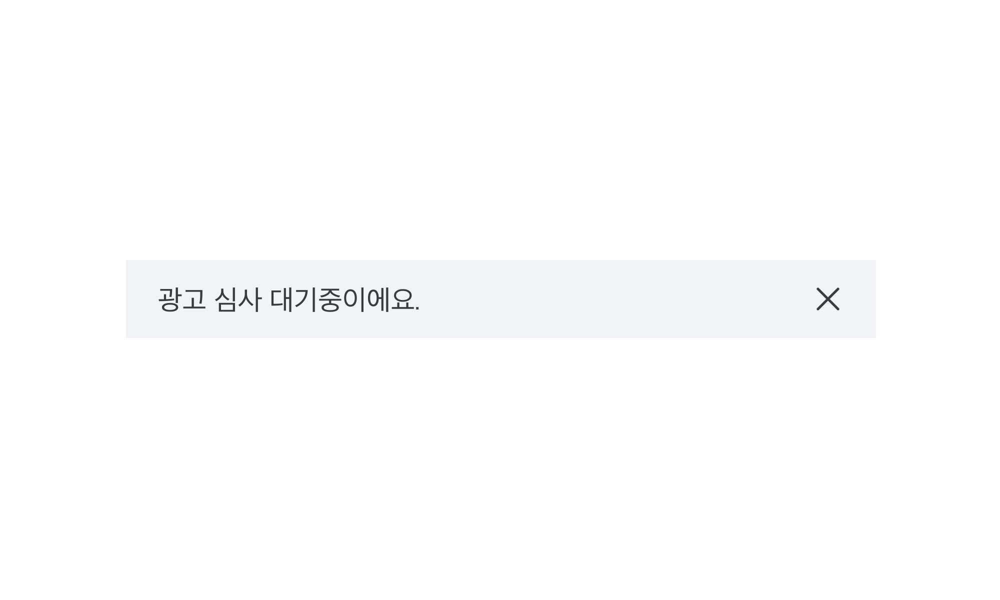
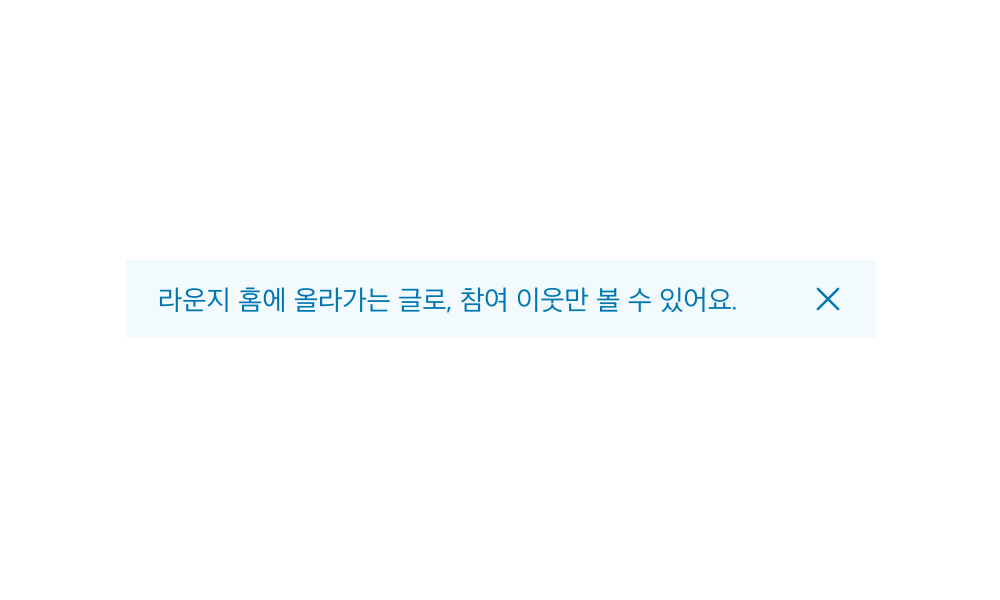
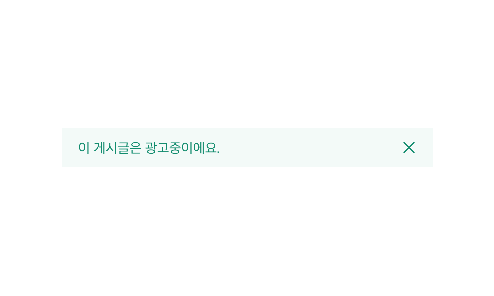
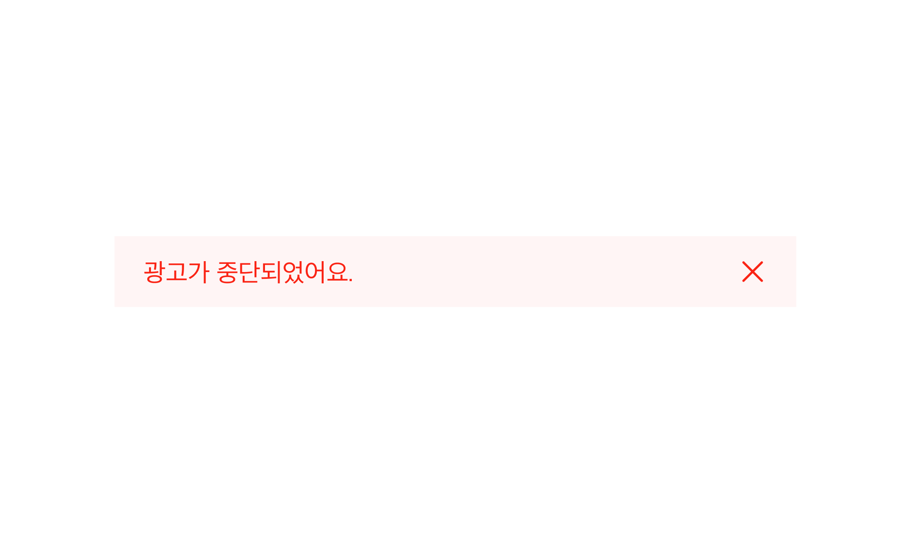
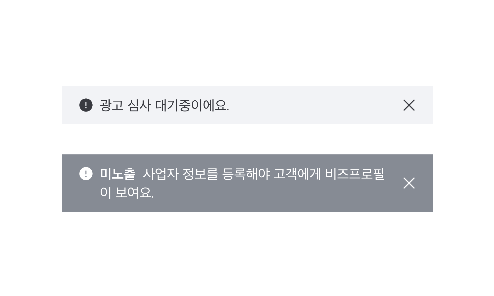
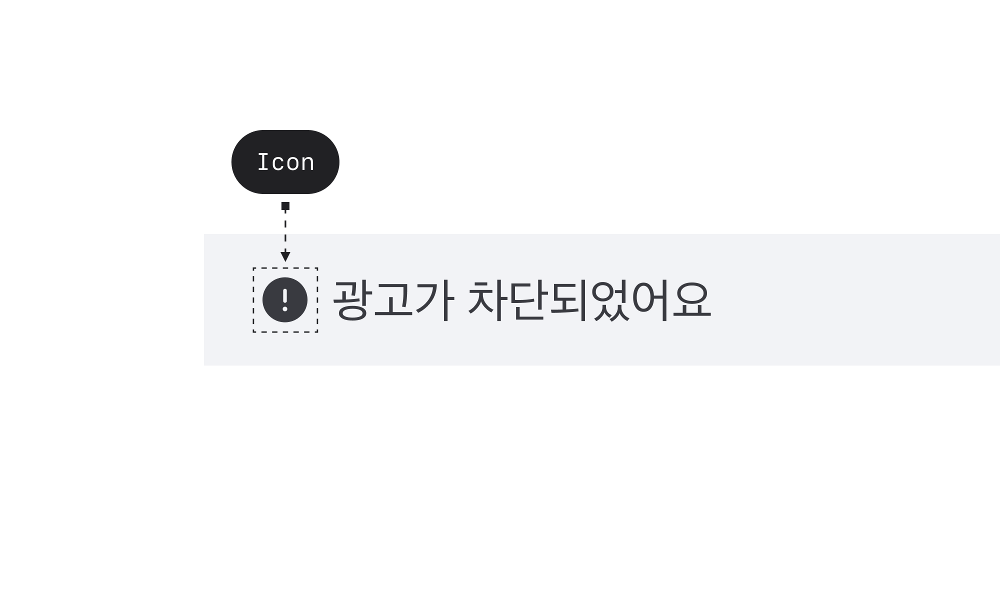

## 구조도

<Anatomy></Anatomy>

1. Root
2. Icon
3. Content
4. Title
5. Description
6. Action

## 옵션

<HalfCard>
  <HalfCardImageCell>
    
  </HalfCardImageCell>
  <HalfCardDescriptionCell>
    <HalfCardDescriptionTitle>Normal</HalfCardDescriptionTitle>
    <HalfCardDescription>
      일반적인 상황에 사용되는 배리언트로, 일반적인 정보나 안내에 적합합니다.
    </HalfCardDescription>
  </HalfCardDescriptionCell>
</HalfCard>

<HalfCard>
  <HalfCardImageCell>
    
  </HalfCardImageCell>
  <HalfCardDescriptionCell>
    <HalfCardDescriptionTitle>Info</HalfCardDescriptionTitle>
    <HalfCardDescription>
      추가 정보를 전달하거나 유저에게 주의를 요하는 경우에 사용됩니다. 주로 중요한 메시지 전달에 활용됩니다.
    </HalfCardDescription>
  </HalfCardDescriptionCell>
</HalfCard>

<HalfCard>
  <HalfCardImageCell>
    
  </HalfCardImageCell>
  <HalfCardDescriptionCell>
    <HalfCardDescriptionTitle>Success</HalfCardDescriptionTitle>
    <HalfCardDescription>
      성공적인 작업을 나타내는 배리언트로, 유저의 긍정적인 경험을 강조하거나 과업이 완료되었을 때 나타냅니다.
    </HalfCardDescription>
  </HalfCardDescriptionCell>
</HalfCard>

<HalfCard>
  <HalfCardImageCell>
    
  </HalfCardImageCell>
  <HalfCardDescriptionCell>
    <HalfCardDescriptionTitle>Danger</HalfCardDescriptionTitle>
    <HalfCardDescription>
      위험한 상황을 나타내거나 유저에게 경고를 주어야 할 때 사용되는 배리언트로, 주의가 필요한 상황을 강조합니다.
    </HalfCardDescription>
  </HalfCardDescriptionCell>
</HalfCard>

<HalfCard>
  <HalfCardImageCell>
    
  </HalfCardImageCell>
  <HalfCardDescriptionCell>
    <HalfCardDescriptionTitle>Weight</HalfCardDescriptionTitle>
    <HalfCardDescription>
      Standard는 기본값으로 사용을 권장하며, 대부분의 상황에서 적합합니다. 일반적인 메시지나 안내에 이 옵션을 사용하여 메시지를 전달하는 것이 좋습니다. Strong은 특정 메시지를 강조하는 데 사용됩니다. 시각적으로 강한 주목도를 갖고있어 꼭 필요한 경우에 제한적으로 사용합니다.
    </HalfCardDescription>
  </HalfCardDescriptionCell>
</HalfCard>

<HalfCard>
  <HalfCardImageCell>
    
  </HalfCardImageCell>
  <HalfCardDescriptionCell>
    <HalfCardDescriptionTitle>Icon</HalfCardDescriptionTitle>
    <HalfCardDescription>
      Icon은 Inline Alert의 내용이나 목적을 시각적으로 나타내고 보조하는 역할을 합니다. 유저가 Icon을 통해 어떤 유형의 메시지인지 쉽게 인지할 수 있도록 돕습니다.
    </HalfCardDescription>
  </HalfCardDescriptionCell>
</HalfCard>

### 옵션 테이블

| 속성        | 값                                     | 기본값 |
| ----------- | -------------------------------------- | ------ |
| variant     | normal, info, success, danger | normal |
| weight       | standard, strong                                   |        |
| description | text                                   |        |
| icon        | Icon                                   |        |