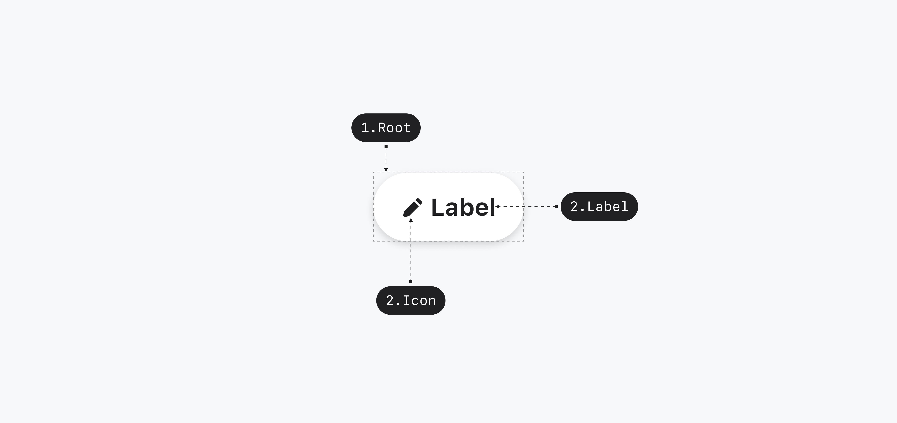
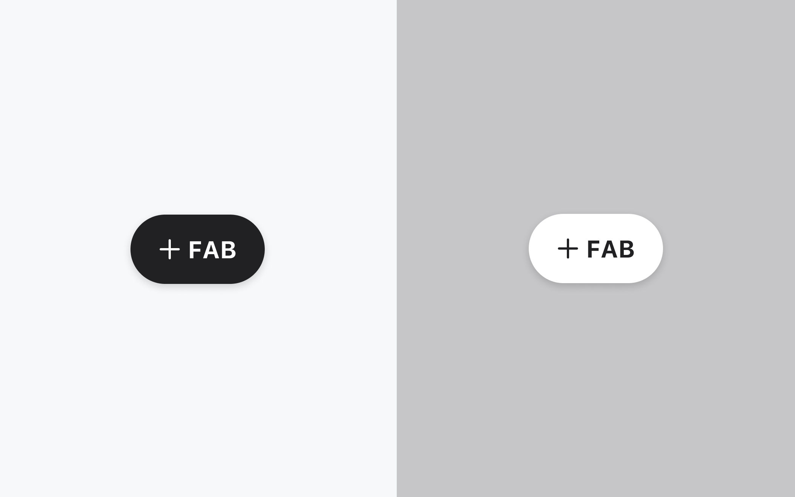

## 구조도

<Anatomy></Anatomy>

1. Root - ButtonPrimitive.Root
2. Label - ButtonPrimitive.Label
3. Icon

## 옵션

<HalfCard>
  <HalfCardImageCell>
    
  </HalfCardImageCell>
  <HalfCardDescriptionCell>
    <HalfCardDescriptionTitle>Size</HalfCardDescriptionTitle>
    <HalfCardDescription>
      Extended FAB는 small, medium 2개의 사이즈를 가질 수 있습니다. small이 가장
      보편적으로 사용되며, 다른 사이즈는 페이지 내의 중요도가 높은 경우에
      제한적으로 사용합니다.
    </HalfCardDescription>
  </HalfCardDescriptionCell>
</HalfCard>

<HalfCard>
  <HalfCardImageCell>
    
  </HalfCardImageCell>
  <HalfCardDescriptionCell>
    <HalfCardDescriptionTitle>Variant</HalfCardDescriptionTitle>
    <HalfCardDescription>
      Over paper는 가장 보편적으로 사용됩니다. Over image는 이미지 캐러셀,
      지도와 같이 시각적으로 채도나 복잡도가 높은 화면 위에서 사용합니다.
    </HalfCardDescription>
  </HalfCardDescriptionCell>
</HalfCard>

<HalfCard>
  <HalfCardImageCell>
    
  </HalfCardImageCell>
  <HalfCardDescriptionCell>
    <HalfCardDescriptionTitle>Icon / Label</HalfCardDescriptionTitle>
    <HalfCardDescription>
      Icon과 Label을 통해 유저에게 FAB을 클릭하면 발생할 액션에 대한 힌트를
      제공합니다. 목적과 컨텍스트에 맞는 의미 전달과 직관성을 고려하여 적절한
      icon과 label을 선택해야 합니다.
    </HalfCardDescription>
  </HalfCardDescriptionCell>
</HalfCard>

### 옵션 테이블

| 속성    | 값                     | 기본값     |
| ------- | ---------------------- | ---------- |
| size    | medium, small          | small      |
| variant | over paper, over image | over paper |
| icon    | Icon                   |            |
| label   | text                   |            |

## 상호작용

<FullCard>
  <FullCardImageCell>
    
  </FullCardImageCell>
  <FullCardDescription>
    마우스 클릭 또는 터치로 Extended FAB와 상호작용할 수 있습니다.
  </FullCardDescription>
</FullCard>

### 키보드

<HalfCard>
  <HalfCardImageCell>
    
  </HalfCardImageCell>
  <HalfCardDescriptionCell>
    <HalfCardDescriptionTitle>Action</HalfCardDescriptionTitle>
    <HalfCardDescription>
      <Keyboard>Space</Keyboard> 또는 <Keyboard>Enter</Keyboard>키를 통해
      Extended FAB의 액션을 실행시킬 수 있습니다.
    </HalfCardDescription>
  </HalfCardDescriptionCell>
</HalfCard>

## 가이드라인

Working In Progress
