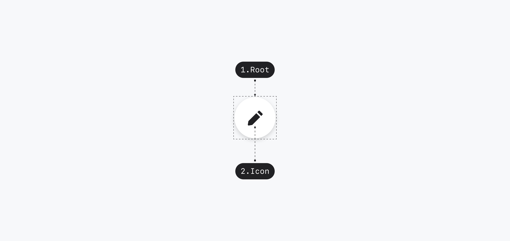
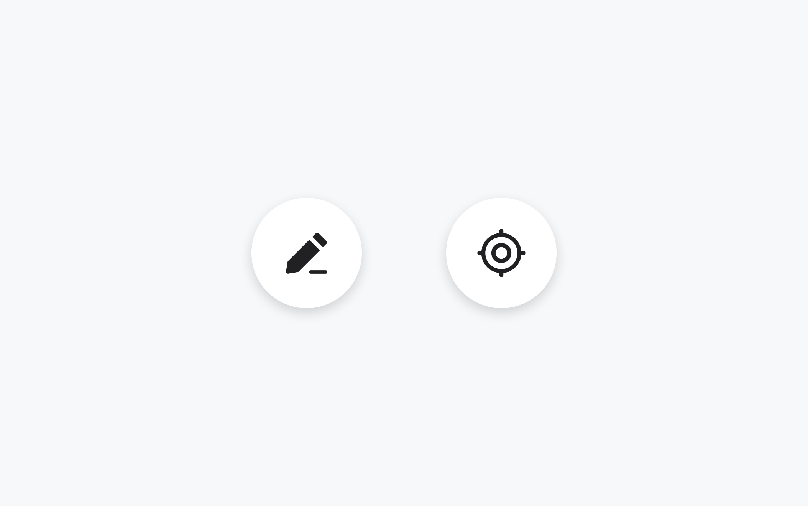
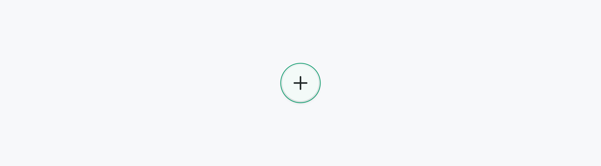
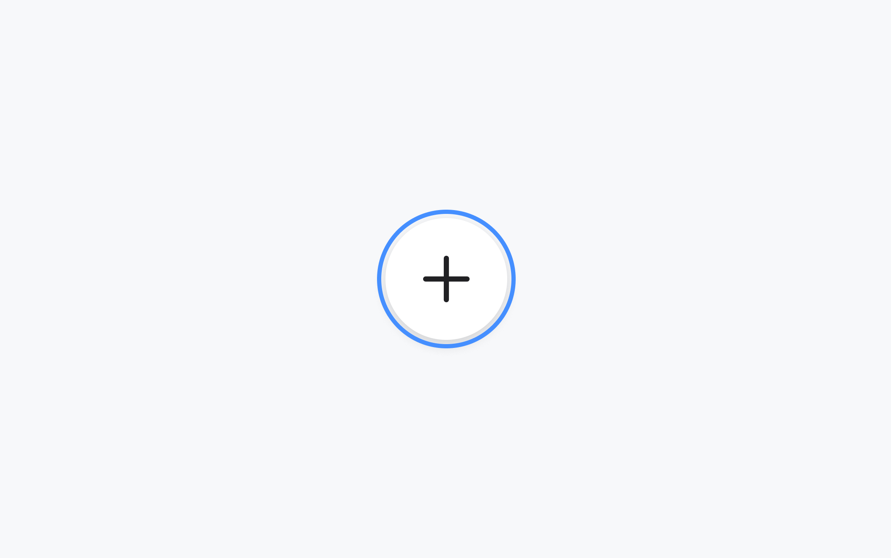

## 구조도

<Anatomy></Anatomy>

1. Root : Button 컴포넌트를 감싸는 컨테이너 영역 - ButtonPrimitive.Root
2. Icon : Button에 대한 정보를 전달하는 아이콘

## 컴포넌트 미리보기

<Iframe
  src="https://sprout-storybook.vercel.app/iframe.html?args=&id=components-fabs-fab--basic&viewMode=story"
  height="100px"
/>

## 옵션

<HalfCard>
  <HalfCardImageCell>
    
  </HalfCardImageCell>
  <HalfCardDescriptionCell>
    <HalfCardDescriptionTitle>Size</HalfCardDescriptionTitle>
    <HalfCardDescription>
      FAB는 small, medium 2개의 사이즈를 가질 수 있습니다. small이 가장
      보편적으로 사용되며, 다른 사이즈는 페이지 내의 중요도가 높은 경우에
      제한적으로 사용합니다.
    </HalfCardDescription>
  </HalfCardDescriptionCell>
</HalfCard>

<HalfCard>
  <HalfCardImageCell>
    
  </HalfCardImageCell>
  <HalfCardDescriptionCell>
    <HalfCardDescriptionTitle>Icon</HalfCardDescriptionTitle>
    <HalfCardDescription>
      FAB는 icon을 통해 유저에게 FAB을 클릭하면 발생할 액션에 대한 힌트를
      제공합니다. 목적과 컨텍스트에 맞는 의미 전달과 직관성을 고려하여 적절한
      아이콘을 선택해야 합니다.
    </HalfCardDescription>
  </HalfCardDescriptionCell>
</HalfCard>

### 옵션 테이블

| 속성 | 값            | 기본값 |
| ---- | ------------- | ------ |
| size | medium, small | small  |
| icon | Icon          |        |

## 상호작용

<FullCard>
  <FullCardImageCell>
    
  </FullCardImageCell>
  <FullCardDescription>
    마우스 클릭 또는 터치로 FAB와 상호작용할 수 있습니다.
  </FullCardDescription>
</FullCard>

### 키보드

<HalfCard>
  <HalfCardImageCell>
    
  </HalfCardImageCell>
  <HalfCardDescriptionCell>
    <HalfCardDescriptionTitle>Action</HalfCardDescriptionTitle>
    <HalfCardDescription>
      <Keyboard>Space</Keyboard> 또는 <Keyboard>Enter</Keyboard>키를 통해 FAB의
      액션을 실행시킬 수 있습니다.
    </HalfCardDescription>
  </HalfCardDescriptionCell>
</HalfCard>

## 가이드라인

Working In Progress
