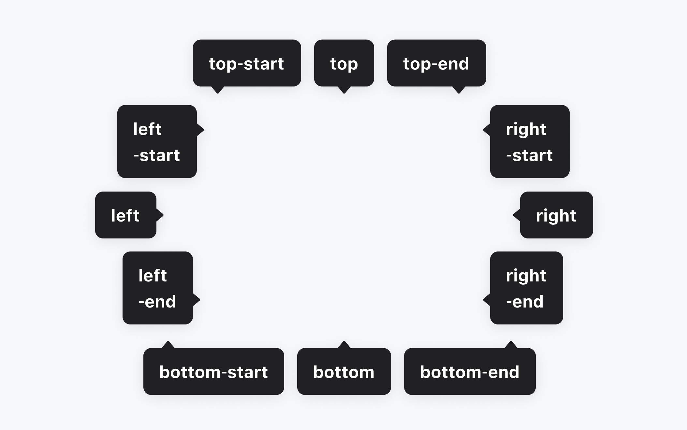
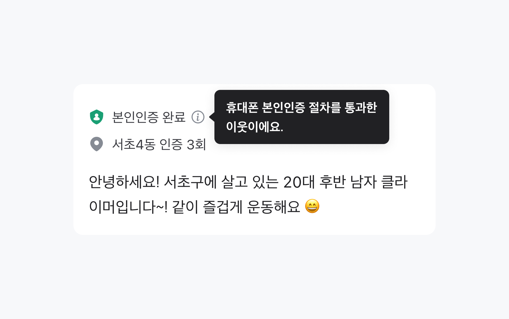
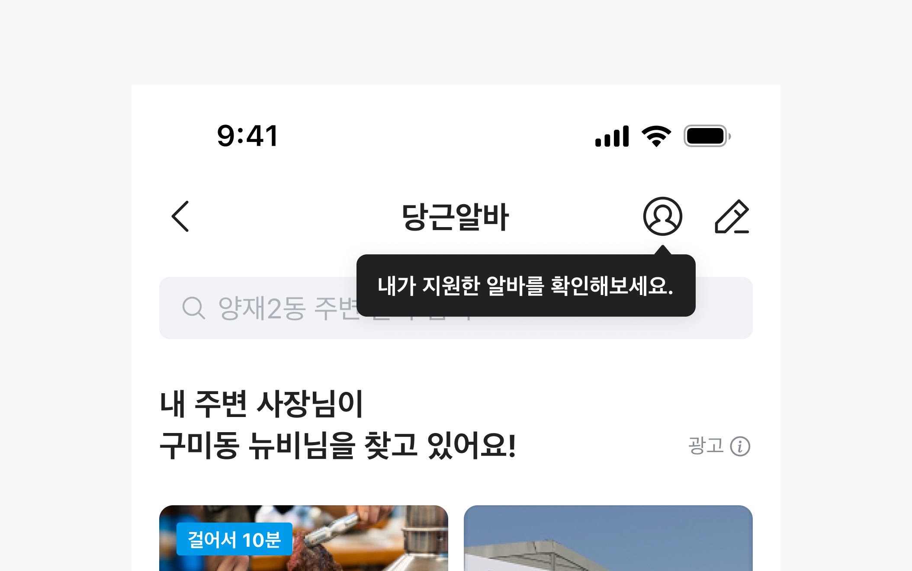
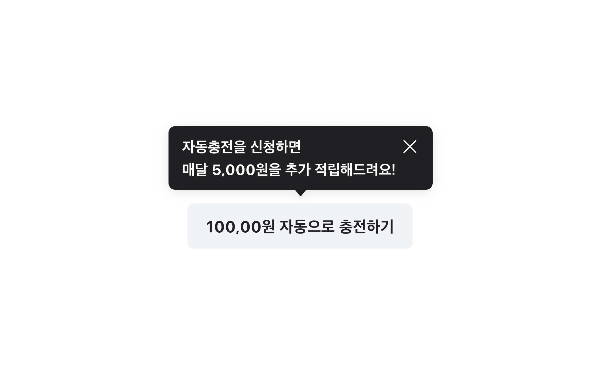

## 구조도

<Anatomy></Anatomy>

1. Trigger
2. Anchor
3. Backdrop
4. Arrow
5. Content
6. Message
7. Close Trigger

## 컴포넌트 미리보기

<Iframe
  src="https://sprout-storybook.vercel.app/iframe.html?args=&id=components-helpbubble-helpbubbletrigger--over-component&viewMode=story"
  height="260px"
/>

## 옵션

<HalfCard>
  <HalfCardImageCell>
    
  </HalfCardImageCell>
  <HalfCardDescriptionCell>
    <HalfCardDescriptionTitle>Placement</HalfCardDescriptionTitle>
    <HalfCardDescription>
      Help Bubble은 Trigger를 기준으로 위치를 지정합니다. 다양한 Placement
      옵션을 적절히 배치하여, 유저가 최대한 편리하게 정보를 이해하고 접근할 수
      있도록 도와줍니다.
    </HalfCardDescription>
  </HalfCardDescriptionCell>
</HalfCard>

<HalfCard>
  <HalfCardImageCell>
    
  </HalfCardImageCell>
  <HalfCardDescriptionCell>
    <HalfCardDescriptionTitle>Offset</HalfCardDescriptionTitle>
    <HalfCardDescription>
      Offset은 Help Bubble과 Trigger 사이의 거리 값입니다. 기본값은 8입니다.
    </HalfCardDescription>
  </HalfCardDescriptionCell>
</HalfCard>

<HalfCard>
  <HalfCardImageCell>
    
  </HalfCardImageCell>
  <HalfCardDescriptionCell>
    <HalfCardDescriptionTitle>Modal</HalfCardDescriptionTitle>
    <HalfCardDescription>
      Modal 옵션은 유저의 화면을 일시적으로 멈춘 뒤 전달해야 하는 중요한 정보인
      경우에 사용합니다. 다른 요소와 상호작용 할 수 없음을 Backdrop을 통해
      전달합니다.
    </HalfCardDescription>
  </HalfCardDescriptionCell>
</HalfCard>

<HalfCard>
  <HalfCardImageCell>
    
  </HalfCardImageCell>
  <HalfCardDescriptionCell>
    <HalfCardDescriptionTitle>Close Trigger</HalfCardDescriptionTitle>
    <HalfCardDescription>
      Help Bubble은 Close trigger를 가질 수 있습니다. 유저가 Help Bubble의
      내용을 모두 읽었거나, 더 이상 필요하지 않을 때 Close trigger를 통해 닫을
      수 있습니다.
    </HalfCardDescription>
  </HalfCardDescriptionCell>
</HalfCard>

<HalfCard>
  <HalfCardImageCell>
    
  </HalfCardImageCell>
  <HalfCardDescriptionCell>
    <HalfCardDescriptionTitle>
      Close On Interact Outside
    </HalfCardDescriptionTitle>
    <HalfCardDescription>
      Help Bubble 외부를 클릭하거나 터치, 또는 <Keyboard>Tab</Keyboard>키를 통해
      다른 요소에 Focus 했을 때 Help Bubble을 닫을지 여부를 결정할 수 있습니다.
    </HalfCardDescription>
  </HalfCardDescriptionCell>
</HalfCard>

### 옵션 테이블

| 속성                      | 값                                                                                                                                           | 기본값   |
| ------------------------- | -------------------------------------------------------------------------------------------------------------------------------------------- | -------- |
| placement                 | "top", "top-start", "top-end", "right", "right-start", "right-end", "bottom", "bottom-start", "bottom-end", "left", "left-start", "left-end" | "bottom" |
| offset                    | number                                                                                                                                       | 8pt      |
| cross offset              | number                                                                                                                                       | 0pt      |
| is modal                  | false, true                                                                                                                                  | gray     |
| default open              | false, true                                                                                                                                  | false    |
| show close trigger        | false, true                                                                                                                                  | false    |
| close on interact outside | false, true                                                                                                                                  | true     |

## 상호작용

<FullCard>
  <FullCardImageCell>
    
  </FullCardImageCell>
  <FullCardDescription>
    Click, Touch는 Close Button 영역에만 작동합니다.
  </FullCardDescription>
</FullCard>

### 키보드

<HalfCard>
  <HalfCardImageCell>
    
  </HalfCardImageCell>
  <HalfCardDescriptionCell>
    <HalfCardDescriptionTitle>Dismiss</HalfCardDescriptionTitle>
    <HalfCardDescription>
      <Keyboard>Esc</Keyboard>키를 통해 Help Bubble을 닫을 수 있습니다.
    </HalfCardDescription>
  </HalfCardDescriptionCell>
</HalfCard>

## 가이드라인

<HalfCard>
  <HalfCardImageCell>
    
  </HalfCardImageCell>
  <HalfCardDescriptionCell>
    <HalfCardDescriptionTitle>Trigger</HalfCardDescriptionTitle>
    <HalfCardDescription>
      Trigger 사용을 통해 유저가 Help Bubble에 접근할 수 있도록 유도할 수
      있습니다. 주로 직관적인 Text Button이나 Icon을 사용합니다.
    </HalfCardDescription>
  </HalfCardDescriptionCell>
</HalfCard>

<HalfCard>
  <HalfCardImageCell>
    
  </HalfCardImageCell>
  <HalfCardDescriptionCell>
    <HalfCardDescriptionTitle>간결한 문구</HalfCardDescriptionTitle>
    <HalfCardDescription>
      문구는 최대한 간결하게 작성하고, 불필요한 부가정보는 최소화합니다.
    </HalfCardDescription>
  </HalfCardDescriptionCell>
</HalfCard>

<HalfCard>
  <HalfCardImageCell>
    
  </HalfCardImageCell>
  <HalfCardDescriptionCell>
    <HalfCardDescriptionTitle>Close Button</HalfCardDescriptionTitle>
    <HalfCardDescription>
      Help Bubble은 화면에 Overlay되는 컴포넌트로, 내용을 가려 사용자 경험을
      방해할 수 있습니다. 유저가 Help Bubble의 내용을 확인한 후 닫을 수 있도록
      Close Button을 활용합니다.
    </HalfCardDescription>
  </HalfCardDescriptionCell>
</HalfCard>
