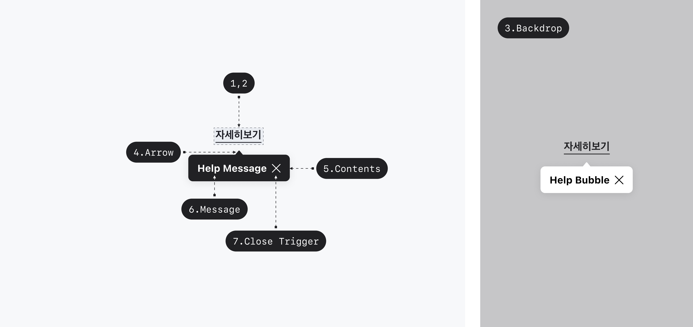
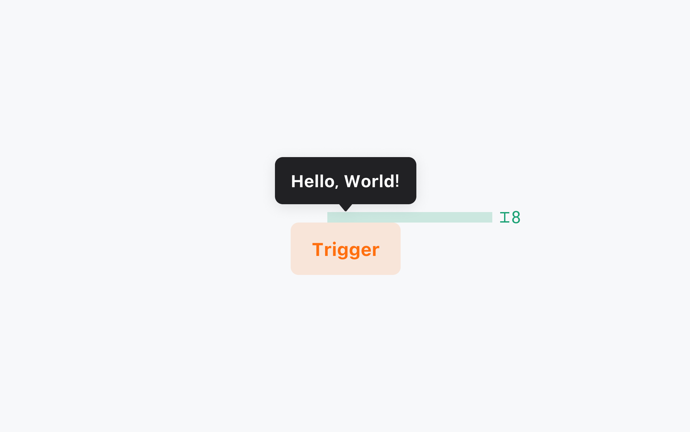
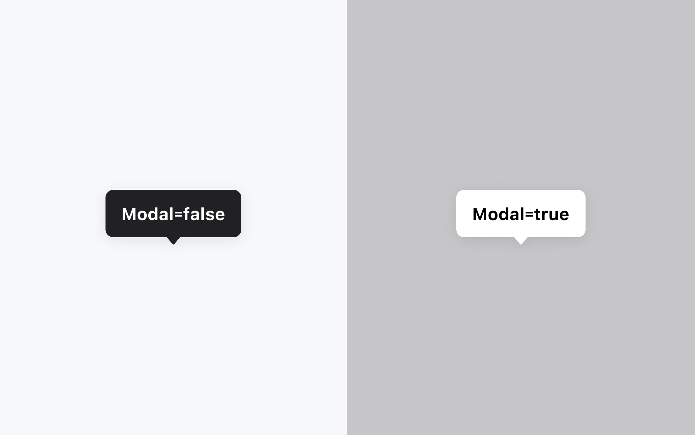

## 구조도

<Anatomy></Anatomy>

1. Trigger
2. Anchor
3. Backdrop
4. Arrow
5. Content
6. Message
7. Close Trigger

## 옵션

<HalfCard>
  <HalfCardImageCell>
    
  </HalfCardImageCell>
  <HalfCardDescriptionCell>
    <HalfCardDescriptionTitle>Placement</HalfCardDescriptionTitle>
    <HalfCardDescription>
      Help Bubble은 Trigger를 기준으로 위치를 지정합니다. 다양한 Placement
      옵션을 적절히 배치하여, 유저가 최대한 편리하게 정보를 이해하고 접근할 수
      있도록 도와줍니다.
    </HalfCardDescription>
  </HalfCardDescriptionCell>
</HalfCard>

<HalfCard>
  <HalfCardImageCell>
    
  </HalfCardImageCell>
  <HalfCardDescriptionCell>
    <HalfCardDescriptionTitle>Offset</HalfCardDescriptionTitle>
    <HalfCardDescription>
      Offset은 Help Bubble과 Trigger 사이의 거리 값입니다. 기본값은 8입니다.
    </HalfCardDescription>
  </HalfCardDescriptionCell>
</HalfCard>

<HalfCard>
  <HalfCardImageCell>
    
  </HalfCardImageCell>
  <HalfCardDescriptionCell>
    <HalfCardDescriptionTitle>Modal</HalfCardDescriptionTitle>
    <HalfCardDescription>
      Modal 옵션은 Backdrop 여부에 따라 제공합니다. 유저의 화면을 일시적으로
      멈춘 뒤 전달해야 하는 중요한 정보인 경우에 해당 옵션을 사용합니다.
    </HalfCardDescription>
  </HalfCardDescriptionCell>
</HalfCard>

<HalfCard>
  <HalfCardImageCell>
    
  </HalfCardImageCell>
  <HalfCardDescriptionCell>
    <HalfCardDescriptionTitle>Close Trigger</HalfCardDescriptionTitle>
    <HalfCardDescription>
      Help Bubble은 Close trigger를 가질 수 있습니다. 유저가 Help Bubble의
      내용을 모두 읽었거나, 더 이상 필요하지 않을 때 Close trigger를 통해 닫을
      수 있습니다.
    </HalfCardDescription>
  </HalfCardDescriptionCell>
</HalfCard>

### 옵션 테이블

| 속성                      | 값                                                                                                                                           | 기본값         |
| ------------------------- | -------------------------------------------------------------------------------------------------------------------------------------------- | -------------- |
| placement                 | "top", "top-start", "top-end", "right", "right-start", "right-end", "bottom", "bottom-start", "bottom-end", "left", "left-start", "left-end" | "bottom-start" |
| offset                    | number                                                                                                                                       | 8pt            |
| cross offset              | number                                                                                                                                       | 0pt            |
| is modal                  | false, true                                                                                                                                  | gray           |
| default open              | false, true                                                                                                                                  | false          |
| show close trigger        | false, true                                                                                                                                  | false          |
| close on interact outside | false, true                                                                                                                                  | true           |

## 상호작용

Working In Progress

## 가이드라인

Working In Progress
