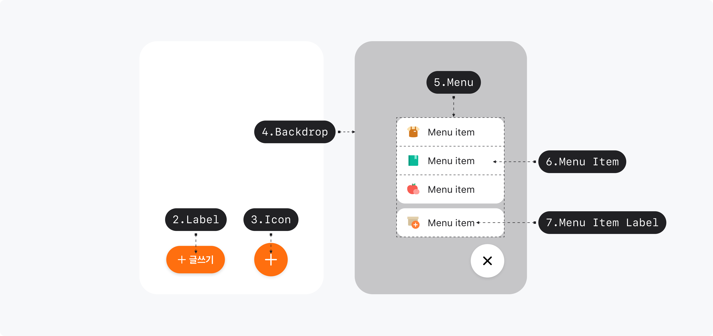

## Anatomy

1. Trigger - ButtonPrimitive.Root
2. Trigger Label - ButtonPrimitive.Label
3. Trigger Icon
4. Backdrop
5. Menu
6. Primary Menu Item
7. Menu Item
8. Menu Item Group
9. Menu Item Icon
10. Menu Item Label

## Root

### Visually Represented States

| State  | Condition      |
| ------ | -------------- |
| Closed | isOpen = false |
| Open   | isOpen = true  |

### 디자인 결정 (Color)

| State  | Part     | Attribute | Value                       |
| ------ | -------- | --------- | --------------------------- |
| \*     | Backdrop | Color     | $semantic.color.overlay-dim |
| Closed | Backdrop | Opacity   | 0%                          |
|        | Menu     | Opacity   | 0%                          |
| Open   | Backdrop | Opacity   | 100%                        |
|        | Menu     | Opacity   | 100%                        |

### 디자인 결정 (Layout)

| Part           | Attribute | Value |
| -------------- | --------- | ----- |
| Menu / Trigger | Spacing   | 12pt  |

### 디자인 결정 (Transform)

| State  | Part | Attribute | Value            |
| ------ | ---- | --------- | ---------------- |
| Closed | Menu | Transform | translateY(25pt) |
|        |      |           | scale(0.3)       |
| Open   | Menu | Transform | translateY(0pt)  |
|        |      |           | scale(1)         |

### 디자인 결정 (Motion)

| From   | To     | Part     | Property  | Attribute       | Value                                  |
| ------ | ------ | -------- | --------- | --------------- | -------------------------------------- |
| Closed | Open   | Backdrop | Opacity   | Duration        | 100ms                                  |
|        |        |          |           | Delay           | 50ms                                   |
|        |        | Menu     | Opacity   | Duration        | 150ms                                  |
|        |        |          |           | Timing Function | $scale.timing-function.standard-easing |
|        |        |          |           | Timing Function | $scale.timing-function.standard-easing |
|        |        |          | Transform | Duration        | 200ms                                  |
|        |        |          |           | Timing Function | $scale.timing-function.standard-easing |
| Open   | Closed | Backdrop | Opacity   | Duration        | 100ms                                  |
|        |        |          |           | Timing Function | $scale.timing-function.standard-easing |
|        |        | Menu     | Opacity   | Duration        | 150ms                                  |
|        |        |          |           | Timing Function | $scale.timing-function.standard-easing |
|        |        |          | Transform | Duration        | 150ms                                  |
|        |        |          |           | Timing Function | $scale.timing-function.standard-easing |

## Trigger

### Visual Options

| Property   | Value       |
| ---------- | ----------- |
| isExtended | false, true |
| label      | text        |

### Visually Represented States

| State   | Condition         |
| ------- | ----------------- |
| Enabled | isPressed = false |
| Pressed | isPressed = true  |

| State     | Condition                          |
| --------- | ---------------------------------- |
| Shortened | isOpen = false, isExtended = false |
| Extended  | isOpen = false, isExtended = true  |
| Closed    | isOpen = false                     |
| Open      | isOpen = true                      |

### 디자인 결정 (Color)

| State           | Part        | Attribute | Value                           |
| --------------- | ----------- | --------- | ------------------------------- |
| Closed, Enabled | Trigger     | Color     | $semantic.color.primary         |
|                 | Label, Icon | Color     | $semantic.color.on-primary      |
| Closed, Pressed | Trigger     | Color     | $semantic.color.primary-pressed |
|                 | Label, Icon | Color     | $semantic.color.on-primary      |
| Open, Enabled   | Trigger     | Color     | $semantic.color.paper-floating  |
|                 | Label, Icon | Color     | $scale.color.gray-900           |
| Open, Pressed   | Trigger     | Color     | $semantic.color.gray-pressed    |
|                 | Label, Icon | Color     | $scale.color.gray-900           |

### 디자인 결정 (Typography)

| Part  | Attribute  | Value                            |
| ----- | ---------- | -------------------------------- |
| Label | Typography | $semantic.typography.label2-bold |

### 디자인 결정 (Shadow)

| Part | Attribute            | Value   |
| ---- | -------------------- | ------- |
| Root | Shadow Offset X      | 0pt     |
|      | Shadow Offset Y      | 2pt     |
|      | Shadow Blur Radius   | 6pt     |
|      | Shadow Spread Radius | 0pt     |
|      | Shadow Color         | #000000 |
|      | Shadow Opacity       | 0.10    |

### 디자인 결정 (Layout)

| State           | Part                         | Attribute          | Value |
| --------------- | ---------------------------- | ------------------ | ----- |
| Shortened, Open | Trigger                      | Padding            | 16pt  |
|                 |                              | Corner Radius      | Full  |
|                 | Trigger Icon                 | Size               | 24pt  |
| Extended        | Trigger                      | Horizontal Padding | 18pt  |
|                 |                              | Vertical Padding   | 18pt  |
|                 |                              | Corner Radius      | Full  |
|                 | Trigger Icon                 | Size               | 16pt  |
|                 | Trigger Icon / Trigger Label | Spacing            | 4pt   |

### 디자인 결정 (Transform)

| State     | Part          | Attribute | Value           |
| --------- | ------------- | --------- | --------------- |
| Extended  | Trigger Label | Transform | translateX(8pt) |
| Shortened | Trigger Label | Transform | translateX(0pt) |
| Open      | Trigger Label | Transform | translateX(8pt) |
|           | Trigger Icon  | Transform | rotate(45deg)   |

### 디자인 결정 (Motion)

| From      | To        | Part          | Property  | Attribute       | Value                                  |
| --------- | --------- | ------------- | --------- | --------------- | -------------------------------------- |
| Shortened | Extended  | Trigger       | Layout    | Duration        | 250ms                                  |
|           |           |               |           | Timing Function | $scale.timing-function.standard-easing |
|           |           | Trigger Label | Opacity   | Duration        | 100ms                                  |
|           |           |               |           | Delay           | 50ms                                   |
|           |           |               |           | Timing Function | $scale.timing-function.standard-easing |
| Extended  | Shortened | Trigger       | Layout    | Duration        | 250ms                                  |
|           |           |               |           | Timing Function | $scale.timing-function.standard-easing |
|           |           | Trigger Label | Opacity   | Duration        | 100ms                                  |
|           |           |               |           | Delay           | 50ms                                   |
|           |           |               |           | Timing Function | $scale.timing-function.standard-easing |
| Extended  | Open      | Trigger       | Layout    | Duration        | 200ms                                  |
|           |           |               |           | Timing Function | $scale.timing-function.standard-easing |
|           |           | Trigger Label | Opacity   | Duration        | 100ms                                  |
|           |           |               |           | Timing Function | $scale.timing-function.standard-easing |
| Open      | Extended  | Trigger       | Layout    | Duration        | 150ms                                  |
|           |           |               |           | Timing Function | $scale.timing-function.standard-easing |
|           |           | Trigger Label | Opacity   | Duration        | 100ms                                  |
|           |           |               |           | Timing Function | $scale.timing-function.standard-easing |
| Shortened | Open      | Trigger Icon  | Transform | Duration        | 200ms                                  |
|           |           |               |           | Timing Function | $scale.timing-function.standard-easing |
| Oepn      | Shortened | Trigger Icon  | Transform | Duration        | 200ms                                  |
|           |           |               |           | Timing Function | $scale.timing-function.standard-easing |

## Primary Menu Item

### 디자인 결정 (Color)

| State   | Part              | Attribute | Value                          |
| ------- | ----------------- | --------- | ------------------------------ |
| Enabled | Primary Menu Item | Color     | $semantic.color.paper-floating |
| Hovered | Primary Menu Item | Color     | $scale.color.gray-alpha-50     |
| Pressed | Primary Menu Item | Color     | $scale.color.gray-alpha-50     |

### 디자인 결정 (Typography)

| Part                    | Attribute  | Value                               |
| ----------------------- | ---------- | ----------------------------------- |
| Primary Menu Item Label | Typography | $semantic.typography.label2-regular |

### 디자인 결정 (Shadow)

| Part            | Attribute            | Value   |
| --------------- | -------------------- | ------- |
| Menu Item Group | Shadow Offset X      | 0pt     |
|                 | Shadow Offset Y      | 2pt     |
|                 | Shadow Blur Radius   | 6pt     |
|                 | Shadow Spread Radius | 0pt     |
|                 | Shadow Color         | #000000 |
|                 | Shadow Opacity       | 0.10    |

### 디자인 결정 (Layout)

| Part                                | Attribute          | Value |
| ----------------------------------- | ------------------ | ----- |
| Primary Menu Item                   | Horizontal Padding | 16pt  |
|                                     | Vertical Padding   | 14pt  |
|                                     | Corner Radius      | 14pt  |
| Menu Item Group / Primary Menu Item | Spacing            | 8pt   |

## Menu Item

### 디자인 결정 (Color)

| State   | Part            | Attribute | Value                      |
| ------- | --------------- | --------- | -------------------------- |
| Enabled | Menu Item Label | Color     | $scale.color.gray-900      |
| Hovered | Menu Item       | Color     | $scale.color.gray-alpha-50 |
| Hovered | Menu Item Label | Color     | $scale.color.gray-900      |
| Pressed | Menu Item       | Color     | $scale.color.gray-alpha-50 |
| Pressed | Menu Item Label | Color     | $scale.color.gray-900      |

### 디자인 결정 (Typography)

| Part            | Attribute  | Value                               |
| --------------- | ---------- | ----------------------------------- |
| Menu Item Label | Typography | $semantic.typography.label2-regular |

### 디자인 결정 (Layout)

| Part                             | Attribute          | Value |
| -------------------------------- | ------------------ | ----- |
| Menu Item                        | Horizontal Padding | 16pt  |
| Menu Item                        | Vertical Padding   | 12pt  |
| Menu Item Icon                   | Size               | 20pt  |
| Menu Item Icon / Menu Item Label | Spacing            | 12pt  |

## Menu Item Group

### 디자인 결정 (Color)

| Part            | Attribute | Value                          |
| --------------- | --------- | ------------------------------ |
| Menu Item Group | Color     | $semantic.color.paper-floating |

### 디자인 결정 (Shadow)

| Part            | Attribute            | Value   |
| --------------- | -------------------- | ------- |
| Menu Item Group | Shadow Offset X      | 0pt     |
|                 | Shadow Offset Y      | 2pt     |
|                 | Shadow Blur Radius   | 6pt     |
|                 | Shadow Spread Radius | 0pt     |
|                 | Shadow Color         | #000000 |
|                 | Shadow Opacity       | 0.10    |

### 디자인 결정 (Layout)

| Part            | Attribute     | Value |
| --------------- | ------------- | ----- |
| Menu Item Group | Corner Radius | 14pt  |
