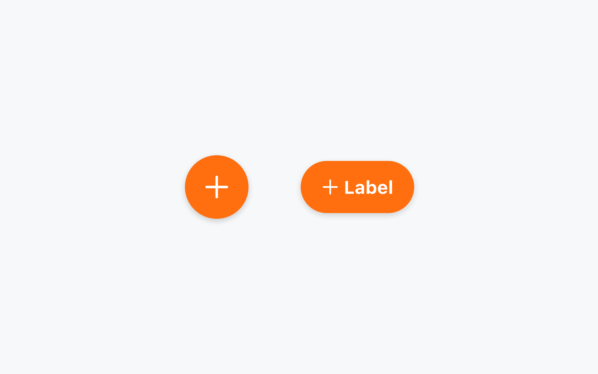
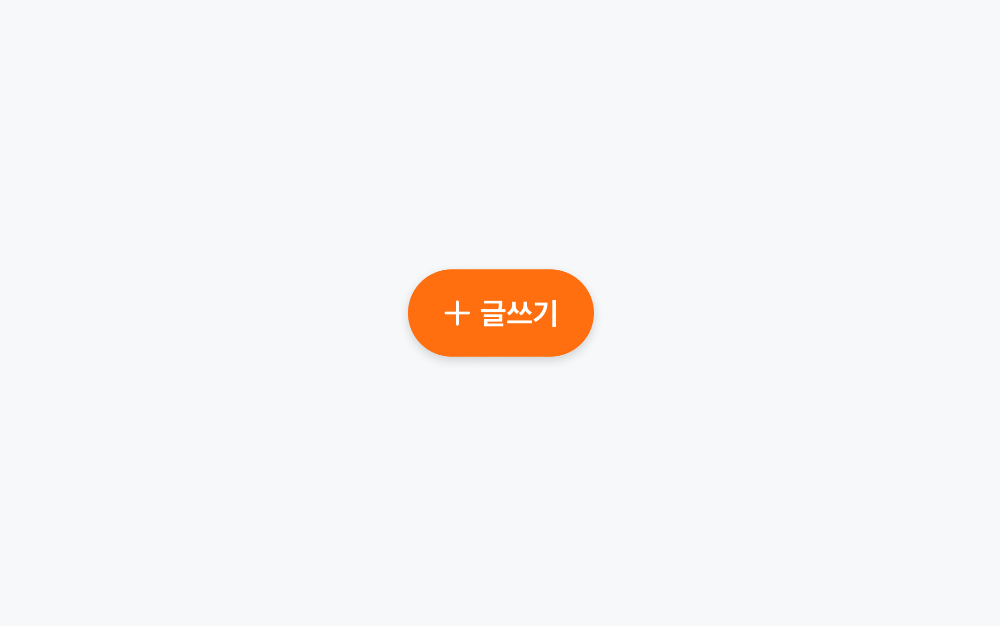
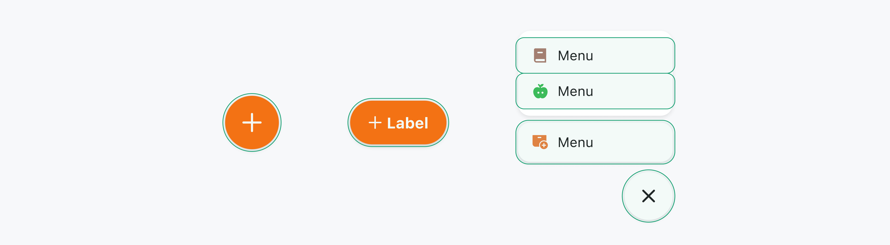
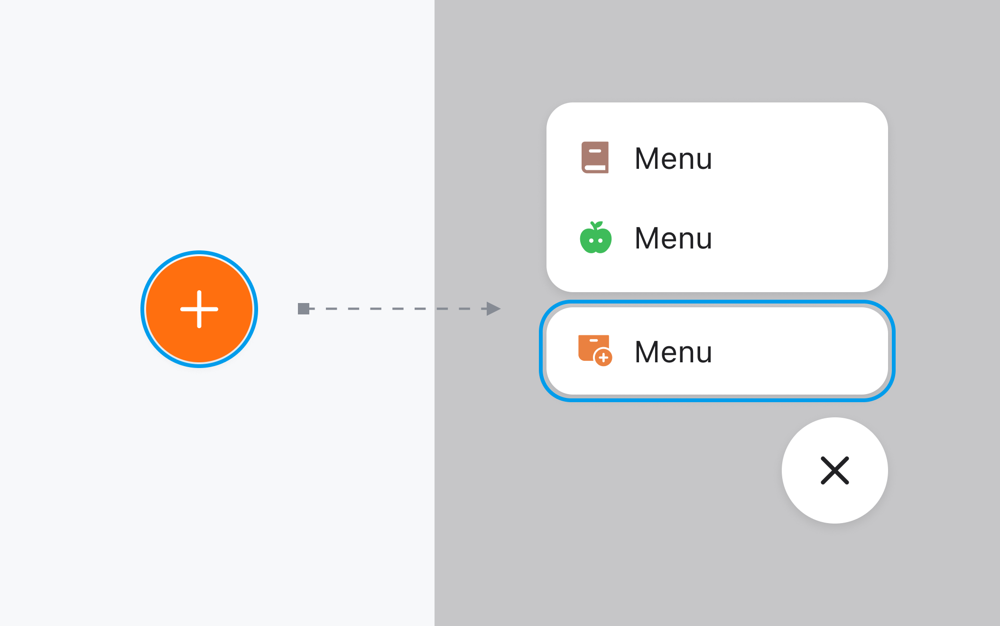
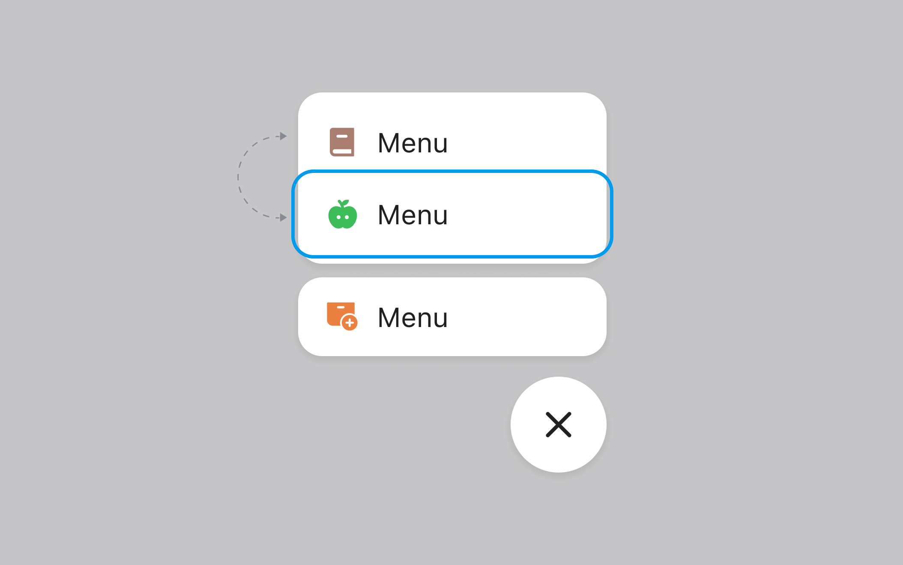
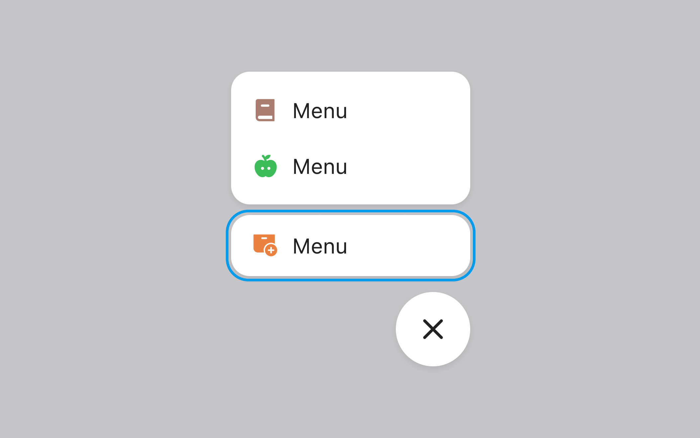
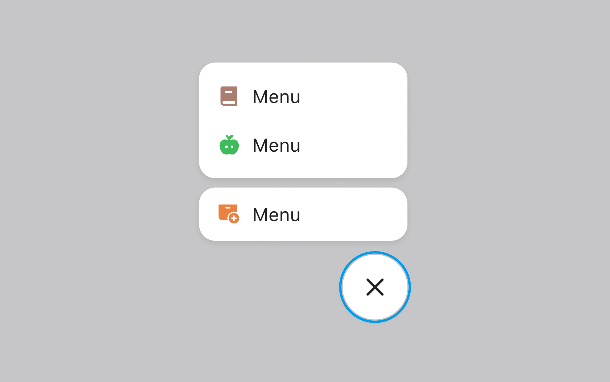

## 구조도

<Anatomy></Anatomy>

1. Button - ButtonPrimitive.Button
2. Label - ButtonPrimitive.Label
3. Icon
4. Backdrop
5. Menu
6. Menu Item
7. Menu Item Label
8. Menu Item Group

## 옵션

<HalfCard>
  <HalfCardImageCell>
    
  </HalfCardImageCell>
  <HalfCardDescriptionCell>
    <HalfCardDescriptionTitle>Extended</HalfCardDescriptionTitle>
    <HalfCardDescription>
      Menu FAB는 Extended 옵션을 통해 Label을 보조적으로 표현할 수 있습니다.
      주로 스크롤 인터랙션에 맞추어 제공합니다.
    </HalfCardDescription>
  </HalfCardDescriptionCell>
</HalfCard>

<HalfCard>
  <HalfCardImageCell>
    
  </HalfCardImageCell>
  <HalfCardDescriptionCell>
    <HalfCardDescriptionTitle>Label</HalfCardDescriptionTitle>
    <HalfCardDescription>
      Label 옵션은 Icon을 보조하며, 유저가 Menu FAB를 클릭했을 시 발생할 액션에
      대해 명확한 정보를 전달합니다.
    </HalfCardDescription>
  </HalfCardDescriptionCell>
</HalfCard>

### 옵션 테이블

| 속성       | 값          | 기본값 |
| ---------- | ----------- | ------ |
| isExtended | false, true | false  |
| label      | text        |        |

## 상호작용

<FullCard>
  <FullCardImageCell>
    
  </FullCardImageCell>
  <FullCardDescription>
    마우스 클릭 또는 터치로 Menu FAB와 상호작용할 수 있습니다.
  </FullCardDescription>
</FullCard>

### 키보드

<HalfCard>
  <HalfCardImageCell>
    
  </HalfCardImageCell>
  <HalfCardDescriptionCell>
    <HalfCardDescriptionTitle>Menu Open</HalfCardDescriptionTitle>
    <HalfCardDescription>
      Trigger에 Focus된 상태에서 <Keyboard>Space</Keyboard> 또는
      <Keyboard>Enter</Keyboard>키를 통해 Menu를 열 수 있습니다. 이때 Focus가 Primary
      Menu Item으로 이동합니다.
    </HalfCardDescription>
  </HalfCardDescriptionCell>
</HalfCard>

<HalfCard>
  <HalfCardImageCell>
    
  </HalfCardImageCell>
  <HalfCardDescriptionCell>
    <HalfCardDescriptionTitle>Focus</HalfCardDescriptionTitle>
    <HalfCardDescription>
      <Keyboard>↑</Keyboard> 또는 <Keyboard>↓</Keyboard>키를 통해 Menu Item간
      Focus 이동이 가능합니다.
    </HalfCardDescription>
  </HalfCardDescriptionCell>
</HalfCard>

<HalfCard>
  <HalfCardImageCell>
    
  </HalfCardImageCell>
  <HalfCardDescriptionCell>
    <HalfCardDescriptionTitle>Action</HalfCardDescriptionTitle>
    <HalfCardDescription>
      Menu Item에 Focus된 상태에서 <Keyboard>Space</Keyboard> 또는
      <Keyboard>Enter</Keyboard>키를 통해 Menu Item의 액션을 실행시킬 수 있습니다.
    </HalfCardDescription>
  </HalfCardDescriptionCell>
</HalfCard>

<HalfCard>
  <HalfCardImageCell>
    
  </HalfCardImageCell>
  <HalfCardDescriptionCell>
    <HalfCardDescriptionTitle>Dismiss</HalfCardDescriptionTitle>
    <HalfCardDescription>
      <Keyboard>Esc</Keyboard>키, 혹은 Trigger에 Focus된 상태에서
      <Keyboard>Space</Keyboard> 또는
      <Keyboard>Enter</Keyboard>키를 통해 Menu를 닫을 수 있습니다.
    </HalfCardDescription>
  </HalfCardDescriptionCell>
</HalfCard>

## 가이드라인

Working In Progress
