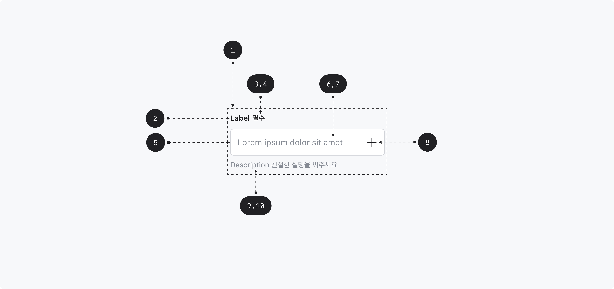

## Anatomy

1. Root - Primitive.Root
2. Label - Primitive.Label
3. Required indicator
4. Optional indicator
5. Field - Primitive.Input
6. Field text
7. Placeholder
8. Suffix
9. Description - Primitive.Description
10. Error message - Primitive.ErrorMessage

## Visual Options

| Property           | Value         | Description |
| ------------------ | ------------- | ----------- |
| size               | medium, small |             |
| label              | text          |             |
| placeholder        | text          |             |
| description        | text          |             |
| error message      | text          |             |
| required indicator | text          |             |
| optional indicator | text          |             |

## Visually Representated States

| State    | Condition                                                 |
| -------- | --------------------------------------------------------- |
| enabled  | isDisabled = false, isReadOnly = false, isFocused = false |
| focused  | isDisabled = false, isReadOnly = false, isFocused = true  |
| readonly | isDisabled = false, isReadOnly = true                     |
| disabled | isDisabled = true                                         |

| State   | Condition         |
| ------- | ----------------- |
| valid   | isInvalid = false |
| invalid | isInvalid = true  |

## 디자인 결정 (Color)

| Part  | Attribute | Value                 |
| ----- | --------- | --------------------- |
| Label | Color     | $scale.color.gray-900 |

| State    | Part           | Attribute     | Value                         |
| -------- | -------------- | ------------- | ----------------------------- |
| Enabled  | Field          | Color         | $semantic.color.paper-default |
|          |                | Outline Color | $scale.color.gray-400         |
|          | Field(invalid) | Color         | $semantic.color.danger-low    |
|          |                | Outline Color | $semantic.color.danger        |
|          | Field text     | Color         | $scale.color.gray-900         |
|          | Placeholder    | Color         | $scale.color.gray-600         |
|          | Description    | Color         | $scale.color.gray-600         |
|          | Error Message  | Color         | $semantic.color.danger        |
| Focused  | Field          | Color         | $semantic.color.paper-default |
|          |                | Outline Color | $scale.color.gray-900         |
|          | Field(invalid) | Color         | $semantic.color.danger-low    |
|          |                | Outline Color | $semantic.color.danger        |
|          | Field text     | Color         | $scale.color.gray-900         |
|          | Placeholder    | Color         | $scale.color.gray-600         |
|          | Description    | Color         | $scale.color.gray-600         |
|          | Error Message  | Color         | $semantic.color.danger        |
| Readonly | Field          | Color         | $scale.color.gray-50          |
|          |                | Outline Color | $scale.color.gray-400         |
|          | Field text     | Color         | $scale.color.gray-900         |
|          | Placeholder    | Color         | $scale.color.gray-600         |
|          | Description    | Color         | $scale.color.gray-600         |
| Disabled | Field          | Color         | $scale.color.gray-100         |
|          |                | Outline Color | $scale.color.gray-400         |
|          | Field text     | Color         | $scale.color.gray-400         |
|          | Placeholder    | Color         | $scale.color.gray-400         |
|          | Description    | Color         | $scale.color.gray-600         |

## 디자인 결정 (Typography)

### size=medium

| Part                                   | Attribute  | Value                               |
| -------------------------------------- | ---------- | ----------------------------------- |
| Label                                  | Typography | $semantic.typography.label3-bold    |
| Required Indicator, Optional Indicator | Typography | $semantic.typography.label3-regular |
| Field Text, Placeholder                | Typography | $semantic.typography.label2-regular |
| Description                            | Typography | $semantic.typography.label3-regular |

### size=small

| Part                                   | Attribute  | Value                               |
| -------------------------------------- | ---------- | ----------------------------------- |
| Label                                  | Typography | $semantic.typography.label3-bold    |
| Required Indicator, Optional Indicator | Typography | $semantic.typography.label3-regular |
| Field Text, Placeholder                | Typography | $semantic.typography.label3-regular |
| Description                            | Typography | $semantic.typography.label4-regular |

## 디자인 결정 (Layout)

### size=medium

| Part                       | Attribute          | Value |
| -------------------------- | ------------------ | ----- |
| Field                      | Corner Radius      | 6pt   |
|                            | Height             | 52pt  |
|                            | Horizontal Padding | 14pt  |
| Label / Required Indicator | Spacing            | 4pt   |
| Label / Field              | Spacing            | 12pt  |
| Field / Description        | Spacing            | 8pt   |

### size=small

| Part                       | Attribute          | Value |
| -------------------------- | ------------------ | ----- |
| Field                      | Corner Radius      | 6pt   |
|                            | Height             | 42pt  |
|                            | Horizontal Padding | 12pt  |
| Label / Required Indicator | Spacing            | 4pt   |
| Label / Field              | Spacing            | 12pt  |
| Field / Description        | Spacing            | 8pt   |
