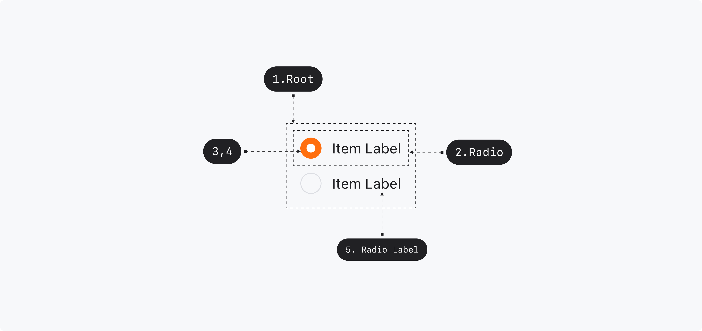

## Anatomy

<Anatomy></Anatomy>

1. Root - Primitive.Root
2. Radio - Primitive.Radio
3. Radio Control - Primitive.ItemControl
4. Radio Control Icon
5. Radio Label - Primitive.ItemLabel

## Root

### Visual Options

| Property | Value                | Description |
| -------- | -------------------- | ----------- |
| size     | small, medium, large |             |

## Radio

### Visually Represented States

| State    | Condition                                                   |
| -------- | ----------------------------------------------------------- |
| enabled  | isDisabled OFF, isHovered OFF, isFocused OFF, isPressed OFF |
| hovered  | isDisabled OFF, isPressed OFF, isHovered ON                 |
| focused  | isDisabled OFF, isPressed OFF, isFocused ON                 |
| pressed  | isDisabled OFF, isPressed ON                                |
| disabled | isDisabled ON                                               |

| State      | Condition                           |
| ---------- | ----------------------------------- |
| unselected | isIndeterminate OFF, isSelected OFF |
| selected   | isIndeterminate OFF, isSelected ON  |

| State   | Condition     |
| ------- | ------------- |
| invalid | isInvalid ON  |
| valid   | isInvalid OFF |

### 디자인 결정 (Color)

| State    | Part                         | Attribute     | Value                           |
| -------- | ---------------------------- | ------------- | ------------------------------- |
| Enabled  | Radio Control (unselected)   | Color         | None                            |
|          |                              | Outline Color | $scale.color.gray-300           |
|          | Radio Control (selected)     | Color         | $semantic.color.primary         |
|          |                              | Outline Color | None                            |
|          | Radio Control Icon(selected) | Color         | $semantic.color.on-primary      |
|          | Radio Label                  | Color         | $scale.color.gray-900           |
| Hovered  | Radio Control (unselected)   | Color         | $semantic.color.gray-hover      |
|          |                              | Outline Color | $scale.color.gray-300           |
|          | Radio Control (selected)     | Color         | $semantic.color.primary-hover   |
|          |                              | Outline Color | None                            |
|          | Radio Control Icon(selected) | Color         | $semantic.color.on-primary      |
|          | Radio Label                  | Color         | $scale.color.gray-900           |
| Pressed  | Radio Control (unselected)   | Color         | $semantic.color.gray-pressed    |
|          |                              | Outline Color | $scale.color.gray-300           |
|          | Radio Control (selected)     | Color         | $semantic.color.primary-pressed |
|          |                              | Outline Color | None                            |
|          | Radio Control Icon(selected) | Color         | $semantic.color.on-primary      |
|          | Radio Label                  | Color         | $scale.color.gray-900           |
| Disabled | Radio Control (unselected)   | Color         | $scale.color.gray-200           |
|          |                              | Outline Color | $scale.color.gray-300           |
|          | Radio Control (selected)     | Color         | None                            |
|          |                              | Outline Color | $scale.color.gray-200           |
|          | Radio Control Icon(selected) | Color         | $scale.color.gray-200           |
|          | Radio Label                  | Color         | $scale.color.gray-400           |

### 디자인 결정 (Typography)

#### Size=Large

| Part        | Attribute  | Value                               |
| ----------- | ---------- | ----------------------------------- |
| Radio Label | Typography | $semantic.typography.label2-regular |

#### Size=Medium

| Part        | Attribute  | Value                               |
| ----------- | ---------- | ----------------------------------- |
| Radio Label | Typography | $semantic.typography.label3-regular |

#### Size=Small

| Part        | Attribute  | Value                                 |
| ----------- | ---------- | ------------------------------------- |
| Radio Label | Typography | $semantic.typography.caption1-regular |

### 디자인 결정 (Layout)

#### Size=Large

| Part                        | Attribute  | Value |
| --------------------------- | ---------- | ----- |
| Radio                       | Min Height | 36pt  |
| Radio Control               | Size       | 24pt  |
| Radio Control Icon          | Size       | 10pt  |
| Radio Control / Radio Label | Spacing    | 8pt   |

#### Size=Medium

| Part                        | Attribute  | Value |
| --------------------------- | ---------- | ----- |
| Radio                       | Min Height | 30pt  |
| Radio Control               | Size       | 20pt  |
| Radio Control Icon          | Size       | 8pt   |
| Radio Control / Radio Label | Spacing    | 8pt   |

#### Size=Small

| Part                        | Attribute  | Value |
| --------------------------- | ---------- | ----- |
| Radio                       | Min Height | 27pt  |
| Radio Control               | Size       | 18pt  |
| Radio Control Icon          | Size       | 7pt   |
| Radio Control / Radio Label | Spacing    | 8pt   |

### 디자인 결정 (Motion)

| State      | Part               | Property  | Attribute       | Value                                  |
| ---------- | ------------------ | --------- | --------------- | -------------------------------------- |
| Selected   | Radio Control Icon | transform | Duration        | 100ms                                  |
|            |                    |           | Timing Function | $scale.timing-function.standard-easing |
| Selected   | Radio Control      | opacity   | Duration        | 50ms                                   |
|            |                    |           | Timing Function | $scale.timing-function.standard-easing |
| Unselected | Radio Control      | opacity   | Duration        | 50ms                                   |
|            |                    |           | Timing Function | $scale.timing-function.standard-easing |

#### State=Selected

| Part               | Attribute | From     | To       |
| ------------------ | --------- | -------- | -------- |
| Radio Control Icon | transform | scale(0) | scale(1) |
| Radio Control      | opacity   | 0        | 1        |

#### State=Unselected

| Part          | Attribute | From | To  |
| ------------- | --------- | ---- | --- |
| Radio Control | opacity   | 1    | 0   |
