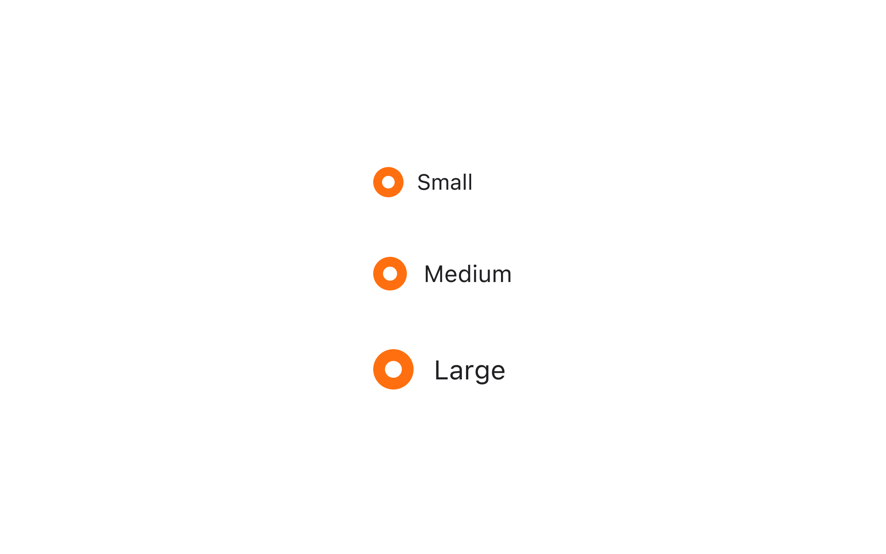

## 구조도

1. Root
2. Radio
3. Radio Control
4. Radio Control Icon
5. Radio Label

## 옵션

<HalfCard>
  <HalfCardImageCell>
    
  </HalfCardImageCell>
  <HalfCardDescriptionCell>
    <HalfCardDescriptionTitle>Label</HalfCardDescriptionTitle>
    <HalfCardDescription>
      Radio Group은 항상 Label을 가져야 합니다. Label이 설정되지 않은 라디오
      그룹은 다른 컴포넌트와의 관계가 매우 명확하고, 사용자에게 충분한 맥락을
      전달할 수 있을때만 사용합니다.
    </HalfCardDescription>
  </HalfCardDescriptionCell>
</HalfCard>

<HalfCard>
  <HalfCardImageCell>
    
  </HalfCardImageCell>
  <HalfCardDescriptionCell>
    <HalfCardDescriptionTitle>Selection</HalfCardDescriptionTitle>
    <HalfCardDescription>
      Radio Group은 selected, unselected 중 하나의 상태를 가질 수 있습니다.
    </HalfCardDescription>
  </HalfCardDescriptionCell>
</HalfCard>

<HalfCard>
  <HalfCardImageCell>
    
  </HalfCardImageCell>
  <HalfCardDescriptionCell>
    <HalfCardDescriptionTitle>Size</HalfCardDescriptionTitle>
    <HalfCardDescription>
      Radio Group은 small, medium, large 3개의 사이즈를 가질 수 있습니다.
      medium이 가장 보편적으로 사용되며, 다른 사이즈는 페이지 내의 중요도를
      나눠서 표현해야 할 때만 제한적으로 사용합니다.
    </HalfCardDescription>
  </HalfCardDescriptionCell>
</HalfCard>

<HalfCard>
  <HalfCardImageCell>
    
  </HalfCardImageCell>
  <HalfCardDescriptionCell>
    <HalfCardDescriptionTitle>Disabled</HalfCardDescriptionTitle>
    <HalfCardDescription>
      Disabled 상태는 라디오 그룹이 존재하지만 지금은 사용할 수 없는 상태를
      나타냅니다. 이 옵션은 레이아웃 일관성을 유지하고 이후 상호작용이 가능할
      수도 있음을 사용자에게 알려줍니다.
    </HalfCardDescription>
  </HalfCardDescriptionCell>
</HalfCard>

### 옵션 테이블 (Radio Group)

| 속성        | 값                   | 기본값 | 설명                                                     |
| ----------- | -------------------- | ------ | -------------------------------------------------------- |
| size        | small, medium, large | medium |                                                          |
| is disabled | true, false          | false  | true일 경우, Radio Group 전체가 유저와 상호작용하지 않음 |
| is readonly | true, false          | false  | true일 경우, isSelected를 변경할 수 없음                 |
| is required | true, false          | false  | true일 경우, isSelected = true가 필수임을 나타냄         |
| is invalid  | true, false          | false  | true일 경우, isSelected가 유효하지 않은 값임을 나타냄    |

### 옵션 테이블 (Radio)

| 속성        | 값          | 기본값 | 설명                                          |
| ----------- | ----------- | ------ | --------------------------------------------- |
| label       | text        |        |                                               |
| is disabled | true, false | false  | true일 경우, Radio가 유저와 상호작용하지 않음 |

## 상호작용

Working In Progress

## 가이드라인

Working In Progress
