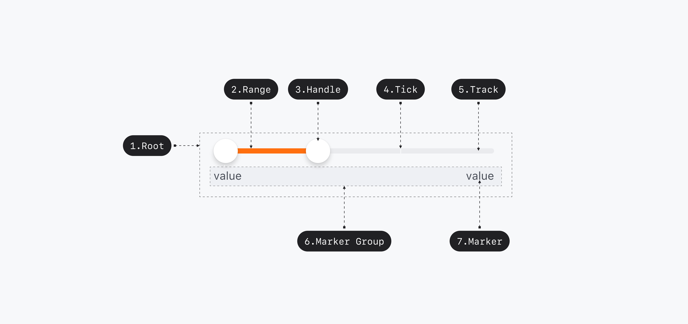

## 구조도

<Anatomy></Anatomy>

1. Root
2. Range
3. Handle
4. Tick
5. Track
6. Marker Group
7. Marker

## 옵션

<HalfCard>
  <HalfCardImageCell>
    
  </HalfCardImageCell>
  <HalfCardDescriptionCell>
    <HalfCardDescriptionTitle>Marker</HalfCardDescriptionTitle>
    <HalfCardDescription>
      Marker 옵션을 사용하여 Range Slider에 Marker와 Tick(눈금)을 표시할 수
      있습니다. 이 옵션은 사용자가 각 값의 위치를 쉽게 파악하고 선택할 수 있도록
      돕습니다.
    </HalfCardDescription>
  </HalfCardDescriptionCell>
</HalfCard>

<HalfCard>
  <HalfCardImageCell>
    
  </HalfCardImageCell>
  <HalfCardDescriptionCell>
    <HalfCardDescriptionTitle>Disabled</HalfCardDescriptionTitle>
    <HalfCardDescription>
      Disabled 상태는 Range Slider가 존재하지만 지금은 사용할 수 없는 상태를
      나타냅니다. 이 옵션은 레이아웃 일관성을 유지하고 이후 상호작용이 가능할
      수도 있음을 사용자에게 알려줍니다.
    </HalfCardDescription>
  </HalfCardDescriptionCell>
</HalfCard>

### 옵션 테이블

| 속성        | 값          | 기본값 | 설명                                                 |
| ----------- | ----------- | ------ | ---------------------------------------------------- |
| is disabled | true, false | false  | True일 경우, Range Slider가 유저와 상호작용하지 않음 |
| label       | text        |        |                                                      |
| min         | number      | 0      |                                                      |
| max         | number      | 100    |                                                      |
| step        | number      | 1      |                                                      |

## 상호작용

### 터치 / 마우스

<FullCard>
  <FullCardImageCell>
    
  </FullCardImageCell>
  <FullCardDescription>
    마우스 클릭 또는 터치로 Slider와 상호작용할 수 있습니다.
  </FullCardDescription>
</FullCard>

<HalfCard>
  <HalfCardImageCell>
    
  </HalfCardImageCell>
  <HalfCardDescriptionCell>
    <HalfCardDescriptionTitle>Track</HalfCardDescriptionTitle>
    <HalfCardDescription>
      Track을 터치하면 해당 위치로 Handle이 이동합니다.
    </HalfCardDescription>
  </HalfCardDescriptionCell>
</HalfCard>

<HalfCard>
  <HalfCardImageCell></HalfCardImageCell>
  <HalfCardDescriptionCell>
    <HalfCardDescriptionTitle>Drag</HalfCardDescriptionTitle>
    <HalfCardDescription>
      Handle을 드래그하여 값을 조정할 수 있습니다.
    </HalfCardDescription>
  </HalfCardDescriptionCell>
</HalfCard>

## 가이드라인

Working In Progress
