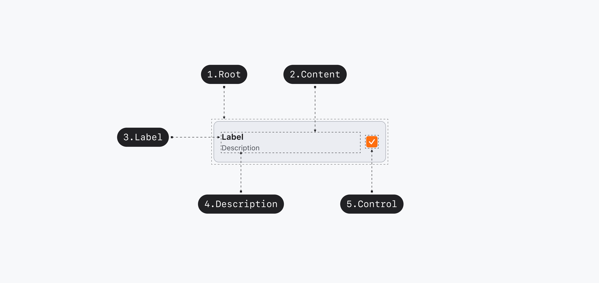
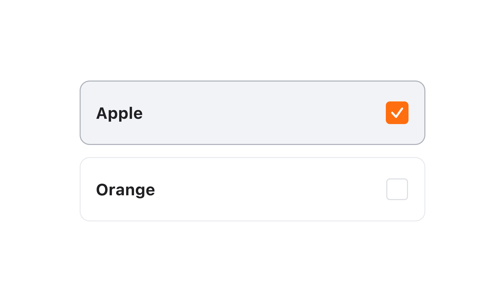
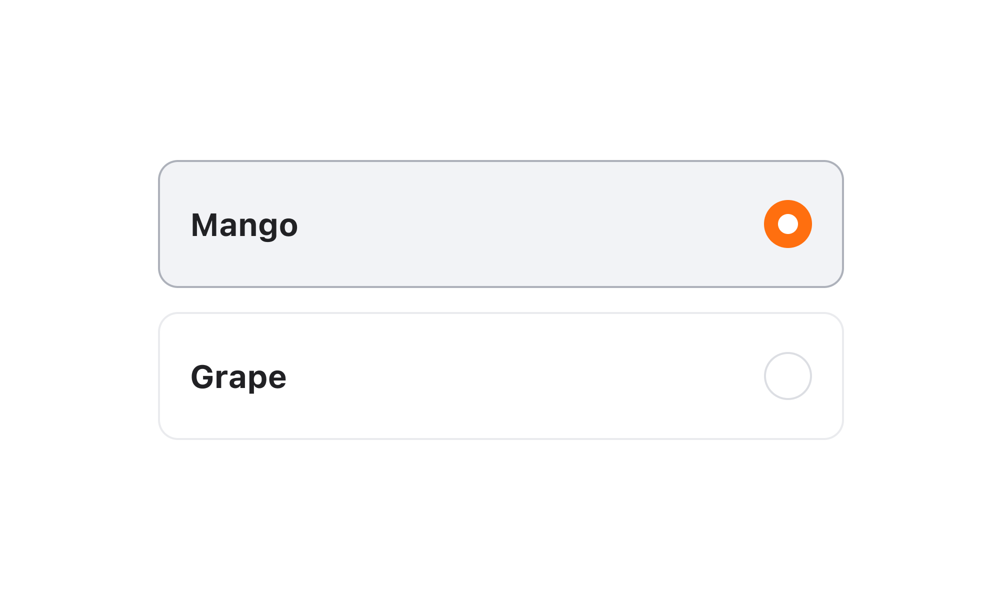
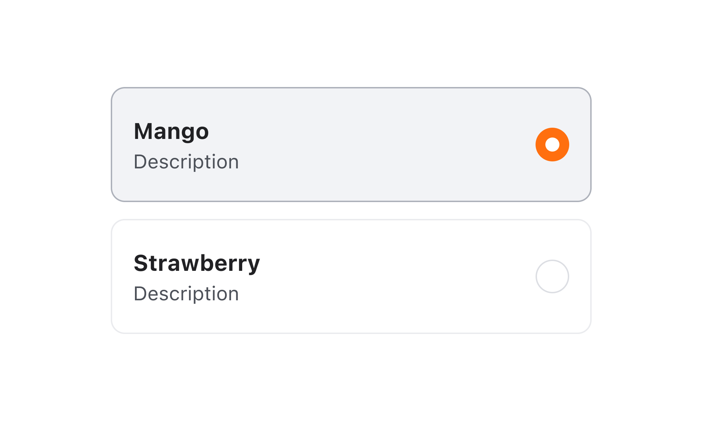
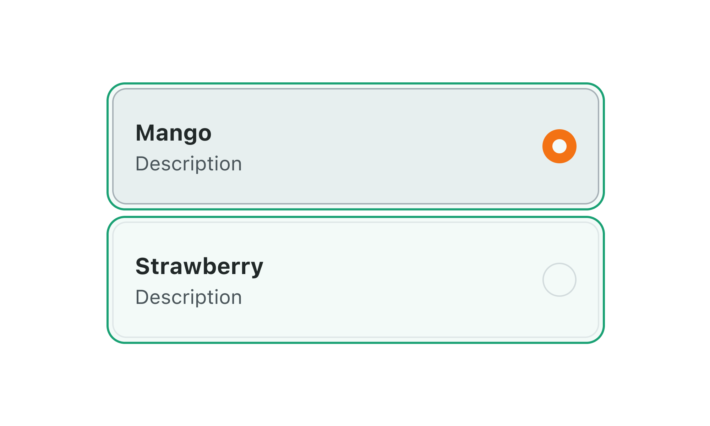
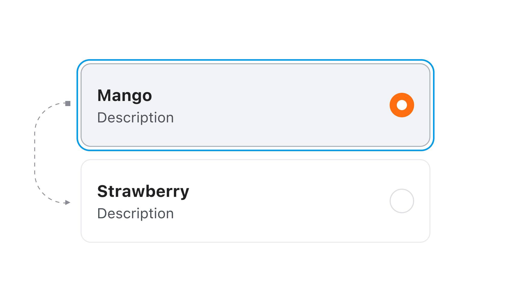
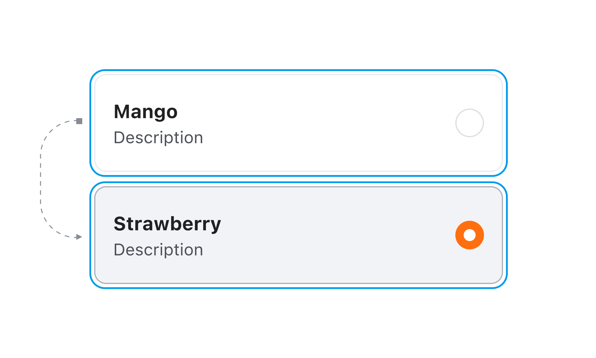

## 구조도

<Anatomy></Anatomy>

1. Root
2. Content
3. Label
4. Description
5. Control

## 옵션

<HalfCard>
  <HalfCardImageCell>
    
  </HalfCardImageCell>
  <HalfCardDescriptionCell>
    <HalfCardDescriptionTitle>Checkbox</HalfCardDescriptionTitle>
    <HalfCardDescription>
      유저가 여러가지 옵션을 복수 선택할 수 있습니다.
    </HalfCardDescription>
  </HalfCardDescriptionCell>
</HalfCard>

<HalfCard>
  <HalfCardImageCell>
    
  </HalfCardImageCell>
  <HalfCardDescriptionCell>
    <HalfCardDescriptionTitle>Radio</HalfCardDescriptionTitle>
    <HalfCardDescription>
      두 가지 이상의 옵션 중 하나의 옵션만 선택할 수 있으며, 사용자가 하나의 옵션을 선택하면 다른 옵션은 Unselected 됩니다.
    </HalfCardDescription>
  </HalfCardDescriptionCell>
</HalfCard>

<HalfCard>
  <HalfCardImageCell>
    
  </HalfCardImageCell>
  <HalfCardDescriptionCell>
    <HalfCardDescriptionTitle>Description</HalfCardDescriptionTitle>
    <HalfCardDescription>
      사용자가 선택해야 하는 옵션에 대한 추가 컨텍스트나 도움말을 제공할 수 있습니다. 사용자가 옵션 선택을 더욱 쉽게 이해하고 완료할 수 있도록 돕습니다.
    </HalfCardDescription>
  </HalfCardDescriptionCell>
</HalfCard>

### 옵션 테이블

| 속성        | 값                                     | 기본값 |
| ----------- | -------------------------------------- | ------ |
| control     | checkbox, radio | checkbox |
| description | text                                   |        |

## 상호작용

### 터치/마우스

<HalfCard>
  <HalfCardImageCell>
    
  </HalfCardImageCell>
  <HalfCardDescriptionCell>
    <HalfCardDescriptionTitle>Touch area</HalfCardDescriptionTitle>
    <HalfCardDescription>
      마우스 클릭 또는 터치로 Select Box와 상호작용할 수 있습니다.
    </HalfCardDescription>
  </HalfCardDescriptionCell>
</HalfCard>

### 키보드

<HalfCard>
  <HalfCardImageCell>
    
  </HalfCardImageCell>
  <HalfCardDescriptionCell>
    <HalfCardDescriptionTitle>Focus</HalfCardDescriptionTitle>
    <HalfCardDescription>
      <Keyboard>tab</Keyboard> 키를 통해 Focus를 옮길 수 있습니다.
    </HalfCardDescription>
  </HalfCardDescriptionCell>
</HalfCard>

<HalfCard>
  <HalfCardImageCell>
    
  </HalfCardImageCell>
  <HalfCardDescriptionCell>
    <HalfCardDescriptionTitle>Selected ON/OFF</HalfCardDescriptionTitle>
    <HalfCardDescription>
      Focus된 상태에서 <Keyboard>space</Keyboard> 키를 통해 ON / OFF를 전환할 수
      있습니다.
    </HalfCardDescription>
  </HalfCardDescriptionCell>
</HalfCard>