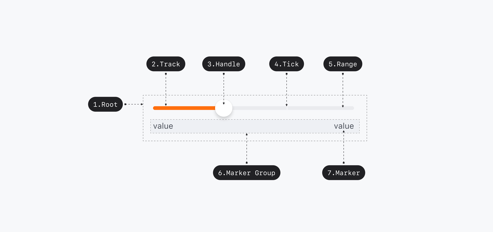

## Anatomy

<Anatomy></Anatomy>

1. Root - Primitive.Root
2. Range - Primitive.Range
3. Handle - Primitive.Handle
4. Tick
5. Track - Primitive.Track
6. Marker Group
7. Marker

## Root

### Visually Represented States

| State    | Condition          |
| -------- | ------------------ |
| enabled  | isDisabled = False |
| disabled | isDisabled = True  |

## Thumb

### Visually Represented States

| State    | Condition                                                                   |
| -------- | --------------------------------------------------------------------------- |
| enabled  | isDisabled = False, isHovered = False, isFocused = False, isPressed = False |
| focused  | isDisabled = False, isDragging = False, isFocused = True                    |
| dragging | isDisabled = False, isDragging = True                                       |
| disabled | isDisabled = True                                                           |

## 디자인 결정 (Color)

| Part  | Attribute | Value                 |
| ----- | --------- | --------------------- |
| Label | Color     | $scale.color.gray-900 |

| State    | Part   | Attribute | Value                      |
| -------- | ------ | --------- | -------------------------- |
| Enabled  | Track  | Color     | $scale.color.gray-200      |
|          | Range  | Color     | $semantic.color.primary    |
|          | Thumb  | Color     | $static.color.static-white |
|          | Output | Color     | $scale.color.gray-900      |
| Disabled | Track  | Color     | $scale.color.gray-200      |
|          | Range  | Color     | $scale.color.gray-400      |
|          | Thumb  | Color     | $static.color.static-white |
|          | Output | Color     | $scale.color.gray-400      |

## 디자인 결정 (Shadow)

| State    | Part  | Attribute            | Value   |
| -------- | ----- | -------------------- | ------- |
| Enabled  | Thumb | Shadow Offset X      | 0pt     |
|          |       | Shadow Offset Y      | 4pt     |
|          |       | Shadow Blur Radius   | 6pt     |
|          |       | Shadow Spread Radius | 0pt     |
|          |       | Shadow Color         | #000000 |
|          |       | Shadow Opacity       | 0.15    |
| Dragging | Thumb | Shadow Offset X      | 0pt     |
|          |       | Shadow Offset Y      | 0pt     |
|          |       | Shadow Blur Radius   | 0pt     |
|          |       | Shadow Spread Radius | 5pt     |
|          |       | Shadow Color         | #000000 |
|          |       | Shadow Opacity       | 0.22    |
| Focused  | Thumb | Shadow Offset X      | 0pt     |
|          |       | Shadow Offset Y      | 0pt     |
|          |       | Shadow Blur Radius   | 0pt     |
|          |       | Shadow Spread Radius | 5pt     |
|          |       | Shadow Color         | #000000 |
|          |       | Shadow Opacity       | 0.22    |
| Disabled | Thumb | Shadow Offset X      | 0pt     |
|          |       | Shadow Offset Y      | 4pt     |
|          |       | Shadow Blur Radius   | 6pt     |
|          |       | Shadow Spread Radius | 0pt     |
|          |       | Shadow Color         | #000000 |
|          |       | Shadow Opacity       | 0.15    |

## 디자인 결정 (Typography)

| Part   | Attribute  | Value                               |
| ------ | ---------- | ----------------------------------- |
| Label  | Typography | $semantic.typography.label3-bold    |
| Output | Typography | $semantic.typography.label3-regular |

## 디자인 결정 (Layout)

| Part            | Attribute     | Value |
| --------------- | ------------- | ----- |
| Root            | Min Width     | 240pt |
| Track           | Height        | 5pt   |
|                 | Corner Radius | 3pt   |
| Thumb           | Size          | 28pt  |
|                 | Corner Radius | Full  |
| Label / Control | Spacing       | 6pt   |

### 디자인 결정 (Motion)

| State    | Part  | Property  | Attribute       | Value                                    |
| -------- | ----- | --------- | --------------- | ---------------------------------------- |
| Dragging | Thumb | transform | Duration        | 120ms                                    |
|          |       |           | Timing Function | $scale.timing-function.standard-entrance |
