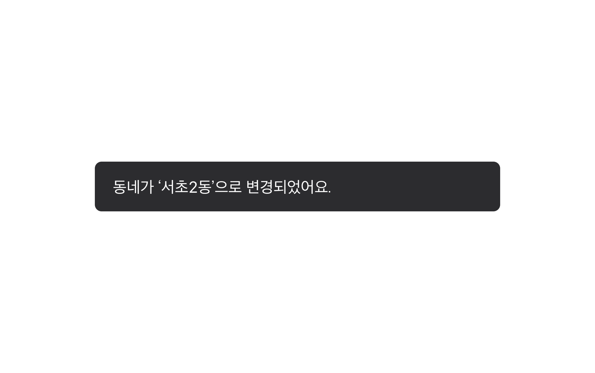
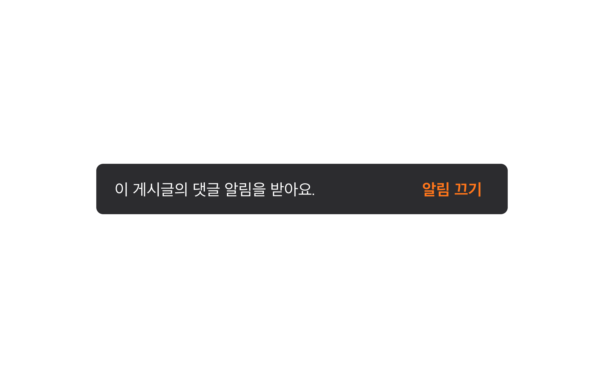
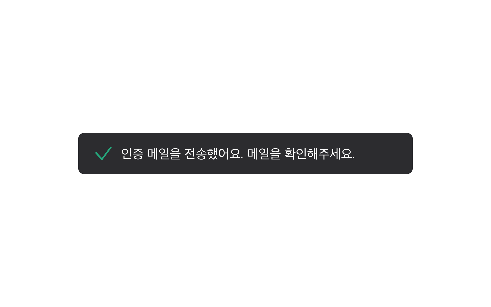
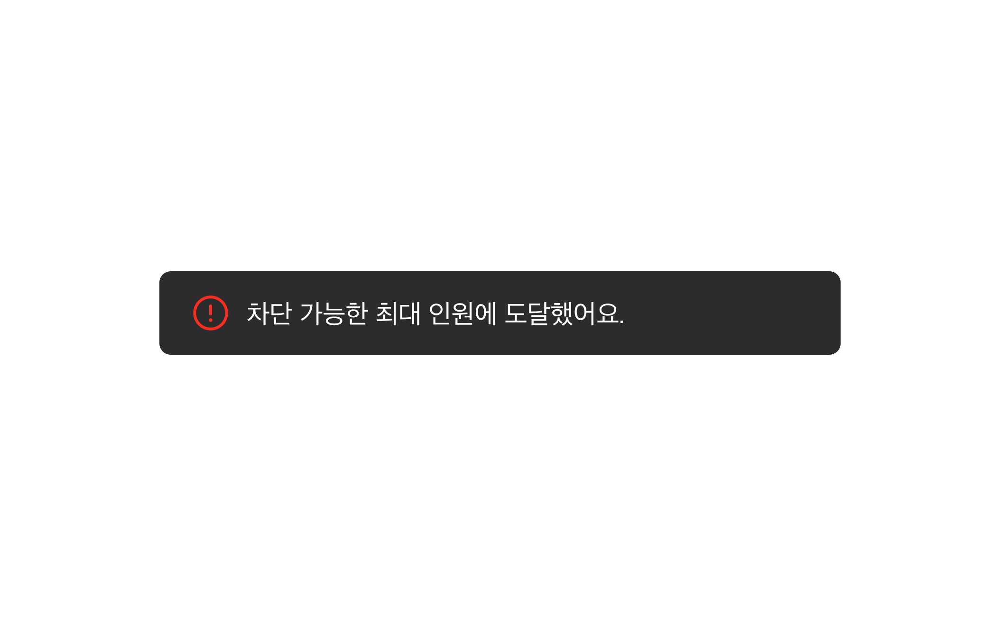
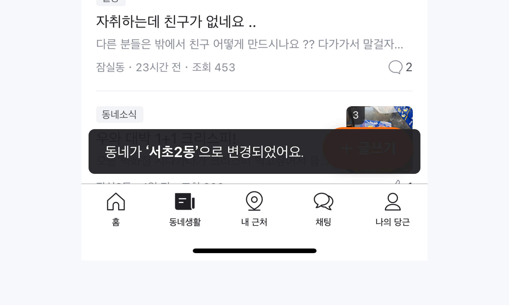
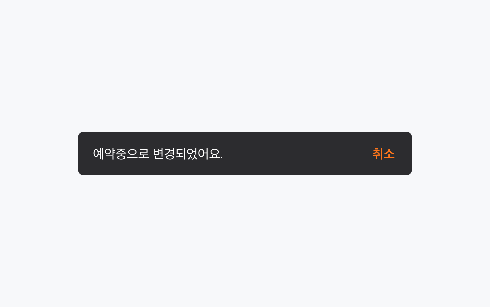
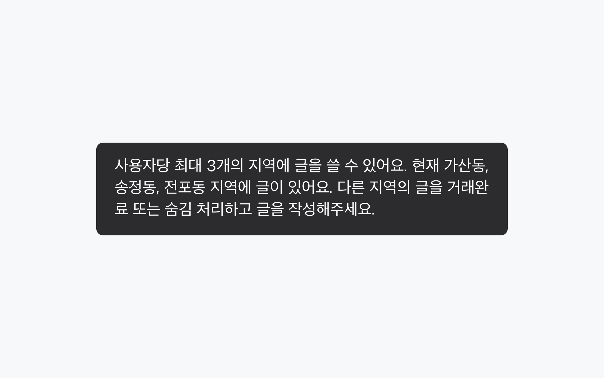
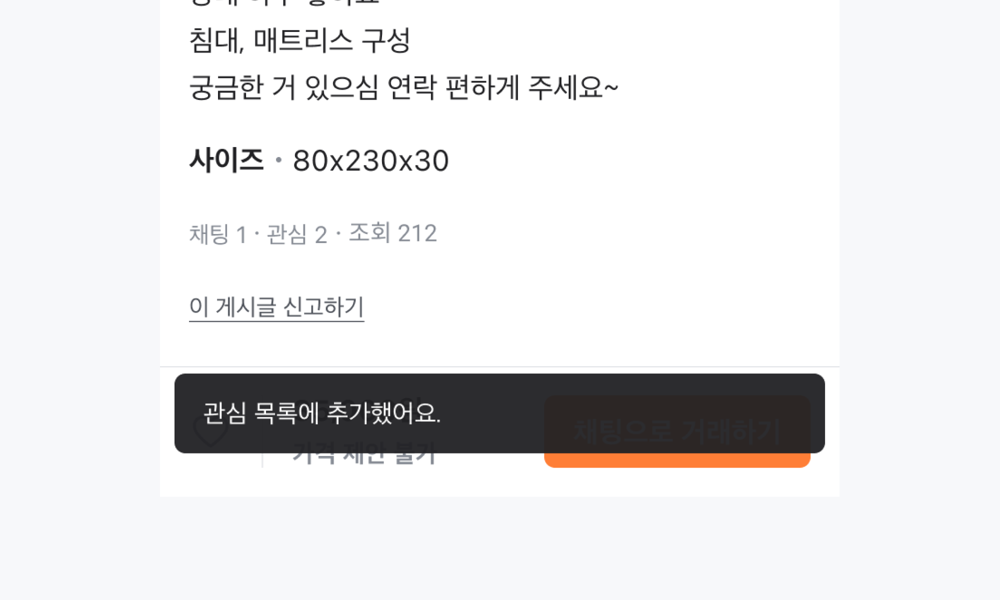

## 구조도

<Anatomy></Anatomy>

1. Region
2. Snackbar
3. Icon
4. Message
5. Action Button
6. Action Label

## 컴포넌트 미리보기

<Iframe
  src="https://sprout-storybook.vercel.app/iframe.html?args=&id=components-snackbar--basic&viewMode=story"
  height="300px"
/>

## 옵션

<HalfCard>
  <HalfCardImageCell>
    
  </HalfCardImageCell>
  <HalfCardDescriptionCell>
    <HalfCardDescriptionTitle>Message</HalfCardDescriptionTitle>
    <HalfCardDescription>
      Snackbar는 반드시 메세지를 포함해야합니다. 어떤 일이 일어났는지, 혹은
      일어나고 있는지 가능한 간결하게 작성합니다.
    </HalfCardDescription>
  </HalfCardDescriptionCell>
</HalfCard>

<HalfCard>
  <HalfCardImageCell>
    
  </HalfCardImageCell>
  <HalfCardDescriptionCell>
    <HalfCardDescriptionTitle>Action</HalfCardDescriptionTitle>
    <HalfCardDescription>
      Action Label은 메세지와 연관되어 가능한 간결한 텍스트로 동작을 제시해야
      합니다. Action은 1개만 노출할 수 있습니다.
    </HalfCardDescription>
  </HalfCardDescriptionCell>
</HalfCard>

<HalfCard>
  <HalfCardImageCell>
    
  </HalfCardImageCell>
  <HalfCardDescriptionCell>
    <HalfCardDescriptionTitle>Default Type</HalfCardDescriptionTitle>
    <HalfCardDescription>
      Default Type은 중립적인 텍스트 메세지를 전달합니다.
    </HalfCardDescription>
  </HalfCardDescriptionCell>
</HalfCard>

<HalfCard>
  <HalfCardImageCell>
    
  </HalfCardImageCell>
  <HalfCardDescriptionCell>
    <HalfCardDescriptionTitle>Success Type</HalfCardDescriptionTitle>
    <HalfCardDescription>
      Success Type은 사용자가 긍정적인 액션을 했거나, 해당 액션이 성공적으로
      완료되었을 때 사용합니다.
    </HalfCardDescription>
  </HalfCardDescriptionCell>
</HalfCard>

<HalfCard>
  <HalfCardImageCell>
    
  </HalfCardImageCell>
  <HalfCardDescriptionCell>
    <HalfCardDescriptionTitle>Warning Type</HalfCardDescriptionTitle>
    <HalfCardDescription>
      Warning Type은 사용자의 액션에 대한 경고나 실패에 대한 메세지를 전달할 때
      사용합니다.
    </HalfCardDescription>
  </HalfCardDescriptionCell>
</HalfCard>

### 옵션 테이블

| 속성               | 값                        | 기본값  | 설명 |
| ------------------ | ------------------------- | ------- | ---- |
| type               | default, success, warning | default |      |
| message            | text                      |         |      |
| action label       | text                      |         |      |
| pauseOnInteraction | false, true               | true    |      |

## 상호작용

### 터치 / 마우스

<FullCard>
  <FullCardImageCell>
    
  </FullCardImageCell>
  <FullCardDescription>
    Click, Touch는 Action 영역에만 작동합니다.
  </FullCardDescription>
</FullCard>

 

### 키보드

<HalfCard>
  <HalfCardImageCell>
    
  </HalfCardImageCell>
  <HalfCardDescriptionCell>
    <HalfCardDescriptionTitle>Focus</HalfCardDescriptionTitle>
    <HalfCardDescription>
      <Keyboard>Tab</Keyboard>키를 통해 Root에 Focus할 수 있습니다.
    </HalfCardDescription>
  </HalfCardDescriptionCell>
</HalfCard>

<HalfCard>
  <HalfCardImageCell>
    
  </HalfCardImageCell>
  <HalfCardDescriptionCell>
    <HalfCardDescriptionTitle>Action focus</HalfCardDescriptionTitle>
    <HalfCardDescription>
      <Keyboard>Tab</Keyboard>키를 통해 Action의 Focus를 이동할 수 있습니다.
    </HalfCardDescription>
  </HalfCardDescriptionCell>
</HalfCard>

<HalfCard>
  <HalfCardImageCell>
    
  </HalfCardImageCell>
  <HalfCardDescriptionCell>
    <HalfCardDescriptionTitle>Action</HalfCardDescriptionTitle>
    <HalfCardDescription>
      <Keyboard>Space</Keyboard> 혹은 <Keyboard>Enter</Keyboard>키를 통해
      Action을 실행할 수 있습니다.
    </HalfCardDescription>
  </HalfCardDescriptionCell>
</HalfCard>

 

### Min Width

<FullCard>
  <FullCardImageCell>
    
  </FullCardImageCell>
  <FullCardDescription>Snackbar의 최소 너비는 170입니다.</FullCardDescription>
</FullCard>

## 가이드라인

<HalfCard>
  <HalfCardImageCell>
    
  </HalfCardImageCell>
  <HalfCardDescriptionCell>
    <HalfCardDescriptionTitle>Snackbar</HalfCardDescriptionTitle>
    <HalfCardDescription>
      Snackbar는 유저의 액션(좋아요, 저장, 삭제 등)에 즉각적인 피드백을 줄 때,
      혹은 앱 내 백그라운드 상태나 설정에 대한 알림일 때 사용합니다.
    </HalfCardDescription>
  </HalfCardDescriptionCell>
</HalfCard>

<HalfCard>
  <HalfCardImageCell>
    
  </HalfCardImageCell>
  <HalfCardDescriptionCell>
    <HalfCardDescriptionTitle>간결한 문구</HalfCardDescriptionTitle>
    <HalfCardDescription>
      문구는 최대한 간결하게 작성하고, 불필요한 부가정보는 최소화합니다.
    </HalfCardDescription>
  </HalfCardDescriptionCell>
</HalfCard>

<HalfCard>
  <HalfCardImageCell>
    
  </HalfCardImageCell>
  <HalfCardDescriptionCell>
    <HalfCardDescriptionTitle>Bold</HalfCardDescriptionTitle>
    <HalfCardDescription>
      특정 부분을 강조하고 싶은 경우 메시지에 Bold를 사용할 수 있습니다. 혹은
      유저가 조심해야 하거나 주의해야 하는 정보인 경우에도 사용할 수 있습니다.
      텍스트 전체에 적용하기보단 부분적으로 사용할 것을 권장합니다.
    </HalfCardDescription>
  </HalfCardDescriptionCell>
</HalfCard>

<HalfCard>
  <HalfCardImageCell>
    
  </HalfCardImageCell>
  <HalfCardDescriptionCell>
    <HalfCardDescriptionTitle>적절한 피드백 제공</HalfCardDescriptionTitle>
    <HalfCardDescription>
      로딩실패, 삭제 등의 유저액션에 대한 피드백인 경우 재시도, 되돌리기 같은
      간단한 액션버튼을 제공합니다.
    </HalfCardDescription>
  </HalfCardDescriptionCell>
</HalfCard>
 

### Do / Don't

 

<DoDontLayout>
  <DoBox>
    <DoImage></DoImage>
    <DoText>
      Snackbar의 문구는 최대한 간결하게 작성합니다. 유저가 빠르게 원하는 정보만
      얻을 수 있도록 합니다.
    </DoText>
  </DoBox>
  <DontBox>
    <DontImage>
      
    </DontImage>
    <DontText>
      Snackbar의 문구는 2줄을 초과하지 않습니다. 불필요한 문장과 내용은
      제거하며, 핵심 메세지만 전달합니다.
    </DontText>
  </DontBox>
</DoDontLayout>

 
 

<DoDontLayout>
  <DoBox>
    <DoImage></DoImage>
    <DoText>상,하/좌,우 Margin은 해상도에 상관없이 8px로 사용합니다.</DoText>
  </DoBox>
  <DontBox>
    <DontImage>
      
    </DontImage>
    <DontText>Snackbar가 하단의 주요 액션 버튼을 가리지 않도록합니다.</DontText>
  </DontBox>
</DoDontLayout>

 
