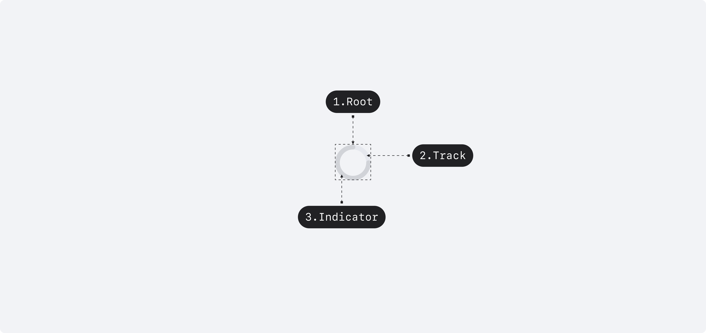

## Anatomy

<Anatomy></Anatomy>

1. Root
2. Track
3. Indicator

## Visual Options

| Property | Value                |
| -------- | -------------------- |
| size     | small, medium        |
| variant  | gray, white, primary |

## 디자인 결정 (Color)

### Variant=Gray

| Part      | Attribute | Value                      |
| --------- | --------- | -------------------------- |
| Indicator | Color     | $scale.color.gray-400      |
| Track     | Color     | $scale.color.gray-alpha-50 |

### Variant=White

| Part      | Attribute | Value                                |
| --------- | --------- | ------------------------------------ |
| Indicator | Color     | $static.color.static-white           |
| Track     | Color     | $static.color.static-white-alpha-200 |

### Variant=Primary

| Part      | Attribute | Value                       |
| --------- | --------- | --------------------------- |
| Indicator | Color     | $semantic.color.primary     |
| Track     | Color     | $semantic.color.primary-low |

## 디자인 결정 (Layout)

### Size=Medium

| Part      | Attribute | Value |
| --------- | --------- | ----- |
| Indicator | Size      | 40pt  |

### Size=Small

| Part      | Attribute | Value |
| --------- | --------- | ----- |
| Indicator | Size      | 24pt  |

## 디자인 결정 (Motion)

### Part=Indicator, Property=head

| Part      | Property | Attribute       | Value                          |
| --------- | -------- | --------------- | ------------------------------ |
| Indicator | head     | Duration        | 800ms                          |
|           |          | Delay           | 0ms                            |
|           |          | Timing Function | cubic-bezier(0.35, 0, 0.65, 1) |

#### Keyframe

| Progress     | Part      | Property | Value |
| ------------ | --------- | -------- | ----- |
| 0% (0ms)     | Indicator | head     | 1%    |
| 100% (800ms) | Indicator | head     | 100%  |

### Part=Indicator, Property=tail

| Part      | Property | Attribute       | Value                            |
| --------- | -------- | --------------- | -------------------------------- |
| Indicator | tail     | Duration        | 900ms                            |
|           |          | Delay           | 300ms                            |
|           |          | Timing Function | cubic-bezier(0.35, 0, 0.65, 0.6) |

#### Keyframe

| Progress      | Part      | Property | Value |
| ------------- | --------- | -------- | ----- |
| 0% (300ms)    | Indicator | tail     | 0%    |
| 100% (1200ms) | Indicator | tail     | 99%   |

### Part=Root, Property=transform

| Part | Property  | Attribute       | Value                                |
| ---- | --------- | --------------- | ------------------------------------ |
| Root | transform | Duration        | 1200ms                               |
|      |           | Delay           | 0ms                                  |
|      |           | Timing Function | cubic-bezier(0.35, 0.25, 0.65, 0.75) |

#### Keyframe

| Progress      | Part | Property  | Value          |
| ------------- | ---- | --------- | -------------- |
| 0% (0ms)      | Root | transform | rotate(0deg)   |
| 100% (1200ms) | Root | transform | rotate(360deg) |
