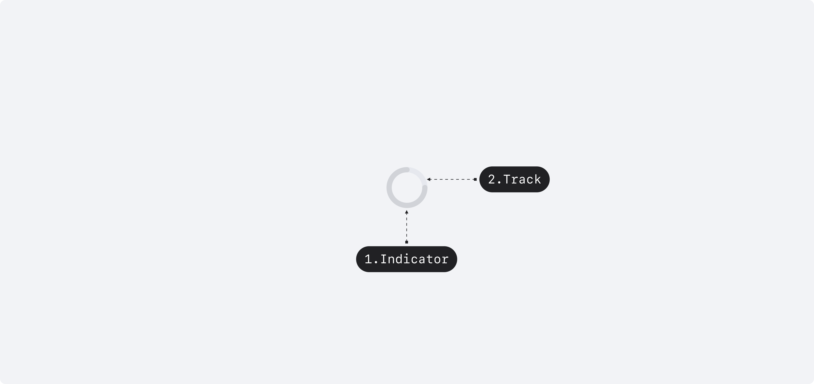
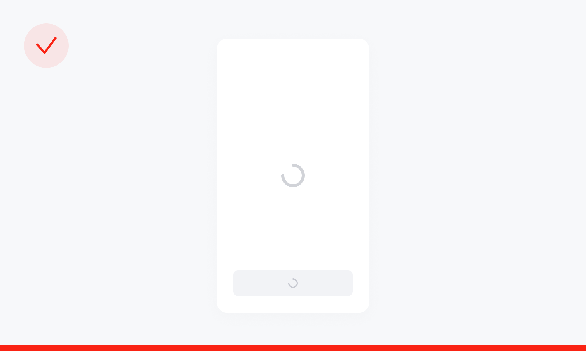

## 구조도

<Anatomy></Anatomy>

1. Indicator
2. Track

## 옵션

<HalfCard>
  <HalfCardImageCell>
    
  </HalfCardImageCell>
  <HalfCardDescriptionCell>
    <HalfCardDescriptionTitle>Size</HalfCardDescriptionTitle>
    <HalfCardDescription>
      Spinner는 small, medium 2개의 사이즈를 가질 수 있습니다. medium은 화면
      전체를 로딩할 때, 독립적인 요소로 쓰일 때 사용하며, small은 다른 요소와
      나란히 쓰일 때, 컴포넌트 위에서 사용합니다.
    </HalfCardDescription>
  </HalfCardDescriptionCell>
</HalfCard>

<HalfCard>
  <HalfCardImageCell>
    
  </HalfCardImageCell>
  <HalfCardDescriptionCell>
    <HalfCardDescriptionTitle>Variant</HalfCardDescriptionTitle>
    <HalfCardDescription>
      Spinner는 gray, primary, gray(on overlay) 3개의 Variant 옵션을 가질 수
      있습니다. gray가 가장 보편적이며, primary는 화면 내에서 중요도가 높은
      경우에만 사용합니다. white는 overlay 레이어 위에서만 사용합니다.
    </HalfCardDescription>
  </HalfCardDescriptionCell>
</HalfCard>

### 옵션 테이블

| 속성    | 값                   | 기본값 |
| ------- | -------------------- | ------ |
| size    | small, medium        | medium |
| variant | gray, white, primary | gray   |

## 가이드라인

<HalfCard>
  <HalfCardImageCell>
    
  </HalfCardImageCell>
  <HalfCardDescriptionCell>
    <HalfCardDescriptionTitle>Spinner Only</HalfCardDescriptionTitle>
    <HalfCardDescription>
      화면 전체 단위를 로딩하는 경우, Medium Size를 사용합니다.
    </HalfCardDescription>
  </HalfCardDescriptionCell>
</HalfCard>

<HalfCard>
  <HalfCardImageCell>
    
  </HalfCardImageCell>
  <HalfCardDescriptionCell>
    <HalfCardDescriptionTitle>Sheet</HalfCardDescriptionTitle>
    <HalfCardDescription>
      Bottomsheet, Dialog와 같은 Overlay 요소를 로딩하는 경우, Medium Size를
      사용합니다.
    </HalfCardDescription>
  </HalfCardDescriptionCell>
</HalfCard>

<HalfCard>
  <HalfCardImageCell>
    
  </HalfCardImageCell>
  <HalfCardDescriptionCell>
    <HalfCardDescriptionTitle>Placement</HalfCardDescriptionTitle>
    <HalfCardDescription>
      Spinner가 로딩하고있는 영역의 중앙에 배치합니다.
    </HalfCardDescription>
  </HalfCardDescriptionCell>
</HalfCard>

<HalfCard>
  <HalfCardImageCell>
    
  </HalfCardImageCell>
  <HalfCardDescriptionCell>
    <HalfCardDescriptionTitle>Don't</HalfCardDescriptionTitle>
    <HalfCardDescription>
      한 화면에 여러개의 Spinner를 표시하지 않습니다. 이는 유저의 행동을 방해할
      수 있으며, 유저에게 필요 이상의 불안정한 상태를 제공합니다.
    </HalfCardDescription>
  </HalfCardDescriptionCell>
</HalfCard>
