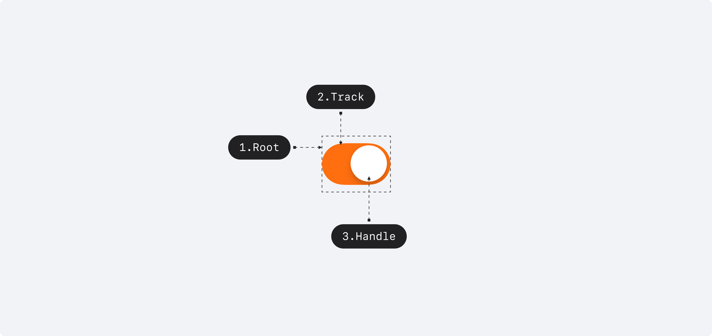

## 구조도

<Anatomy></Anatomy>

1. Root
2. Track
3. Handle

## 컴포넌트 미리보기

<Iframe
  src="https://sprout-storybook.vercel.app/iframe.html?args=&id=components-switch--basic&viewMode=story"
  height="80px"
/>

## 옵션

<HalfCard>
  <HalfCardImageCell>
    
  </HalfCardImageCell>
  <HalfCardDescriptionCell>
    <HalfCardDescriptionTitle>Selection</HalfCardDescriptionTitle>
    <HalfCardDescription>
      Switch는 Checkbox와 달리 selected, unselected 2개의 상태만 가질 수
      있습니다.
    </HalfCardDescription>
  </HalfCardDescriptionCell>
</HalfCard>

<HalfCard>
  <HalfCardImageCell>
    
  </HalfCardImageCell>
  <HalfCardDescriptionCell>
    <HalfCardDescriptionTitle>Disabled</HalfCardDescriptionTitle>
    <HalfCardDescription>
      Disabled 상태는 Switch가 존재하지만 지금은 사용할 수 없는 상태를
      나타냅니다. 이 옵션은 레이아웃 일관성을 유지하고 이후 상호작용이 가능할
      수도 있음을 사용자에게 알려줍니다.
    </HalfCardDescription>
  </HalfCardDescriptionCell>
</HalfCard>

### 옵션 테이블

| 속성        | 값          | 기본값 | 설명                                                  |
| ----------- | ----------- | ------ | ----------------------------------------------------- |
| is disabled | true, false | false  | true일 경우, Switch가 유저와 상호작용하지 않음        |
| is readonly | true, false | false  | true일 경우, isSelected를 변경할 수 없음              |
| is required | true, false | false  | true일 경우, isSelected = true가 필수임을 나타냄      |
| is invalid  | true, false | false  | true일 경우, isSelected가 유효하지 않은 값임을 나타냄 |

## 상호작용

## 가이드라인

<HalfCard>
  <HalfCardImageCell>
    
  </HalfCardImageCell>
  <HalfCardDescriptionCell>
    <HalfCardDescriptionTitle>Checkbox vs Switch</HalfCardDescriptionTitle>
    <HalfCardDescription>
      Checkbox는 선택을 표현할 때 (예를 들어, 리스트에서 선택된 아이템을 표현할
      때) 사용하고, Switch는 활성화/비활성화를 표현할 때 (예를 들어, 알림을 켜고
      끌 때) 사용합니다. Checkbox는 Switch와 다르게 error 상태를 가질 수
      있습니다.
    </HalfCardDescription>
  </HalfCardDescriptionCell>
</HalfCard>
