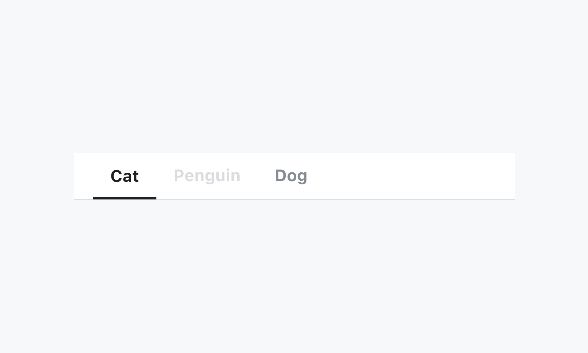
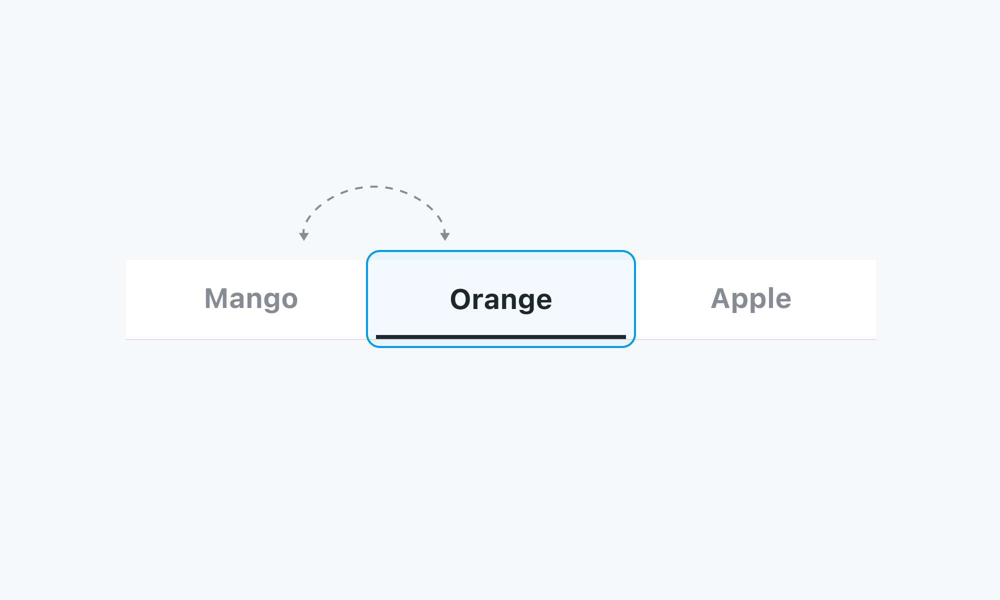
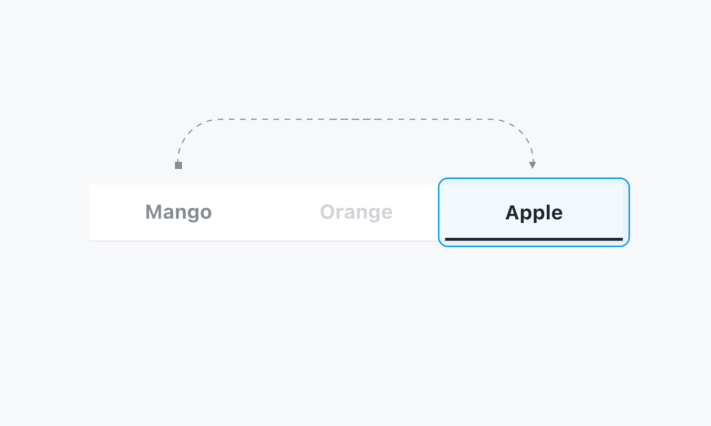
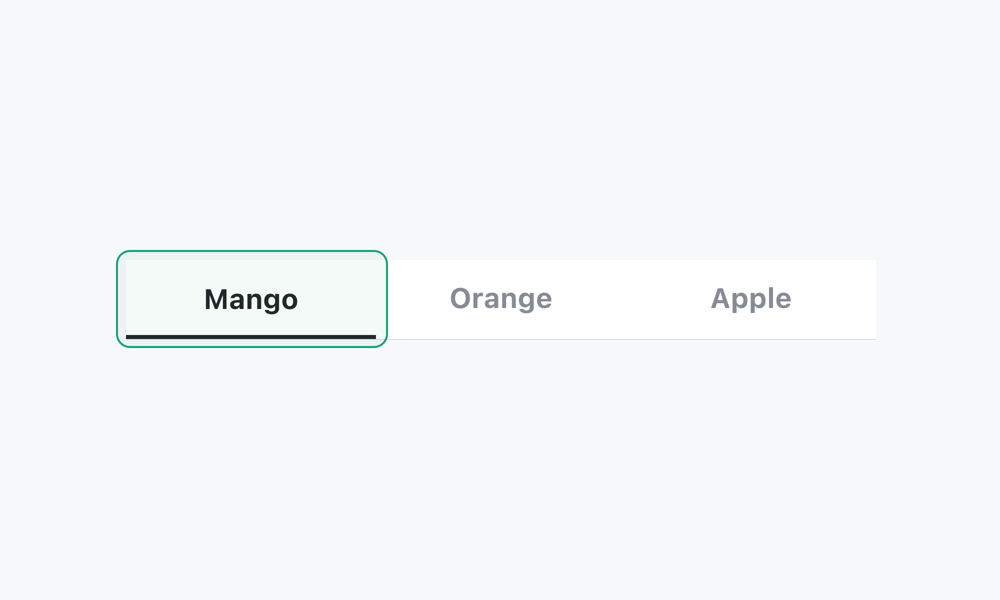
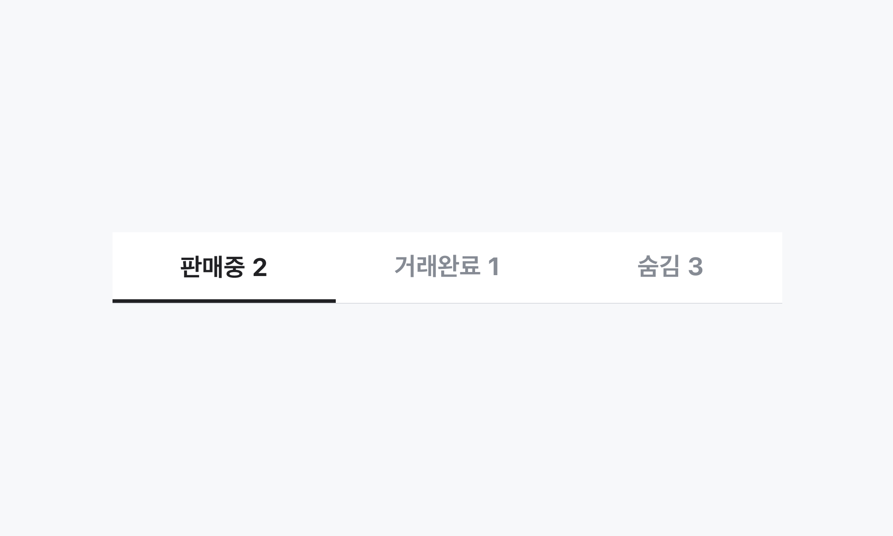
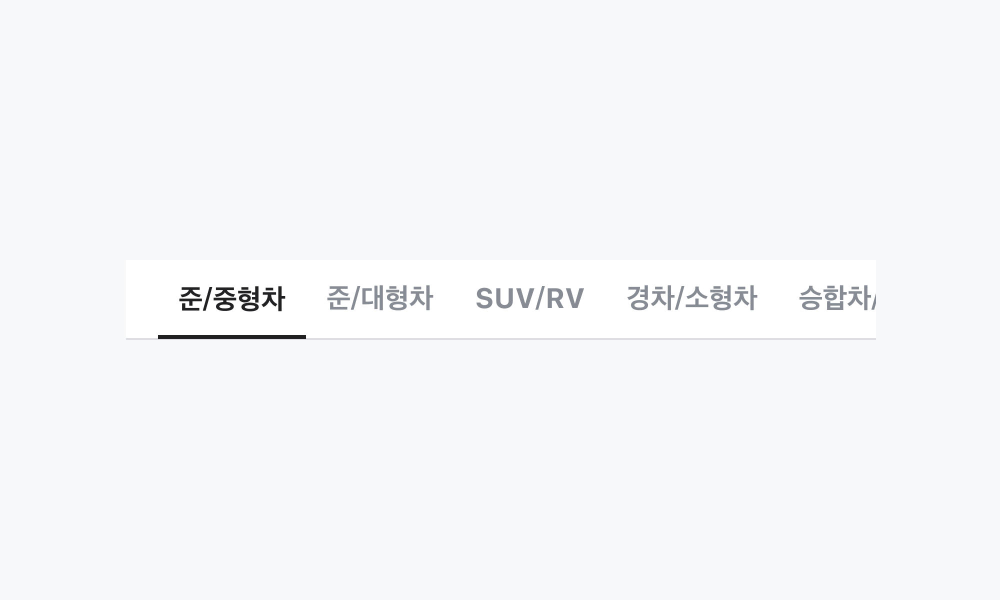
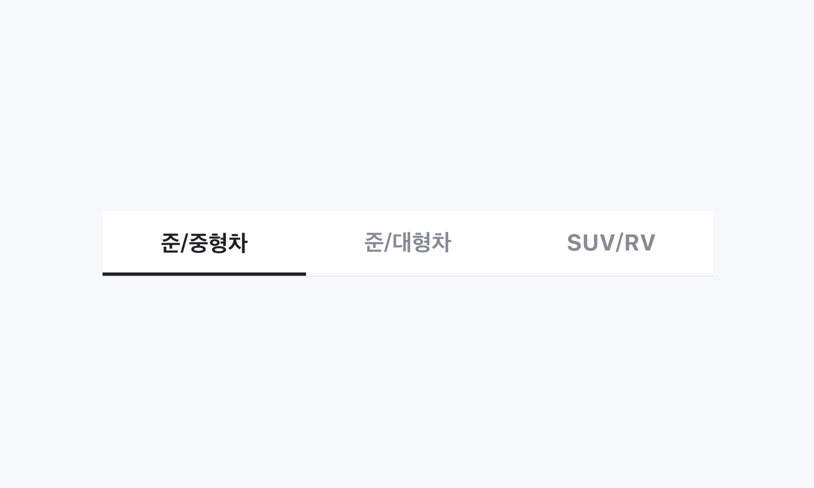
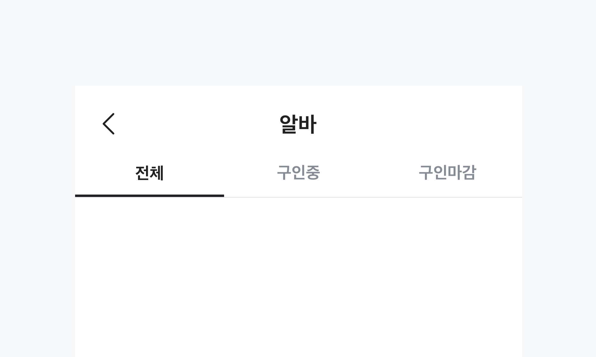
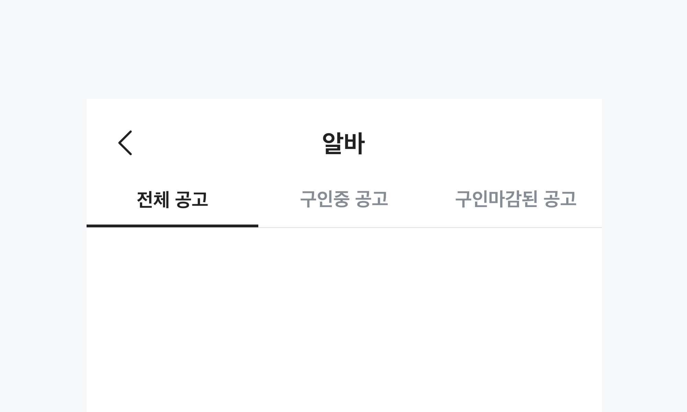

## 구조도

<Anatomy></Anatomy>

1. Root
2. Tab List
3. Tab
4. Tab Label
5. Panel Group
6. Panel
7. Indicator
8. Indicator Track

## 컴포넌트 미리보기

<Iframe
  src="https://sprout-storybook.vercel.app/iframe.html?args=&id=components-tabs-tabs--basic&viewMode=story"
  height="300px"
/>

## 옵션

<HalfCard>
  <HalfCardImageCell>
    
  </HalfCardImageCell>
  <HalfCardDescriptionCell>
    <HalfCardDescriptionTitle>Selected</HalfCardDescriptionTitle>
    <HalfCardDescription>
      선택되어있는 Tabs의 컨텐츠가 화면에 표시됩니다. Indicator는 현재
      선택되어있는 Tab을 나타냅니다.
    </HalfCardDescription>
  </HalfCardDescriptionCell>
</HalfCard>

<HalfCard>
  <HalfCardImageCell>
    
  </HalfCardImageCell>
  <HalfCardDescriptionCell>
    <HalfCardDescriptionTitle>Disabled</HalfCardDescriptionTitle>
    <HalfCardDescription>
      Disabled 상태는 Tab이 존재하지만 지금은 사용할 수 없는 상태를 나타냅니다.
      이 옵션은 레이아웃 일관성을 유지하고 이후 상호작용이 가능할 수도 있음을
      사용자에게 알려줍니다.
    </HalfCardDescription>
  </HalfCardDescriptionCell>
</HalfCard>

### 옵션 테이블 (Root)

| 속성        | 값          | 기본값 | 설명                                              |
| ----------- | ----------- | ------ | ------------------------------------------------- |
| is disabled | true, false | false  | true일 경우, Tabs 전체가 유저와 상호작용하지 않음 |
| layout      | hug, fill   | hug    |                                                   |

### 옵션 테이블 (Tab)

| 속성        | 값          | 기본값 | 설명                                        |
| ----------- | ----------- | ------ | ------------------------------------------- |
| label       | text        |        |                                             |
| is disabled | true, false | false  | true일 경우, Tab이 유저와 상호작용하지 않음 |
| dot         | true, false | false  | Tab에 dot의 존재 여부를 결정                |

## 상호작용

### 키보드

<HalfCard>
  <HalfCardImageCell>
    
  </HalfCardImageCell>
  <HalfCardDescriptionCell>
    <HalfCardDescriptionTitle>Focus</HalfCardDescriptionTitle>
    <HalfCardDescription>
      Focus된 상태에서 <Keyboard>Space</Keyboard> 키를 통해 Tab Item 에 Focus 할
      수 있습니다.
    </HalfCardDescription>
  </HalfCardDescriptionCell>
</HalfCard>

<HalfCard>
  <HalfCardImageCell>
    
  </HalfCardImageCell>
  <HalfCardDescriptionCell>
    <HalfCardDescriptionTitle>Disabled</HalfCardDescriptionTitle>
    <HalfCardDescription>
      Focus 이동시 Disabled 상태인 Tab Item은 인식하지 않습니다.
    </HalfCardDescription>
  </HalfCardDescriptionCell>
</HalfCard>

### 터치/마우스

<HalfCard>
  <HalfCardImageCell>
    
  </HalfCardImageCell>
  <HalfCardDescriptionCell>
    <HalfCardDescriptionTitle>Click/Touch Area</HalfCardDescriptionTitle>
    <HalfCardDescription>
      Tab Item 단위로 클릭/터치하여 상호작용할 수 있습니다.
    </HalfCardDescription>
  </HalfCardDescriptionCell>
</HalfCard>

## 가이드라인

<HalfCard>
  <HalfCardImageCell>
    
  </HalfCardImageCell>
  <HalfCardDescriptionCell>
    <HalfCardDescriptionTitle>Count</HalfCardDescriptionTitle>
    <HalfCardDescription>
      Label에 숫자 값을 입력하여 Content의 값을 Tabs에서 표현할 수 있습니다.
    </HalfCardDescription>
  </HalfCardDescriptionCell>
</HalfCard>

<HalfCard>
  <HalfCardImageCell>
    
  </HalfCardImageCell>
  <HalfCardDescriptionCell>
    <HalfCardDescriptionTitle>Hug Layout</HalfCardDescriptionTitle>
    <HalfCardDescription>
      Tab Item이 6개 이상인 경우에 Hug Layout를 사용합니다. 또는 Tab Item의
      컨텐츠가 유동적인 경우에도 사용합니다. 화면 최상단이 아닌 스크롤되는
      컨텐츠 사이에서 소분류를 위해 사용할 수 있습니다.
    </HalfCardDescription>
  </HalfCardDescriptionCell>
</HalfCard>

<HalfCard>
  <HalfCardImageCell>
    
  </HalfCardImageCell>
  <HalfCardDescriptionCell>
    <HalfCardDescriptionTitle>Fill Layout</HalfCardDescriptionTitle>
    <HalfCardDescription>
      Tab Item의 위치가 고정이며 Tab Item의 순서나 위치가 유저에게 중요한 경우
      사용합니다. Tab Item은 최대 5개까지 배치가 가능합니다. 주로 화면 전체를
      분류하는 대분류에 사용하며, 화면 최상단에 위치합니다.
    </HalfCardDescription>
  </HalfCardDescriptionCell>
</HalfCard>

### Do / Don't

<DoDontLayout>
  <DoBox>
    <DoImage></DoImage>
    <DoText>Tab Item의 Label은 간결하고 명확하게 작성합니다.</DoText>
  </DoBox>
  <DontBox>
    <DontImage></DontImage>
    <DontText>
      Label에 서술형이나 불필요한 문구를 작성하지 않습니다. 간결한 문구를 통해
      유저가 쉽게 인지할 수 있도록 합니다.
    </DontText>
  </DontBox>
</DoDontLayout>
