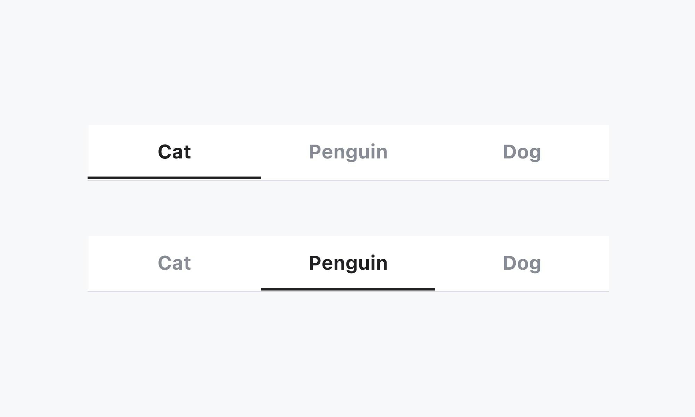
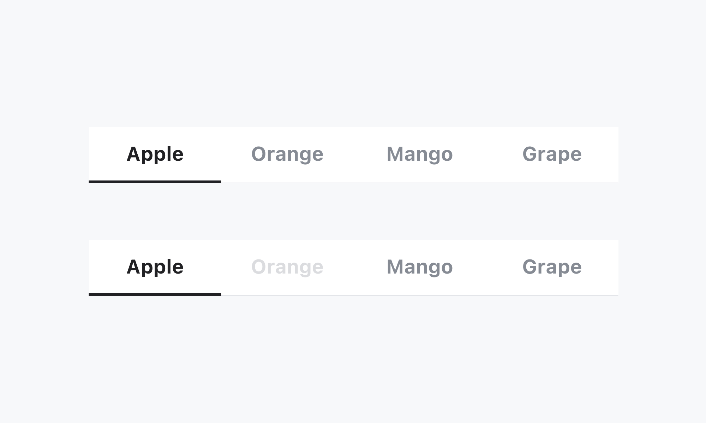

## 구조도

1. Root
2. Tab List
3. Tab
4. Tab Label
5. Panel Group
6. Panel
7. Indicator
8. Indicator Track

## 옵션

<HalfCard>
  <HalfCardImageCell>
    
  </HalfCardImageCell>
  <HalfCardDescriptionCell>
    <HalfCardDescriptionTitle>Selected</HalfCardDescriptionTitle>
    <HalfCardDescription>
      선택되어있는 Tabs의 컨텐츠가 화면에 표시됩니다. Indicator는 현재
      선택되어있는 Tab을 나타냅니다.
    </HalfCardDescription>
  </HalfCardDescriptionCell>
</HalfCard>

<HalfCard>
  <HalfCardImageCell>
    
  </HalfCardImageCell>
  <HalfCardDescriptionCell>
    <HalfCardDescriptionTitle>Disabled</HalfCardDescriptionTitle>
    <HalfCardDescription>
      Disabled 상태는 Tab이 존재하지만 지금은 사용할 수 없는 상태를 나타냅니다.
      이 옵션은 레이아웃 일관성을 유지하고 이후 상호작용이 가능할 수도 있음을
      사용자에게 알려줍니다.
    </HalfCardDescription>
  </HalfCardDescriptionCell>
</HalfCard>

### 옵션 테이블 (Root)

| 속성        | 값          | 기본값 | 설명                                              |
| ----------- | ----------- | ------ | ------------------------------------------------- |
| is disabled | true, false | false  | true일 경우, Tabs 전체가 유저와 상호작용하지 않음 |
| layout      | hug, fill   | hug    |                                                   |

### 옵션 테이블 (Tab)

| 속성        | 값          | 기본값 | 설명                                        |
| ----------- | ----------- | ------ | ------------------------------------------- |
| label       | text        |        |                                             |
| is disabled | true, false | false  | true일 경우, Tab이 유저와 상호작용하지 않음 |
| dot         | true, false | false  | Tab에 dot의 존재 여부를 결정                |

## 상호작용

Working In Progress

## 가이드라인

Working In Progress
