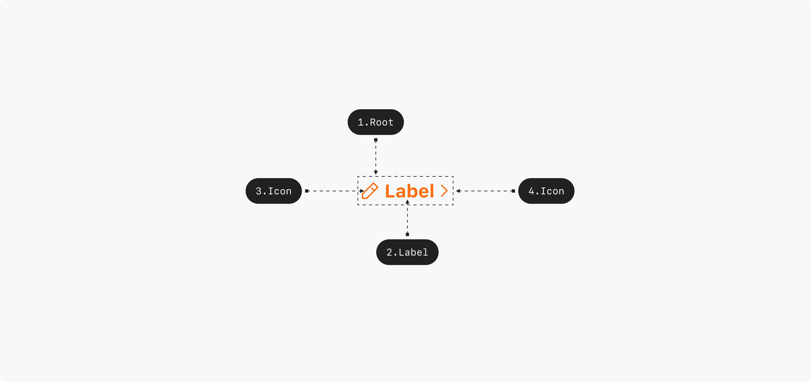

## Anatomy

1. Root : Button 컴포넌트를 감싸는 컨테이너 영역 - Primitive.Root
2. Label : Button에 대한 정보를 전달하는 라벨 - Primitive.Label
3. Icon : Button에 대한 정보를 전달하는 아이콘

## Visual Options

| Property | Value                                           | Description |
| -------- | ----------------------------------------------- | ----------- |
| size     | small, medium, large                            |             |
| variant  | primary, primary-low, secondary, accent, danger |             |
| style    | basic, underlined                               |             |
| bold     | true, false                                     |             |

## Visually Representated States

| State    | Condition                                                                   |
| -------- | --------------------------------------------------------------------------- |
| enabled  | isDisabled = False, isHovered = False, isFocused = False, isPressed = False |
| hovered  | isDisabled = False, isPressed = False, isHovered = True                     |
| focused  | isDisabled = False, isPressed = False, isFocused = True                     |
| pressed  | isDisabled = False, isPressed = True                                        |
| disabled | isDisabled = True                                                           |

## 디자인 결정 (Color)

### Variant=Primary

| State    | Part        | Attribute | Value                           |
| -------- | ----------- | --------- | ------------------------------- |
| Enabled  | Root        | Color     | $semantic.color.primary         |
|          | Label, Icon | Color     | $semantic.color.on-primary      |
| Hovered  | Root        | Color     | $semantic.color.primary-hover   |
|          | Label, Icon | Color     | $semantic.color.on-primary      |
| Pressed  | Root        | Color     | $semantic.color.primary-pressed |
|          | Label, Icon | Color     | $semantic.color.on-primary      |
| Disabled | Root        | Color     | $scale.color.gray-400           |
|          | Label, Icon | Color     | $scale.color.gray-400           |

### Variant=Secondary

| State    | Part        | Attribute | Value                     |
| -------- | ----------- | --------- | ------------------------- |
| Enabled  | Root        | Color     | $semantic.color.secondary |
|          | Label, Icon | Color     | $semantic.color.secondary |
| Hovered  | Root        | Color     | $scale.color.gray-700     |
|          | Label, Icon | Color     | $scale.color.gray-700     |
| Pressed  | Root        | Color     | $scale.color.gray-700     |
|          | Label, Icon | Color     | $scale.color.gray-700     |
| Disabled | Root        | Color     | $scale.color.gray-400     |
|          | Label, Icon | Color     | $scale.color.gray-400     |

### Variant=Secondary Low

| State    | Part        | Attribute | Value                 |
| -------- | ----------- | --------- | --------------------- |
| Enabled  | Root        | Color     | $scale.color.gray-600 |
|          | Label, Icon | Color     | $scale.color.gray-600 |
| Hovered  | Root        | Color     | $scale.color.gray-700 |
|          | Label, Icon | Color     | $scale.color.gray-700 |
| Pressed  | Root        | Color     | $scale.color.gray-700 |
|          | Label, Icon | Color     | $scale.color.gray-700 |
| Disabled | Root        | Color     | $scale.color.gray-400 |
|          | Label, Icon | Color     | $scale.color.gray-400 |

### Variant=Accent

| State    | Part        | Attribute | Value                  |
| -------- | ----------- | --------- | ---------------------- |
| Enabled  | Root        | Color     | $semantic.color.accent |
|          | Label, Icon | Color     | $semantic.color.accent |
| Hovered  | Root        | Color     | $scale.color.blue-400  |
|          | Label, Icon | Color     | $scale.color.blue-400  |
| Pressed  | Root        | Color     | $scale.color.blue-400  |
|          | Label, Icon | Color     | $scale.color.blue-400  |
| Disabled | Root        | Color     | $scale.color.gray-400  |
|          | Label, Icon | Color     | $scale.color.gray-400  |

### Variant=Danger

| State    | Part        | Attribute | Value                  |
| -------- | ----------- | --------- | ---------------------- |
| Enabled  | Root        | Color     | $semantic.color.danger |
|          | Label, Icon | Color     | $semantic.color.danger |
| Hovered  | Root        | Color     | $scale.color.red-400   |
|          | Label, Icon | Color     | $scale.color.red-400   |
| Pressed  | Root        | Color     | $scale.color.red-400   |
|          | Label, Icon | Color     | $scale.color.red-400   |
| Disabled | Root        | Color     | $scale.color.gray-400  |
|          | Label, Icon | Color     | $scale.color.gray-400  |

## 디자인 결정 (Typography)

### Size=Large, Bold=False

| Part  | Attribute  | Value                               |
| ----- | ---------- | ----------------------------------- |
| Label | Typography | $semantic.typography.label1-regular |

### Size=Medium, Bold=False

| Part  | Attribute  | Value                               |
| ----- | ---------- | ----------------------------------- |
| Label | Typography | $semantic.typography.label2-regular |

### Size=Small, Bold=False

| Part  | Attribute  | Value                               |
| ----- | ---------- | ----------------------------------- |
| Label | Typography | $semantic.typography.label3-regular |

### Size=Large, Bold=True

| Part  | Attribute  | Value                            |
| ----- | ---------- | -------------------------------- |
| Label | Typography | $semantic.typography.label3-bold |

### Size=Medium, Bold=True

| Part  | Attribute  | Value                            |
| ----- | ---------- | -------------------------------- |
| Label | Typography | $semantic.typography.label2-bold |

### Size=Small, Bold=True

| Part  | Attribute  | Value                            |
| ----- | ---------- | -------------------------------- |
| Label | Typography | $semantic.typography.label1-bold |

### Style=Basic

| Part  | Attribute       | Value |
| ----- | --------------- | ----- |
| Label | Text Decoration | none  |

### Style=Underlined

| Part  | Attribute             | Value     |
| ----- | --------------------- | --------- |
| Label | Text Decoration       | underline |
| Label | Text Underline Offset | 4pt       |

## 디자인 결정 (Layout)

### Size=Large

| Part         | Attribute          | Value  |
| ------------ | ------------------ | ------ |
| Root         | Min Width          | 66pt   |
|              | Horizontal Padding | 20pt   |
|              | Vertical Padding   | 14pt   |
|              | Corner Radius      | 6pt    |
| Label        | Text Align         | Center |
| Icon         | Size               | 16pt   |
| Label / Icon | Padding            | 4pt    |

### Size=Medium

| Part         | Attribute          | Value  |
| ------------ | ------------------ | ------ |
| Root         | Min Width          | 58pt   |
|              | Horizontal Padding | 16pt   |
|              | Vertical Padding   | 10pt   |
|              | Corner Radius      | 6pt    |
| Label        | Text Align         | Center |
| Icon         | Size               | 16pt   |
| Label / Icon | Padding            | 4pt    |

### Size=Small

| Part         | Attribute          | Value  |
| ------------ | ------------------ | ------ |
| Root         | Min Width          | 54pt   |
|              | Horizontal Padding | 14pt   |
|              | Vertical Padding   | 8pt    |
|              | Corner Radius      | 4pt    |
| Label        | Text Align         | Center |
| Icon         | Size               | 16pt   |
| Label / Icon | Padding            | 4pt    |

## 디자인 결정 (Focus)

| State   | Part | Attribute     | Value                 |
| ------- | ---- | ------------- | --------------------- |
| Focused | Root | Outline Color | $scale.color.blue-600 |
|         |      | Outline Width | 2pt                   |
