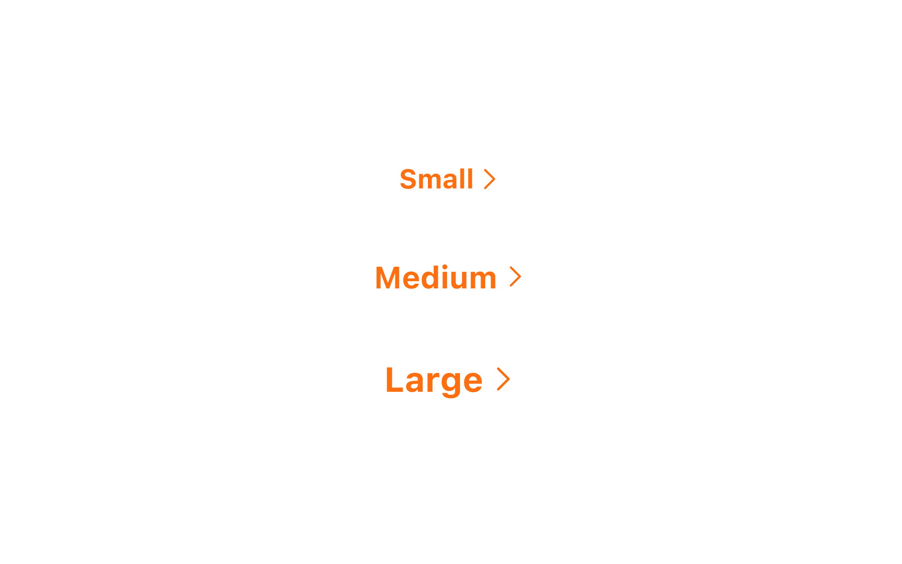
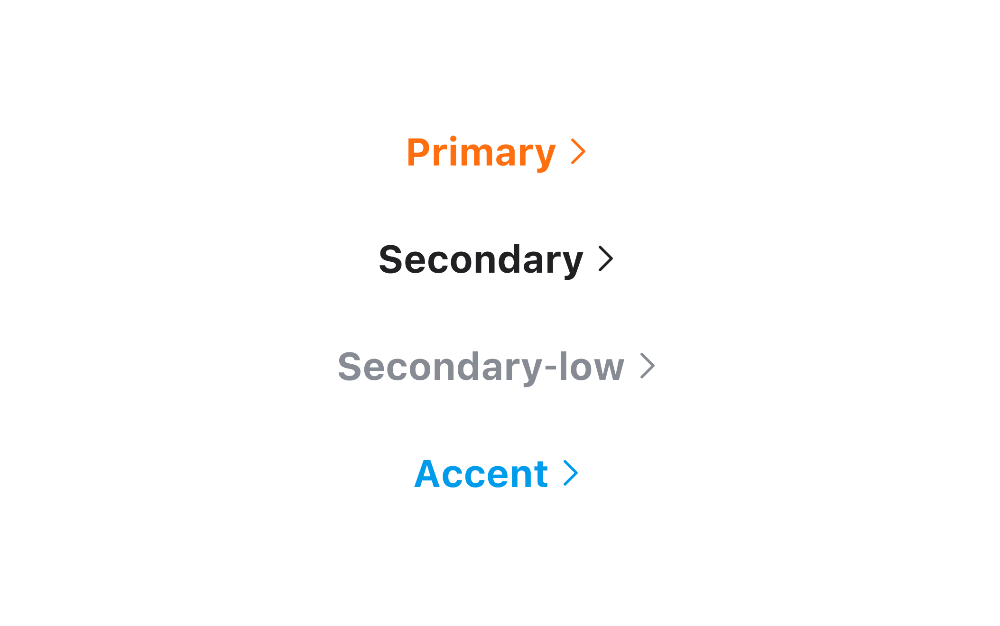
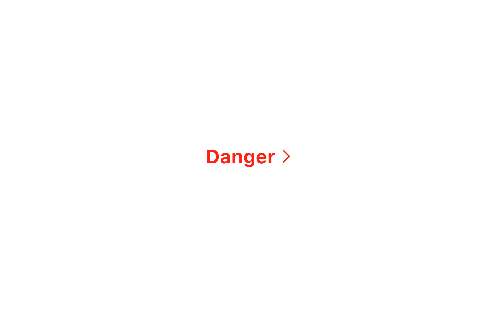
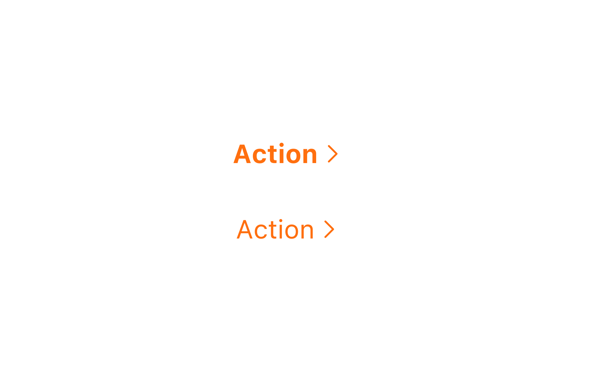
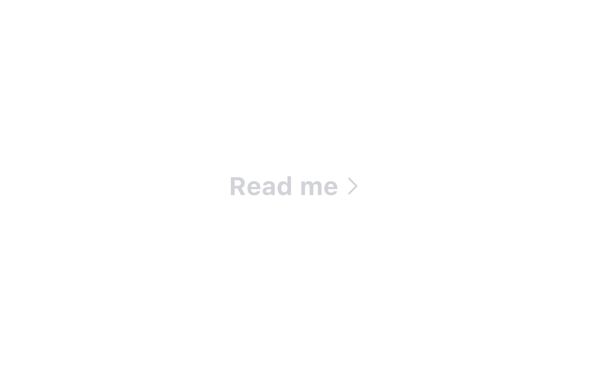
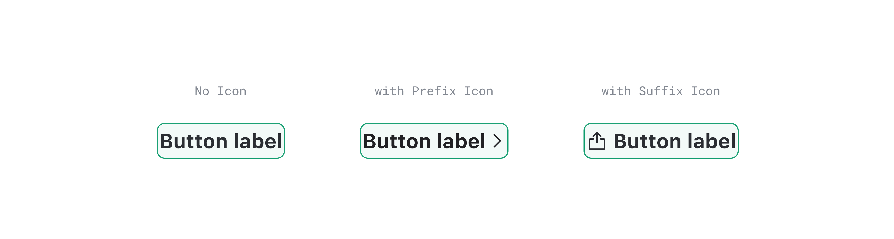

## 구조도

1. Root : Button 컴포넌트를 감싸는 컨테이너 영역
2. Label : Button에 대한 정보를 전달하는 라벨
3. Icon : Button에 대한 정보를 전달하는 아이콘

## 옵션

<HalfCard>
  <HalfCardImageCell>
    
  </HalfCardImageCell>
  <HalfCardDescriptionCell>
    <HalfCardDescriptionTitle>Size</HalfCardDescriptionTitle>
    <HalfCardDescription>
      Text Button은 small, medium, large 3개의 사이즈를 가질 수 있습니다.
      medium이 가장 보편적으로 사용되며, 페이지 내의 중요도와 시각적 균형에 맞게
      적절하게 사용합니다.
    </HalfCardDescription>
  </HalfCardDescriptionCell>
</HalfCard>

<HalfCard>
  <HalfCardImageCell>
    
  </HalfCardImageCell>
  <HalfCardDescriptionCell>
    <HalfCardDescriptionTitle>Variant</HalfCardDescriptionTitle>
    <HalfCardDescription>
      Variant의 중요도는 Primary로 갈수록 높아지며, Secondary로 갈수록
      낮아집니다. 화면 내에서 액션의 중요도에 따라 버튼의 variant를 다르게
      사용합니다.
    </HalfCardDescription>
  </HalfCardDescriptionCell>
</HalfCard>

<HalfCard>
  <HalfCardImageCell>
    
  </HalfCardImageCell>
  <HalfCardDescriptionCell>
    <HalfCardDescriptionTitle>Danger Variant</HalfCardDescriptionTitle>
    <HalfCardDescription>
      Danger variant는 유저에게 위험 요소에 대한 경고를 전달할 때 사용합니다. 이
      버튼으로 인해 파괴적 변화나 부정적인 행동이 일어날 수 있다는 시각적 인지를
      제공합니다.
    </HalfCardDescription>
  </HalfCardDescriptionCell>
</HalfCard>

<HalfCard>
  <HalfCardImageCell>
    
  </HalfCardImageCell>
  <HalfCardDescriptionCell>
    <HalfCardDescriptionTitle>Style</HalfCardDescriptionTitle>
    <HalfCardDescription>
      Basic, Underlined 2개의 스타일을 사용할 수 있습니다.
    </HalfCardDescription>
  </HalfCardDescriptionCell>
</HalfCard>

<HalfCard>
  <HalfCardImageCell>
    
  </HalfCardImageCell>
  <HalfCardDescriptionCell>
    <HalfCardDescriptionTitle>Bold</HalfCardDescriptionTitle>
    <HalfCardDescription>
      Text Button이 전달하고자 하는 의미가 강조되어야 할 경우, Bold를 사용할 수
      있습니다.
    </HalfCardDescription>
  </HalfCardDescriptionCell>
</HalfCard>

<HalfCard>
  <HalfCardImageCell>
    
  </HalfCardImageCell>
  <HalfCardDescriptionCell>
    <HalfCardDescriptionTitle>Disabled</HalfCardDescriptionTitle>
    <HalfCardDescription>
      Disabled 상태는 Text Button이 존재하지만 지금은 사용할 수 없는 상태를
      나타냅니다. 이 옵션은 레이아웃 일관성을 유지하고 이후 상호작용이 가능할
      수도 있음을 사용자에게 알려줍니다.
    </HalfCardDescription>
  </HalfCardDescriptionCell>
</HalfCard>

### 옵션 테이블

| 속성        | 값                                                | 기본값  |
| ----------- | ------------------------------------------------- | ------- |
| size        | small, medium, large                              | medium  |
| variant     | primary, secondary, secondary-low, accent, danger | primary |
| style       | basic, underlined                                 | basic   |
| bold        | true, false                                       | false   |
| is disabled | true, false                                       | false   |

## 상호작용

### 터치 / 마우스 상호작용

<FullCard>
  <FullCardImageCell>
    
  </FullCardImageCell>
  <FullCardDescription>
    마우스 클릭 또는 터치로 Text Button과 상호작용할 수 있는 영역입니다.
  </FullCardDescription>
</FullCard>

<FullCard>
  <FullCardImageCell>
    
  </FullCardImageCell>
  <FullCardDescription>
    PC 환경에서 Text Button에 Hover시 커서가 포인터 모양으로 바뀝니다.
  </FullCardDescription>
</FullCard>

<FullCard>
  <FullCardImageCell>
    
  </FullCardImageCell>
  <FullCardDescription>
    Disabled 상태인 경우 상호작용이 불가능합니다.
  </FullCardDescription>
</FullCard>

### 키보드 상호작용

<FullCard>
  <FullCardImageCell>
    
  </FullCardImageCell>
  <FullCardDescription>
    <Keyboard>space</Keyboard> 또는 <Keyboard>enter</Keyboard> 키를 통해
    Button과 상호작용할 수 있습니다.
  </FullCardDescription>
</FullCard>

<FullCard>
  <FullCardImageCell>
    
  </FullCardImageCell>
  <FullCardDescription>
    Label은 1줄을 초과할 수 없으며 좌우 Margin 각 16px을 유지한 범위내에서만
    텍스트가 노출될 수 있습니다. 범위를 초과한 텍스트값은 입력될 수 없으며
    말줄임 처리도 불가합니다.
  </FullCardDescription>
</FullCard>

## 가이드라인

Working In Progress
