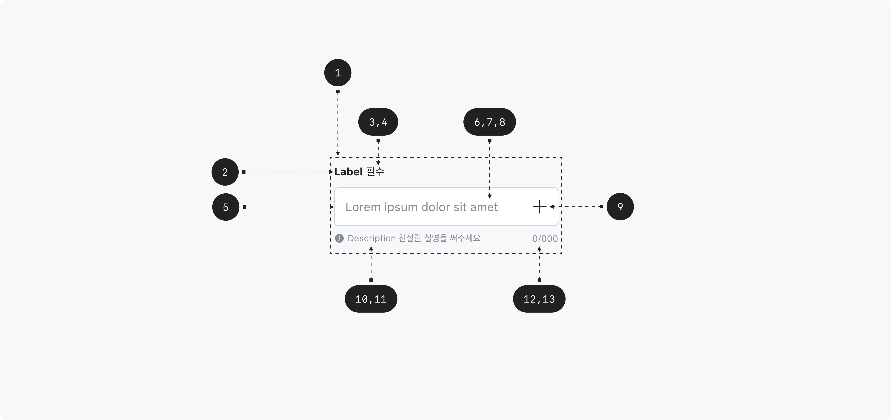

## 구조도

1. Root
2. Label
3. Required indicator
4. Optional indicator
5. Field
6. Field text
7. Placeholder
8. Suffix
9. Description
10. Error message
11. Character Count
12. Max Length

## 옵션

### 옵션 테이블

| 속성               | 값                   | 기본값   | 설명                                               |
| ------------------ | -------------------- | -------- | -------------------------------------------------- |
| variant            | outlined, underlined | outlined |
| label              | text                 |          |                                                    |
| placeholder        | text                 |          |                                                    |
| suffix             | text, button         |          |                                                    |
| max length         | number               |          |
| description        | text                 |          |                                                    |
| error message      | text                 |          |                                                    |
| required indicator | text                 |          |                                                    |
| optional indicator | text                 |          |                                                    |
| is disabled        | true, false          | false    | true일 경우, Text field가 유저와 상호작용하지 않음 |
| is readonly        | true, false          | false    | true일 경우, value를 변경할 수 없음                |
| is required        | true, false          | false    | true일 경우, value가 필수임을 나타냄               |
| is invalid         | true, false          | false    | true일 경우, value가 유효하지 않은 값임을 나타냄   |

## 상호작용

Working In Progress

## 가이드라인

Working In Progress
