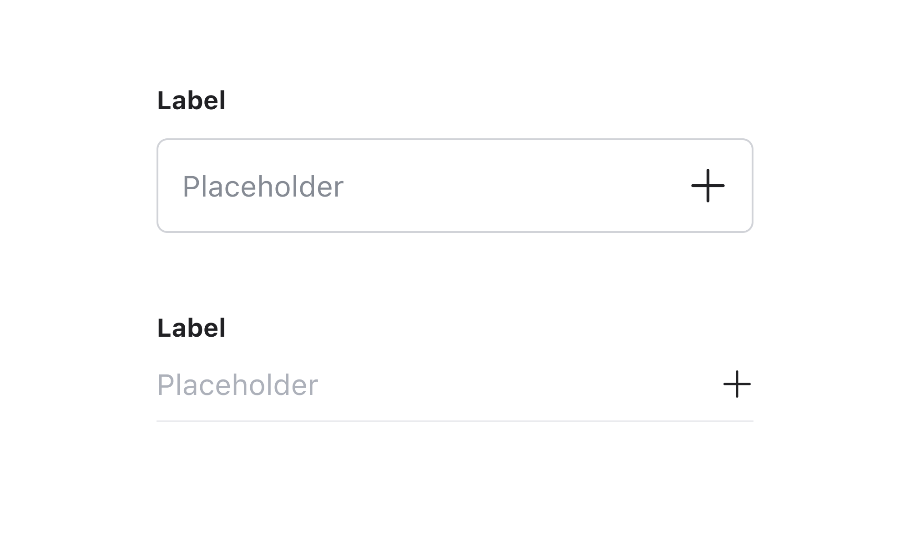
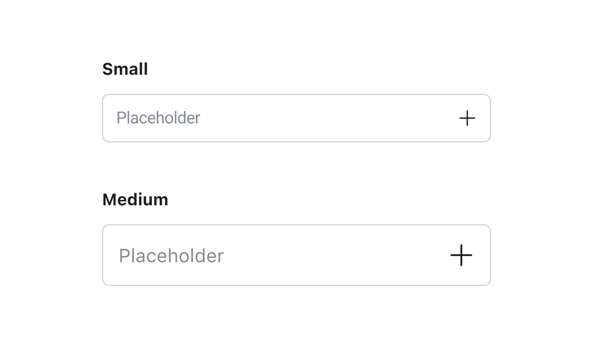
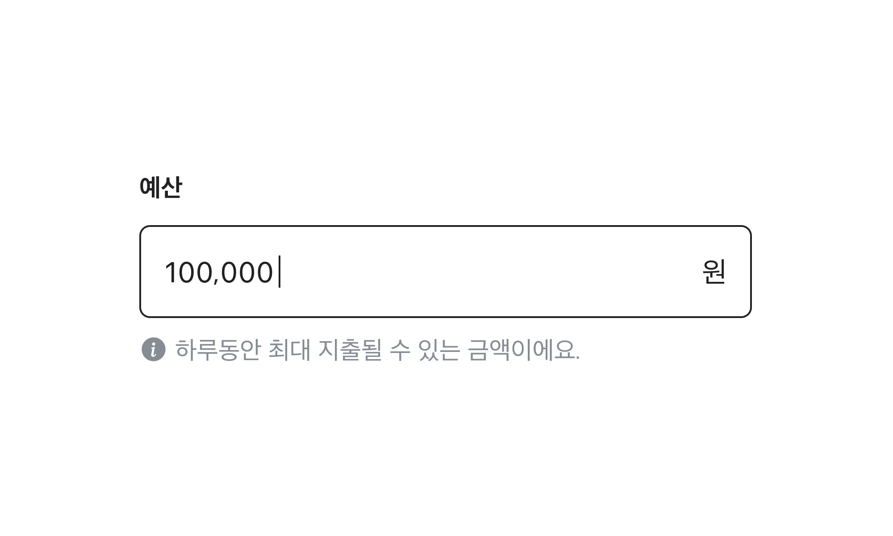
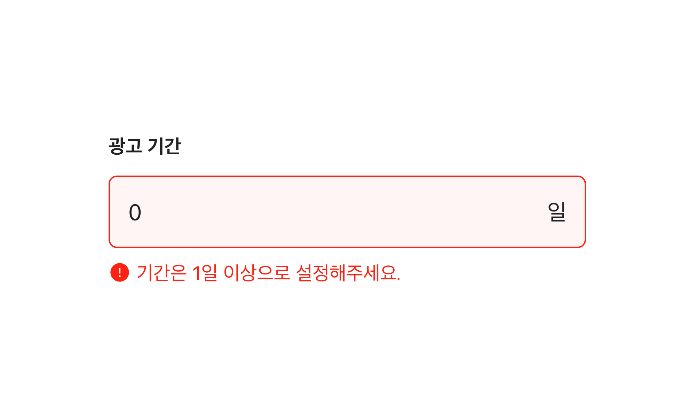
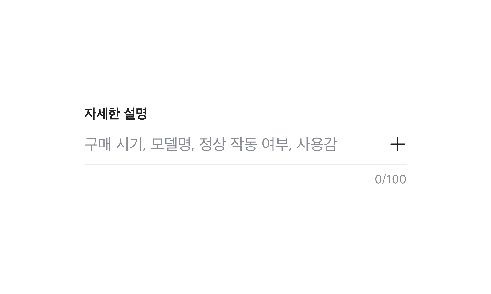
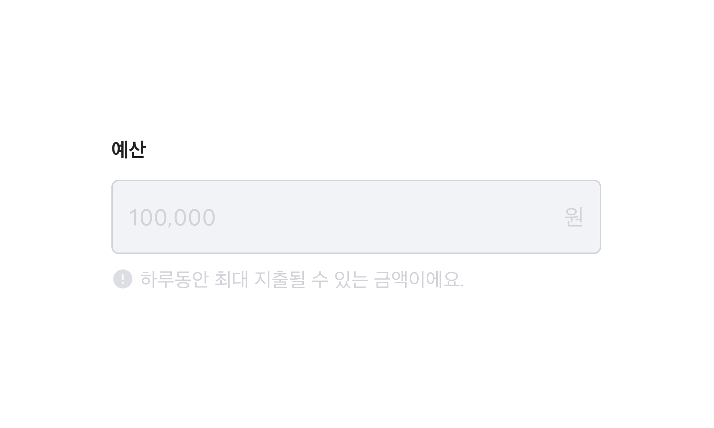
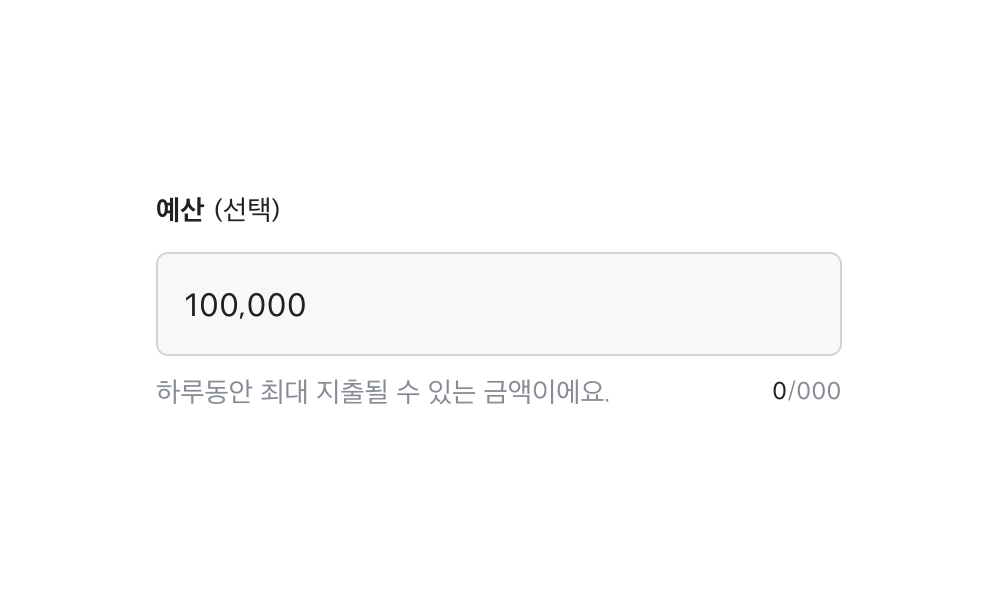

## 구조도

1. Root
2. Label
3. Required indicator
4. Optional indicator
5. Field
6. Field text
7. Placeholder
8. Cursor
9. Suffix
10. Description
11. Error message
12. Character Count
13. Max Length

## 옵션

<HalfCard>
  <HalfCardImageCell>
    
  </HalfCardImageCell>
  <HalfCardDescriptionCell>
    <HalfCardDescriptionTitle>Variant</HalfCardDescriptionTitle>
    <HalfCardDescription>
      Text Field는 outlined, underlined 2개의 Variant 옵션을 가질 수 있습니다.
      2개의 Variant는 모두 같은 옵션을 공유하고 있으며, Outlined이 가장
      보편적입니다. 화면에 따라 컨테이너 스타일을 다르게 사용할 수 있습니다.
    </HalfCardDescription>
  </HalfCardDescriptionCell>
</HalfCard>

<HalfCard>
  <HalfCardImageCell>
    
  </HalfCardImageCell>
  <HalfCardDescriptionCell>
    <HalfCardDescriptionTitle>Size</HalfCardDescriptionTitle>
    <HalfCardDescription>
      Text Field는 small, medium 2개의 사이즈를 가질 수 있습니다.
    </HalfCardDescription>
  </HalfCardDescriptionCell>
</HalfCard>

<HalfCard>
  <HalfCardImageCell>
    
  </HalfCardImageCell>
  <HalfCardDescriptionCell>
    <HalfCardDescriptionTitle>Description</HalfCardDescriptionTitle>
    <HalfCardDescription>
      Description을 통해 사용자가 입력해야 하는 내용에 대한 추가 컨텍스트나
      도움말을 제공할 수 있습니다. 특정 요구사항이나 힌트 텍스트를 전달합니다.
    </HalfCardDescription>
  </HalfCardDescriptionCell>
</HalfCard>

<HalfCard>
  <HalfCardImageCell>
    
  </HalfCardImageCell>
  <HalfCardDescriptionCell>
    <HalfCardDescriptionTitle>Error Message</HalfCardDescriptionTitle>
    <HalfCardDescription>
      Text Field의 필수 요구 사항이 충족되지 않았거나, 잘못된 정보를 기입했을
      경우 사용자에게 에러 메세지를 전달합니다.
    </HalfCardDescription>
  </HalfCardDescriptionCell>
</HalfCard>

<HalfCard>
  <HalfCardImageCell>
    
  </HalfCardImageCell>
  <HalfCardDescriptionCell>
    <HalfCardDescriptionTitle>Suffix</HalfCardDescriptionTitle>
    <HalfCardDescription>
      Suffix에는 텍스트와 버튼을 사용할 수 있습니다. 입력하는 내용과 컨텍스트에
      따라 올바른 맥락으로 사용해야합니다.
    </HalfCardDescription>
  </HalfCardDescriptionCell>
</HalfCard>

<HalfCard>
  <HalfCardImageCell>
    
  </HalfCardImageCell>
  <HalfCardDescriptionCell>
    <HalfCardDescriptionTitle>Max Length</HalfCardDescriptionTitle>
    <HalfCardDescription>
      Text Field에 사용자가 입력할 수 있는 최대 글자 수를 표시합니다.
    </HalfCardDescription>
  </HalfCardDescriptionCell>
</HalfCard>

<HalfCard>
  <HalfCardImageCell>
    
  </HalfCardImageCell>
  <HalfCardDescriptionCell>
    <HalfCardDescriptionTitle>Disabled</HalfCardDescriptionTitle>
    <HalfCardDescription>
      Disabled 상태는 Text Field가 존재하지만 지금은 사용할 수 없는 상태를
      나타냅니다. 이 옵션은 레이아웃 일관성을 유지하고 이후 상호작용이 가능할
      수도 있음을 사용자에게 알려줍니다.
    </HalfCardDescription>
  </HalfCardDescriptionCell>
</HalfCard>

<HalfCard>
  <HalfCardImageCell>
    
  </HalfCardImageCell>
  <HalfCardDescriptionCell>
    <HalfCardDescriptionTitle>Read only</HalfCardDescriptionTitle>
    <HalfCardDescription>
      Read only 상태는 읽기 전용 옵션입니다. 복사나 드래그는 가능하지만 상호
      작용이나 텍스트 입력, 변경은 불가능한 상태입니다.
    </HalfCardDescription>
  </HalfCardDescriptionCell>
</HalfCard>

 

### 옵션 테이블

| 속성               | 값                   | 기본값   | 설명                                               |
| ------------------ | -------------------- | -------- | -------------------------------------------------- |
| variant            | outlined, underlined | outlined |
| label              | text                 |          |                                                    |
| placeholder        | text                 |          |                                                    |
| suffix             | text, button         |          |                                                    |
| max length         | number               |          |
| description        | text                 |          |                                                    |
| error message      | text                 |          |                                                    |
| required indicator | text                 |          |                                                    |
| optional indicator | text                 |          |                                                    |
| is disabled        | true, false          | false    | true일 경우, Text field가 유저와 상호작용하지 않음 |
| is readonly        | true, false          | false    | true일 경우, value를 변경할 수 없음                |
| is required        | true, false          | false    | true일 경우, value가 필수임을 나타냄               |
| is invalid         | true, false          | false    | true일 경우, value가 유효하지 않은 값임을 나타냄   |

## 상호작용

Working In Progress

## 가이드라인

Working In Progress
