## 구조도

<Anatomy>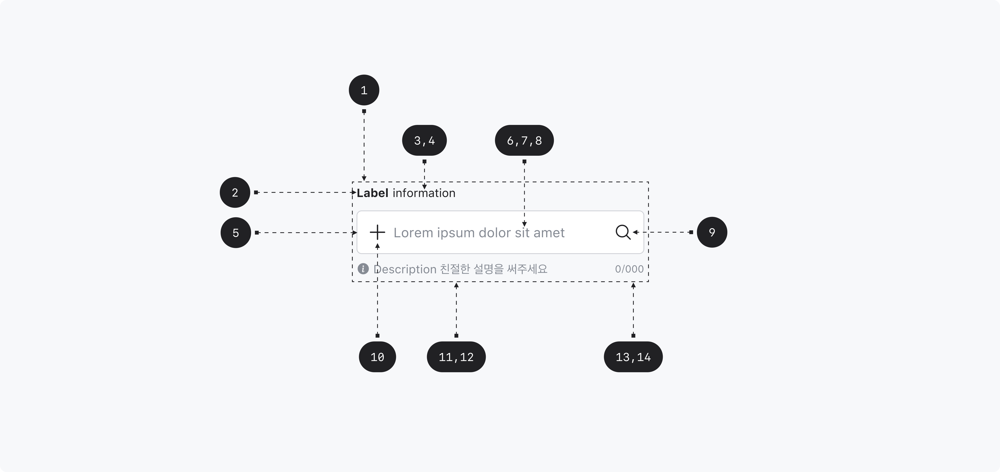</Anatomy>

1. Root
2. Label
3. Required indicator
4. Optional indicator
5. Field
6. Field text
7. Placeholder
8. Cursor
9. Suffix
10. Prefix
11. Description
12. Error message
13. Character Count
14. Max Length

## 컴포넌트 미리보기

<Iframe
  src="https://sprout-storybook.vercel.app/iframe.html?args=&id=components-textfields-textfield--basic&viewMode=story"
  height="150px"
/>

## 옵션

<HalfCard>
  <HalfCardImageCell>
    
  </HalfCardImageCell>
  <HalfCardDescriptionCell>
    <HalfCardDescriptionTitle>Label</HalfCardDescriptionTitle>
    <HalfCardDescription>
      Label과 Placeholder는 Text Field가 사용자에게 요구하는 항목에 대한 설명을
      제공합니다. 명시적 정보 전달을 위해 Label과 Placeholder를 표시하는 것을
      권장합니다.
    </HalfCardDescription>
  </HalfCardDescriptionCell>
</HalfCard>

<HalfCard>
  <HalfCardImageCell>
    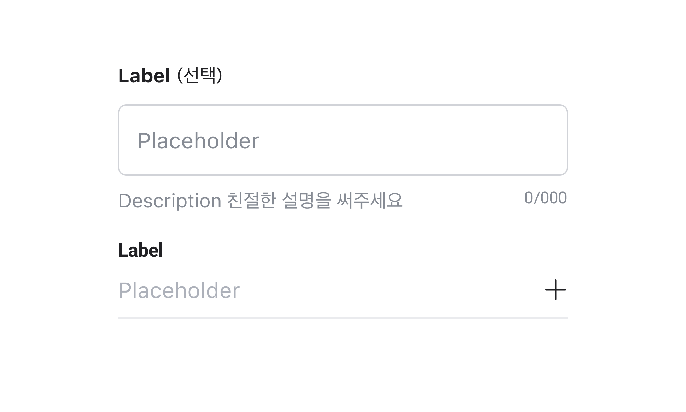
  </HalfCardImageCell>
  <HalfCardDescriptionCell>
    <HalfCardDescriptionTitle>Variant</HalfCardDescriptionTitle>
    <HalfCardDescription>
      Text Field는 Outlined, Underlined 2종류의 Variant를 가질 수 있습니다.
      Outlined가 보편적으로 사용되며, 주변 요소와의 조화를 고려해 컨테이너
      스타일을 다르게 사용할 수 있습니다.
    </HalfCardDescription>
  </HalfCardDescriptionCell>
</HalfCard>

<HalfCard>
  <HalfCardImageCell>
    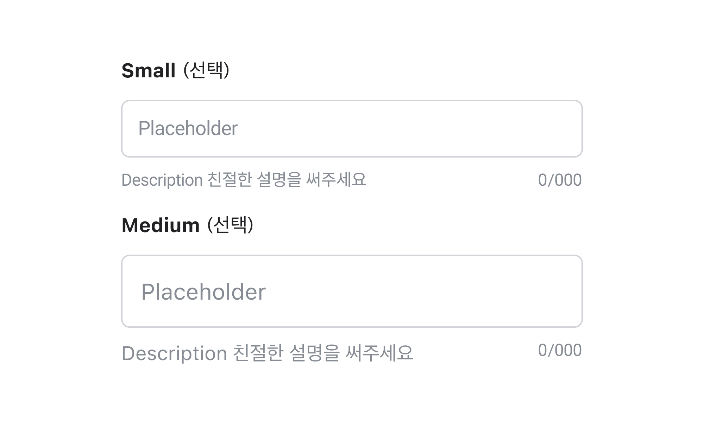
  </HalfCardImageCell>
  <HalfCardDescriptionCell>
    <HalfCardDescriptionTitle>Size</HalfCardDescriptionTitle>
    <HalfCardDescription>
      Text Field는 small, medium, large 3개의 사이즈를 가질 수 있습니다.
      Medium이 기본값으로 가장 보편적으로 사용되며, 다른 크기는 주변 요소와의
      균형 및 위계에 따라 제한적으로 사용합니다.
    </HalfCardDescription>
  </HalfCardDescriptionCell>
</HalfCard>

<HalfCard>
  <HalfCardImageCell>
    
  </HalfCardImageCell>
  <HalfCardDescriptionCell>
    <HalfCardDescriptionTitle>Description</HalfCardDescriptionTitle>
    <HalfCardDescription>
      Description을 통해 사용자가 입력해야 하는 내용에 대한 추가 컨텍스트나
      도움말을 제공할 수 있습니다. 특정 요구사항이나 힌트 텍스트를 전달합니다.
    </HalfCardDescription>
  </HalfCardDescriptionCell>
</HalfCard>

<HalfCard>
  <HalfCardImageCell>
    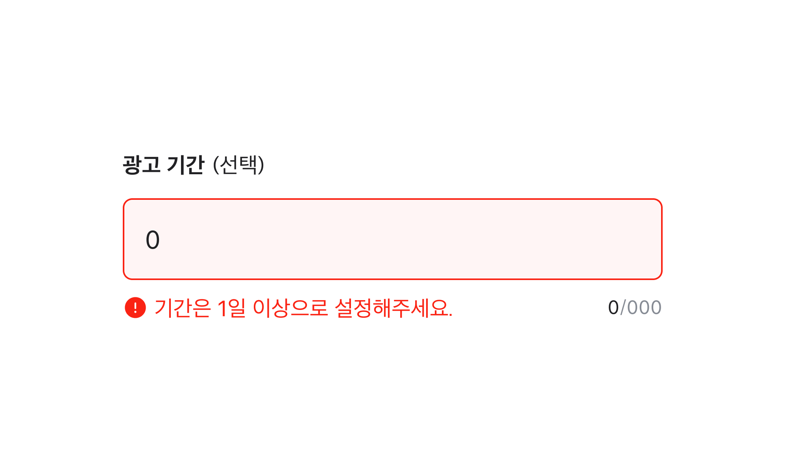
  </HalfCardImageCell>
  <HalfCardDescriptionCell>
    <HalfCardDescriptionTitle>Error Message</HalfCardDescriptionTitle>
    <HalfCardDescription>
      Text Field의 필수 요구 사항이 충족되지 않았거나, 잘못된 정보를 기입했을
      경우 사용자에게 에러 메세지를 전달합니다.
    </HalfCardDescription>
  </HalfCardDescriptionCell>
</HalfCard>

<HalfCard>
  <HalfCardImageCell>
    
  </HalfCardImageCell>
  <HalfCardDescriptionCell>
    <HalfCardDescriptionTitle>Prefix / Suffix</HalfCardDescriptionTitle>
    <HalfCardDescription>
      Prefix와 Suffix에는 텍스트와 버튼을 사용할 수 있습니다. 입력하는 내용과
      컨텍스트에 따라 올바른 맥락으로 사용해야 합니다.
    </HalfCardDescription>
  </HalfCardDescriptionCell>
</HalfCard>

<HalfCard>
  <HalfCardImageCell>
    
  </HalfCardImageCell>
  <HalfCardDescriptionCell>
    <HalfCardDescriptionTitle>Required or Optional</HalfCardDescriptionTitle>
    <HalfCardDescription>
      Required or Optional indicator를 통해 사용자에게 입력값이 필수 또는 선택
      사항인지 표시할 수 있습니다. 선택 사항인 경우 '선택' 이라는 힌트 텍스트를
      제공하거나, 아예 표시하지 않습니다.
    </HalfCardDescription>
  </HalfCardDescriptionCell>
</HalfCard>

<HalfCard>
  <HalfCardImageCell>
    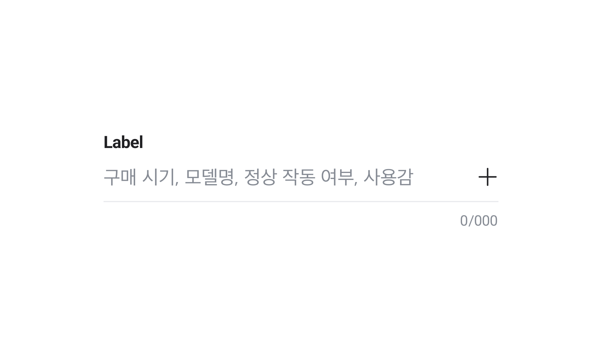
  </HalfCardImageCell>
  <HalfCardDescriptionCell>
    <HalfCardDescriptionTitle>Max Length</HalfCardDescriptionTitle>
    <HalfCardDescription>
      Text Field에 사용자가 입력할 수 있는 최대 글자 수를 표시합니다.
    </HalfCardDescription>
  </HalfCardDescriptionCell>
</HalfCard>

<HalfCard>
  <HalfCardImageCell>
    
  </HalfCardImageCell>
  <HalfCardDescriptionCell>
    <HalfCardDescriptionTitle>Disabled</HalfCardDescriptionTitle>
    <HalfCardDescription>
      Disabled 상태는 Text Field가 존재하지만 지금은 사용할 수 없는 상태를
      나타냅니다. 이 옵션은 레이아웃 일관성을 유지하고 이후 상호작용이 가능할
      수도 있음을 사용자에게 알려줍니다.
    </HalfCardDescription>
  </HalfCardDescriptionCell>
</HalfCard>

<HalfCard>
  <HalfCardImageCell>
    
  </HalfCardImageCell>
  <HalfCardDescriptionCell>
    <HalfCardDescriptionTitle>Read only</HalfCardDescriptionTitle>
    <HalfCardDescription>
      Read only 상태는 읽기 전용 옵션입니다. 복사나 드래그는 가능하지만 상호
      작용이나 텍스트 입력, 변경은 불가능한 상태입니다.
    </HalfCardDescription>
  </HalfCardDescriptionCell>
</HalfCard>

 

### 옵션 테이블

| 속성               | 값                   | 기본값   | 설명                                               |
| ------------------ | -------------------- | -------- | -------------------------------------------------- |
| variant            | outlined, underlined | outlined |
| label              | text                 |          |                                                    |
| placeholder        | text                 |          |                                                    |
| prefix             | text, button         |          |                                                    |
| suffix             | text, button         |          |                                                    |
| max length         | number               |          |
| description        | text                 |          |                                                    |
| error message      | text                 |          |                                                    |
| required indicator | text                 |          |                                                    |
| optional indicator | text                 |          |                                                    |
| is disabled        | true, false          | false    | true일 경우, Text field가 유저와 상호작용하지 않음 |
| is readonly        | true, false          | false    | true일 경우, value를 변경할 수 없음                |
| is required        | true, false          | false    | true일 경우, value가 필수임을 나타냄               |
| is invalid         | true, false          | false    | true일 경우, value가 유효하지 않은 값임을 나타냄   |

## 상호작용

### 터치/마우스 상호작용

<FullCard>
  <FullCardImageCell>
    
  </FullCardImageCell>
  <FullCardDescription>
    마우스 클릭 또는 터치로 Text Field를 동작시킬 수 있는 영역입니다.
  </FullCardDescription>
</FullCard>

<FullCard>
  <FullCardImageCell>
    
  </FullCardImageCell>
  <FullCardDescription>
    Read only일 경우 드래그나 복사는 가능하지만 상호 작용이나 텍스트 입력,
    변경은 불가능한 상태입니다.
  </FullCardDescription>
</FullCard>

 

### 키보드 상호작용

<HalfCard>
  <HalfCardImageCell>
    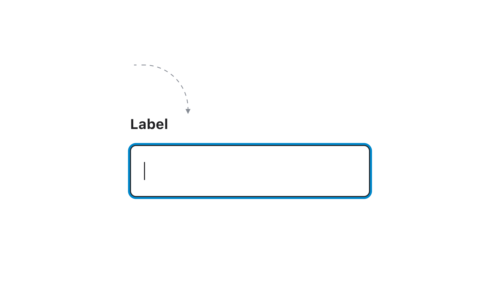
  </HalfCardImageCell>
  <HalfCardDescriptionCell>
    <HalfCardDescriptionTitle>Focused</HalfCardDescriptionTitle>
    <HalfCardDescription>
      <Keyboard>Tab</Keyboard>키를 통해 focused, enabled 상태로 진입이
      가능합니다.
    </HalfCardDescription>
  </HalfCardDescriptionCell>
</HalfCard>

<HalfCard>
  <HalfCardImageCell>
    
  </HalfCardImageCell>
  <HalfCardDescriptionCell>
    <HalfCardDescriptionTitle>Selected text</HalfCardDescriptionTitle>
    <HalfCardDescription>
      이미 작성한 텍스트가 있는 경우, <Keyboard>Tab</Keyboard>키를 통해 텍스트
      selected 상태로 진입 가능합니다.
    </HalfCardDescription>
  </HalfCardDescriptionCell>
</HalfCard>

### Typing

<HalfCard>
  <HalfCardImageCell>
    
  </HalfCardImageCell>
  <HalfCardDescriptionCell>
    <HalfCardDescriptionTitle>Typing text</HalfCardDescriptionTitle>
    <HalfCardDescription>
      넘치는 텍스트는 필드 좌측으로 밀려나 보이지 않게 됩니다.
    </HalfCardDescription>
  </HalfCardDescriptionCell>
</HalfCard>

<HalfCard>
  <HalfCardImageCell>
    
  </HalfCardImageCell>
  <HalfCardDescriptionCell>
    <HalfCardDescriptionTitle>Cursor</HalfCardDescriptionTitle>
    <HalfCardDescription>
      커서를 좌측으로 이동하면 텍스트는 필드 우측으로 밀려나게 됩니다.
    </HalfCardDescription>
  </HalfCardDescriptionCell>
</HalfCard>

<HalfCard>
  <HalfCardImageCell>
    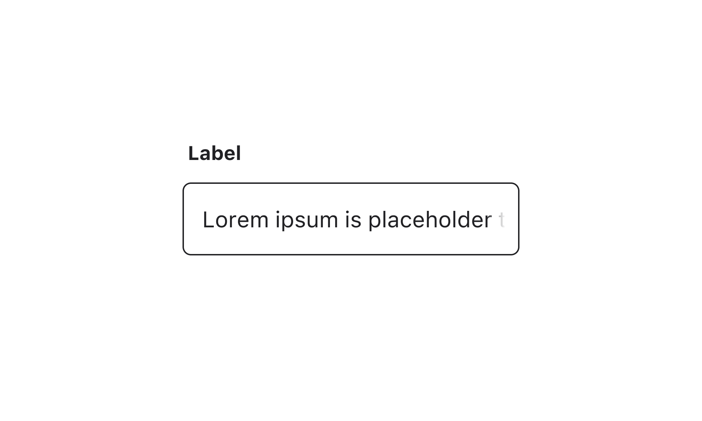
  </HalfCardImageCell>
  <HalfCardDescriptionCell>
    <HalfCardDescriptionTitle>입력 완료</HalfCardDescriptionTitle>
    <HalfCardDescription>
      입력 완료 후 필드를 떠나면 우측으로 밀려난 텍스트는 텍스트 필드 영역을
      기준으로 끝 처리 그라데이션되어 보여집니다.
    </HalfCardDescription>
  </HalfCardDescriptionCell>
</HalfCard>

### Overflow

<FullCard>
  <FullCardImageCell>
    
  </FullCardImageCell>
  <FullCardDescription>
    Label의 문구가 텍스트 필드의 Width보다 입력값이 길면 줄바꿈되어 보여집니다.
  </FullCardDescription>
  <FullCardImageCell>
    
  </FullCardImageCell>
  <FullCardDescription>
    Description이 Width 공간보다 길면 줄바꿈되어 보여집니다.
  </FullCardDescription>
</FullCard>

## 가이드라인

<HalfCard>
  <HalfCardImageCell>
    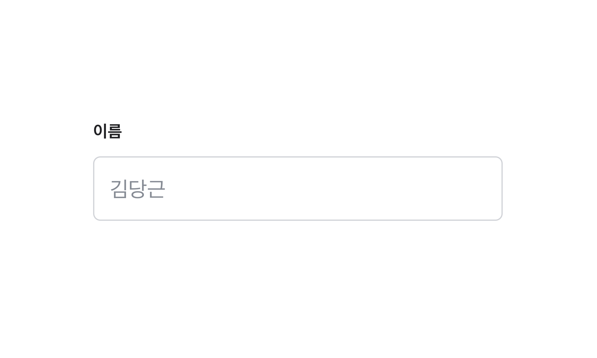
  </HalfCardImageCell>
  <HalfCardDescriptionCell>
    <HalfCardDescriptionTitle>Label</HalfCardDescriptionTitle>
    <HalfCardDescription>
      Label과 Placeholder는 Text Field가 사용자에게 요구하는 항목에 대한 설명을
      제공합니다. 명시적 정보 전달을 위해 Label과 Placeholder를 표시하는 것을
      권장합니다.
    </HalfCardDescription>
  </HalfCardDescriptionCell>
</HalfCard>

<HalfCard>
  <HalfCardImageCell>
    
  </HalfCardImageCell>
  <HalfCardDescriptionCell>
    <HalfCardDescriptionTitle>Suffix</HalfCardDescriptionTitle>
    <HalfCardDescription>
      Suffix value를 통해 입력하는 값과 단위를 다양하게 활용할 수 있습니다.
    </HalfCardDescription>
  </HalfCardDescriptionCell>
</HalfCard>

<HalfCard>
  <HalfCardImageCell>
    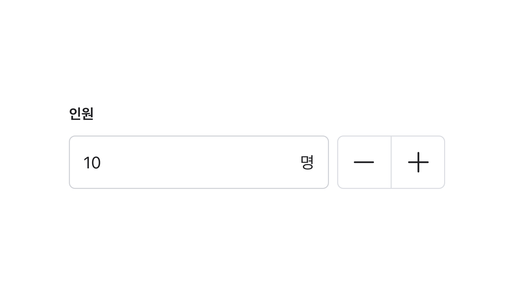
  </HalfCardImageCell>
  <HalfCardDescriptionCell>
    <HalfCardDescriptionTitle>컴포넌트 결합</HalfCardDescriptionTitle>
    <HalfCardDescription>
      필요한 경우 다른 컴포넌트와 조합해 사용할 수 있습니다. 예를들어, Stepper
      Button과의 조합을 통해 모바일 환경에서도 쉽게 값을 조절할 수 있도록
      돕습니다.
    </HalfCardDescription>
  </HalfCardDescriptionCell>
</HalfCard>

 

### Do / Don't

 
<DoDontLayout>
  <DoBox>
    <DoImage>
      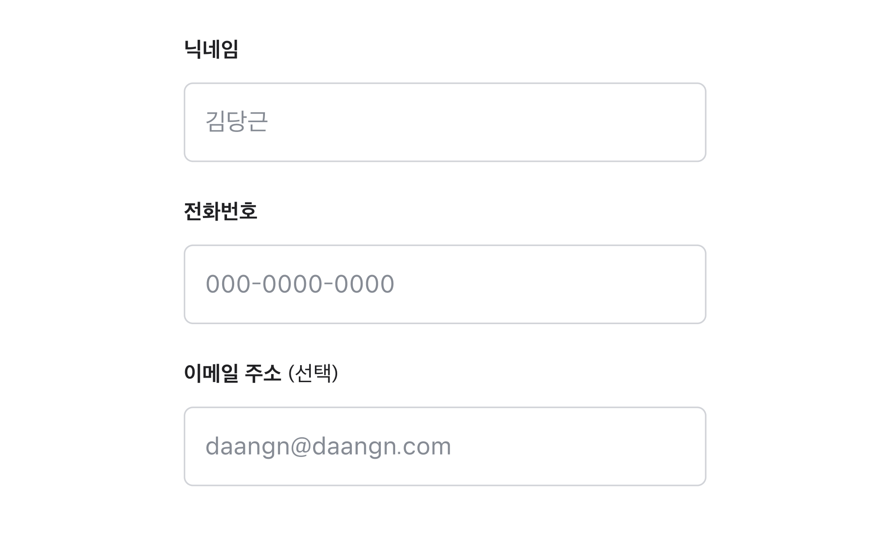
    </DoImage>
    <DoText>
      여러 개의 Text Field가 존재하고 Indicator 표시가 필요한 경우, 더 빈도가
      적은 Indicator를 표시합니다.
    </DoText>
  </DoBox>
  <DontBox>
    <DontImage>
      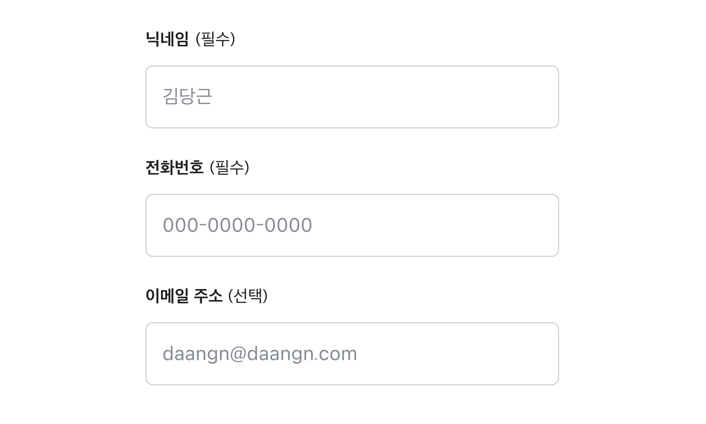
    </DontImage>
    <DontText>
      여러 개의 Text Field가 존재하고 Indicator 표시가 필요한 경우, 모든
      Indicator를 표시하지 않습니다. 정보를 간결하게 전달할수록 이해하기 쉬운
      정보가 됩니다.
    </DontText>
  </DontBox>
</DoDontLayout>
 
 
<DoDontLayout>
  <DoBox>
    <DoImage>
      
    </DoImage>
    <DoText>
      Placeholder는 유저가 입력해야 하는 정보의 예시를 나타냅니다. 이는 힌트
      역할을 하여 무엇을 입력해야 할지에 대한 명확한 이해를 돕습니다.
    </DoText>
  </DoBox>
  <DontBox>
    <DontImage>
      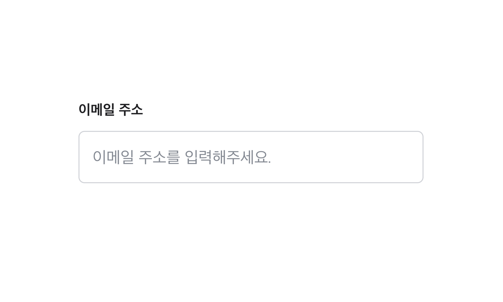
    </DontImage>
    <DontText>
      Placeholder를 정보의 예시가 아닌 설명으로 서술하지 않습니다.
    </DontText>
  </DontBox>
</DoDontLayout>
 
