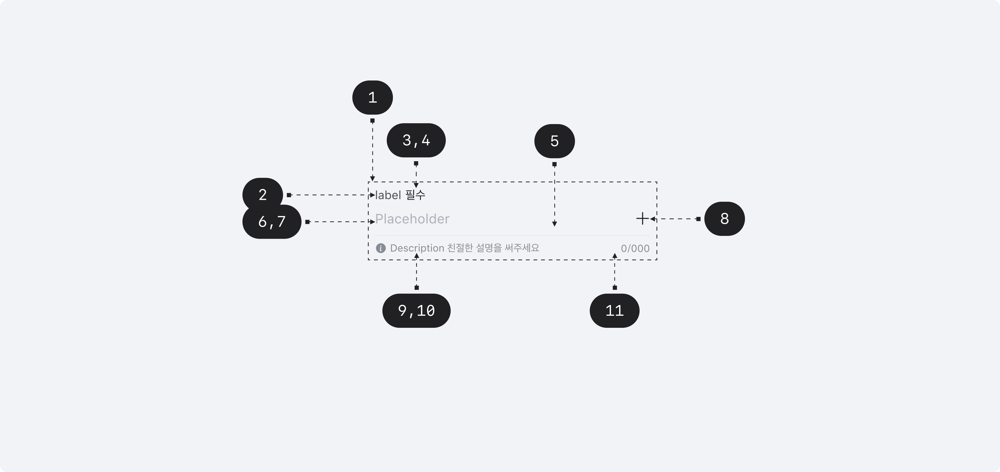

## Anatomy

1. Root - Primitive.Root
2. Label - Primitive.Label
3. Required indicator
4. Optional indicator
5. Field - Primitive.Input
6. Field text
7. Placeholder
8. Suffix
9. Description - Primitive.Description
10. Error message - Primitive.ErrorMessage
11. Character Count

## Visual Options

| Property      | Value        | Description |
| ------------- | ------------ | ----------- |
| label         | text         |             |
| placeholder   | text         |             |
| suffix        | text, button |             |
| max length    | number       |             |
| description   | text         |             |
| error message | text         |             |

## Visually Representated States

| State    | Condition                                                 |
| -------- | --------------------------------------------------------- |
| enabled  | isDisabled = false, isReadOnly = false, isFocused = false |
| focused  | isDisabled = false, isReadOnly = false, isFocused = true  |
| readonly | isDisabled = false, isReadOnly = true                     |
| disabled | isDisabled = true                                         |

| State   | Condition         |
| ------- | ----------------- |
| valid   | isInvalid = false |
| invalid | isInvalid = true  |

## 디자인 결정 (Color)

| Part  | Attribute | Value                 |
| ----- | --------- | --------------------- |
| Label | Color     | $scale.color.gray-700 |

| State    | Part               | Attribute            | Value                  |
| -------- | ------------------ | -------------------- | ---------------------- |
| Enabled  | Field              | Bottom Outline Color | $scale.color.gray-200  |
|          | Field(invalid)     | Bottom Outline Color | $semantic.color.danger |
|          | Field text         | Color                | $scale.color.gray-900  |
|          | Placeholder        | Color                | $scale.color.gray-600  |
|          | Help text          | Color                | $scale.color.gray-600  |
|          | Help text(invalid) | Color                | $semantic.color.danger |
|          | Character Count    | Color                | $scale.color.gray-600  |
| Focused  | Field              | Bottom Outline Color | $scale.color.gray-900  |
|          | Field(invalid)     | Bottom Outline Color | $semantic.color.danger |
|          | Field text         | Color                | $scale.color.gray-900  |
|          | Placeholder        | Color                | $scale.color.gray-600  |
|          | Help text          | Color                | $scale.color.gray-600  |
|          | Help text(invalid) | Color                | $semantic.color.danger |
|          | Character Count    | Color                | $scale.color.gray-600  |
| Readonly | Field              | Bottom Outline Color | $scale.color.gray-400  |
|          | Field text         | Color                | $scale.color.gray-900  |
|          | Placeholder        | Color                | $scale.color.gray-600  |
|          | Help text          | Color                | $scale.color.gray-600  |
|          | Character Count    | Color                | $scale.color.gray-600  |
| Disabled | Field              | Bottom Outline Color | $scale.color.gray-400  |
|          | Field text         | Color                | $scale.color.gray-400  |
|          | Placeholder        | Color                | $scale.color.gray-400  |
|          | Help text          | Color                | $scale.color.gray-400  |
|          | Character Count    | Color                | $scale.color.gray-400  |

## 디자인 결정 (Typography)

| Part                    | Attribute  | Value                                 |
| ----------------------- | ---------- | ------------------------------------- |
| Label                   | Typography | $semantic.typography.caption1-regular |
| Field Text, Placeholder | Typography | $semantic.typography.label2-regular   |
| Help Text               | Typography | $semantic.typography.label4-regular   |
| Character Count         | Typography | $semantic.typography.caption2-regular |

## 디자인 결정 (Layout)

| Part                       | Attribute      | Value |
| -------------------------- | -------------- | ----- |
| Field                      | Bottom Padding | 9pt   |
| Label / Required Indicator | Spacing        | 2pt   |
| Label / Field              | Spacing        | 8pt   |
| Field / Help Text          | Spacing        | 6pt   |
