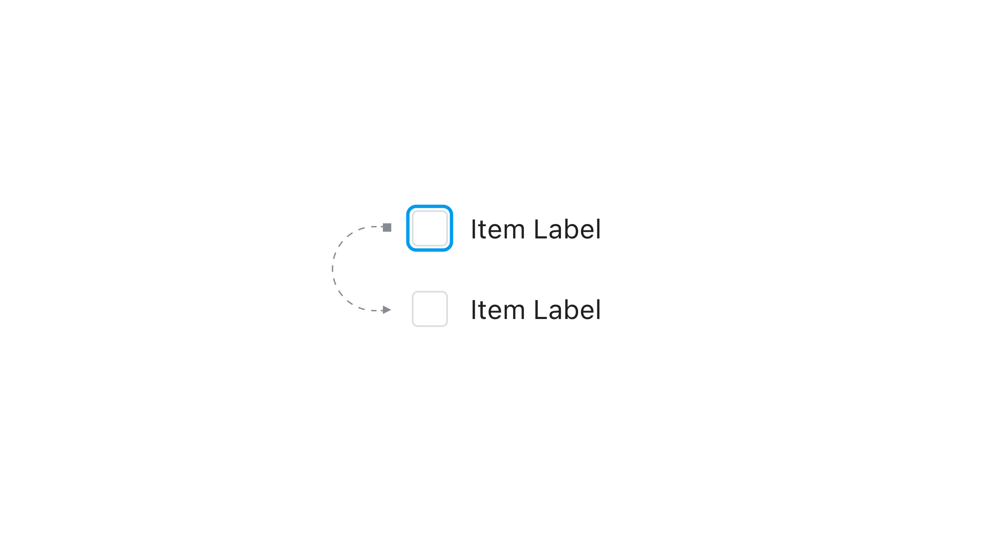
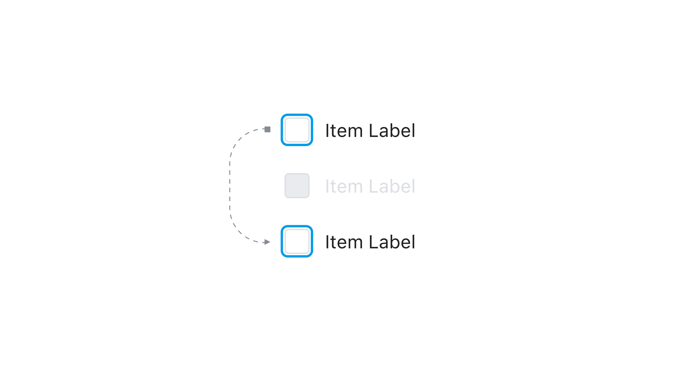

## Anatomy

1. Root : 체크박스 컴포넌트를 감싸는 최소단위 컨테이너 영역
2. Control : 체크박스의 상태를 나타내는 시각 요소
3. Label : 체크박스에 대한 정보를 전달하는 라벨

## Internal States

<Table>
  <TableHead>
    <TableRow>
      <TableData>State</TableData>
      <TableData>Values</TableData>
      <TableData>Default Value</TableData>
      <TableData>Description</TableData>
    </TableRow>
  </TableHead>
  <TableBody>
    <TableRow>
      <TableData>isSelected</TableData>
      <TableData>true | false</TableData>
      <TableData>false</TableData>
      <TableData></TableData>
    </TableRow>
    <TableRow>
      <TableData>isHovered</TableData>
      <TableData>true | false</TableData>
      <TableData>false</TableData>
      <TableData></TableData>
    </TableRow>
    <TableRow>
      <TableData>isFocused</TableData>
      <TableData>true | false</TableData>
      <TableData>false</TableData>
      <TableData></TableData>
    </TableRow>
    <TableRow>
      <TableData>isPressed</TableData>
      <TableData>true | false</TableData>
      <TableData>false</TableData>
      <TableData></TableData>
    </TableRow>
  </TableBody>
</Table>

## Contexts

<Table>
  <TableHead>
    <TableRow>
      <TableData>Context</TableData>
      <TableData>Values</TableData>
      <TableData>Default Value</TableData>
      <TableData>Description</TableData>
    </TableRow>
  </TableHead>
  <TableBody>
    <TableRow>
      <TableData>isDisabled</TableData>
      <TableData>true | false</TableData>
      <TableData>false</TableData>
      <TableData></TableData>
    </TableRow>
    <TableRow>
      <TableData>isIndeterminate</TableData>
      <TableData>true | false</TableData>
      <TableData>false</TableData>
      <TableData></TableData>
    </TableRow>
    <TableRow>
      <TableData>isInvalid</TableData>
      <TableData>true | false</TableData>
      <TableData>false</TableData>
      <TableData></TableData>
    </TableRow>
    <TableRow>
      <TableData>isReadonly</TableData>
      <TableData>true | false</TableData>
      <TableData>false</TableData>
      <TableData></TableData>
    </TableRow>
  </TableBody>
</Table>

## Actions

<Table>
  <TableHead>
    <TableRow>
      <TableData>Action</TableData>
      <TableData>From</TableData>
      <TableData>Condition</TableData>
      <TableData>To</TableData>
    </TableRow>
  </TableHead>
  <TableBody>
    <TableRow>
      <TableData>TOGGLE</TableData>
      <TableData>isSelected = false</TableData>
      <TableData>!isDisabled && !isReadonly</TableData>
      <TableData>isSelected = true</TableData>
    </TableRow>
    <TableRow>
      <TableData>TOGGLE</TableData>
      <TableData>isSelected = true</TableData>
      <TableData>!isDisabled && !isReadonly</TableData>
      <TableData>isSelected = false</TableData>
    </TableRow>
    <TableRow>
      <TableData>FOCUS</TableData>
      <TableData>isFocused = false</TableData>
      <TableData>!isDisabled</TableData>
      <TableData>isFocused = true</TableData>
    </TableRow>
    <TableRow>
      <TableData>BLUR</TableData>
      <TableData>isFocused = true</TableData>
      <TableData></TableData>
      <TableData>isFocused = true</TableData>
    </TableRow>
    <TableRow>
      <TableData>HOVER_IN</TableData>
      <TableData>isHovered = false</TableData>
      <TableData>!isDisabled</TableData>
      <TableData>isHovered = true</TableData>
    </TableRow>
    <TableRow>
      <TableData>HOVER_OUT</TableData>
      <TableData>isHovered = true</TableData>
      <TableData>!isDisabled</TableData>
      <TableData>isHovered = false</TableData>
    </TableRow>
    <TableRow>
      <TableData>PRESS_IN</TableData>
      <TableData>isPressed = false</TableData>
      <TableData>!isDisabled</TableData>
      <TableData>isPressed = true</TableData>
    </TableRow>
    <TableRow>
      <TableData>PRESS_OUT</TableData>
      <TableData>isPressed = true</TableData>
      <TableData>!isDisabled</TableData>
      <TableData>isPressed = false</TableData>
    </TableRow>
  </TableBody>
</Table>

## Behaviors

### Touch / Mouse controls

<FullCard>
  <FullCardImageCell>
    
  </FullCardImageCell>
  <FullCardDescription>
    Mouse Up, Touch Up이 TOGGLE을 발생합니다.
  </FullCardDescription>
</FullCard>

<FullCard>
  <FullCardImageCell>
    
  </FullCardImageCell>
  <FullCardDescription>
    Mouse Up, Touch Up이 PRESS_OUT을 발생합니다.
  </FullCardDescription>
</FullCard>

 

### Keyboard controls

<HalfCard>
  <HalfCardImageCell>
    
  </HalfCardImageCell>
  <HalfCardDescriptionCell>
    <HalfCardDescriptionTitle>Focus</HalfCardDescriptionTitle>
    <HalfCardDescription>
      <Keyboard>tab</Keyboard> 키를 통해 Checkbox로 Focus를 옮길 수 있습니다.
    </HalfCardDescription>
  </HalfCardDescriptionCell>
</HalfCard>

<HalfCard>
  <HalfCardImageCell>
    
  </HalfCardImageCell>
  <HalfCardDescriptionCell>
    <HalfCardDescriptionTitle>Checked ON/OFF</HalfCardDescriptionTitle>
    <HalfCardDescription>
      <Keyboard>←</Keyboard>
      <Keyboard>→</Keyboard> Focus된 상태에서 <Keyboard>space</Keyboard>
      키를 통해 TOGGLE을 발생시킬 수 있습니다.
    </HalfCardDescription>
  </HalfCardDescriptionCell>
</HalfCard>

<HalfCard>
  <HalfCardImageCell>
    
  </HalfCardImageCell>
  <HalfCardDescriptionCell>
    <HalfCardDescriptionTitle>Disabled</HalfCardDescriptionTitle>
    <HalfCardDescription>
      포커스 이동시 Disabled 상태인 Checkbox는 인식하지 않습니다.
    </HalfCardDescription>
  </HalfCardDescriptionCell>
</HalfCard>
