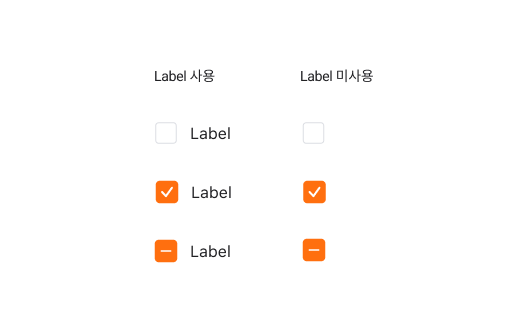
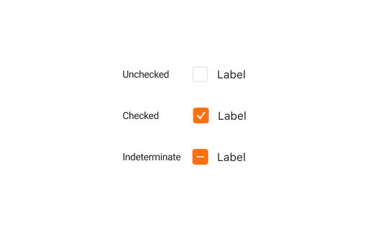
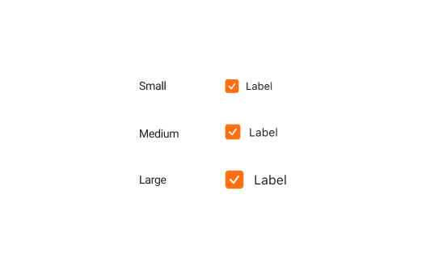
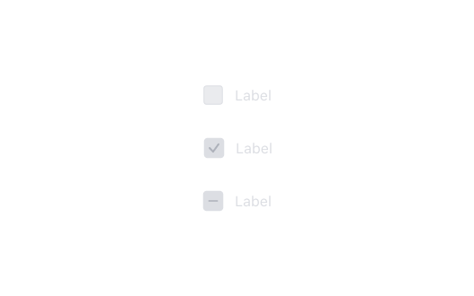

## 구조도

1. Root : 체크박스 컴포넌트를 감싸는 컨테이너 영역
2. Control : 체크박스의 상태를 나타내는 시각 요소
3. Label : 체크박스에 대한 정보를 전달하는 라벨
4. Icon: 체크박스의 상태를 표현하는 아이콘

## 옵션

<HalfCard>
  <HalfCardImageCell>
    
  </HalfCardImageCell>
  <HalfCardDescriptionCell>
    <HalfCardDescriptionTitle>Label</HalfCardDescriptionTitle>
    <HalfCardDescription>
      Checkbox는 항상 Label을 가져야 합니다. Label이 설정되지 않은 체크박스는
      다른 컴포넌트와의 관계가 매우 명확하고, 사용자에에게 충분한 맥락을 전달할
      수 있을때만 사용합니다.
    </HalfCardDescription>
  </HalfCardDescriptionCell>
</HalfCard>

<HalfCard>
  <HalfCardImageCell>
    
  </HalfCardImageCell>
  <HalfCardDescriptionCell>
    <HalfCardDescriptionTitle>Selection</HalfCardDescriptionTitle>
    <HalfCardDescription>
      Checkbox는 selected, unselected, indeterminate 중 하나의 상태를 가질 수
      있습니다. Indeterminate 상태는 하위 체크박스들을 포함하고 있을 때, 하위
      체크박스들의 isSelected 상태가 일관되지 않은 경우 사용합니다.
    </HalfCardDescription>
  </HalfCardDescriptionCell>
</HalfCard>

<HalfCard>
  <HalfCardImageCell>
    
  </HalfCardImageCell>
  <HalfCardDescriptionCell>
    <HalfCardDescriptionTitle>Size</HalfCardDescriptionTitle>
    <HalfCardDescription>
      Checkbox는 small, medium, large 3개의 사이즈를 가질 수 있습니다. medium이
      가장 보편적으로 사용되며, 다른 사이즈는 페이지 내의 중요도를 나눠서
      표현해야 할 때만 제한적으로 사용합니다.
    </HalfCardDescription>
  </HalfCardDescriptionCell>
</HalfCard>

<HalfCard>
  <HalfCardImageCell>
    
  </HalfCardImageCell>
  <HalfCardDescriptionCell>
    <HalfCardDescriptionTitle>Disabled</HalfCardDescriptionTitle>
    <HalfCardDescription>
      Disabled 상태는 체크박스가 존재하지만 지금은 사용할 수 없는 상태를
      나타냅니다. 이 옵션은 레이아웃 일관성을 유지하고 이후 상호작용이 가능할
      수도 있음을 사용자에게 알려줍니다.
    </HalfCardDescription>
  </HalfCardDescriptionCell>
</HalfCard>

### 옵션 테이블

| 속성            | 값                   | 기본 값 | 설명                                                 |
| --------------- | -------------------- | ------- | ---------------------------------------------------- |
| label           | text, none           | -       |                                                      |
| size            | small, medium, large | medium  |                                                      |
| isSelected      | true, false          | false   | Checkbox가 선택되었을 시 True로 전환                 |
| isDisabled      | true, false          | false   | True일 경우, Checkbox가 유저와 상호작용하지 않음     |
| isIndeterminate | true, false          | false   | True일 경우, selected 여부를 결정할 수 없음을 나타냄 |
| isInvalid       | true, false          | false   | True일 경우, 유효하지 않은 값임을 나타냄             |
| inReadonly      | true, false          | false   | True일 경우, isSelected를 변경할 수 없음             |

## 상호작용

### 터치 / 마우스 상호작용

<FullCard>
  <FullCardImageCell>
    
  </FullCardImageCell>
  <FullCardDescription>
    마우스 클릭 또는 터치로 checkbox를 토글할 수 있습니다.
  </FullCardDescription>
</FullCard>

 

### 키보드 상호작용

<HalfCard>
  <HalfCardImageCell>
    
  </HalfCardImageCell>
  <HalfCardDescriptionCell>
    <HalfCardDescriptionTitle>Focus</HalfCardDescriptionTitle>
    <HalfCardDescription>
      <Keyboard>tab</Keyboard> 키를 통해 Checkbox로 Focus를 옮길 수 있습니다.
    </HalfCardDescription>
  </HalfCardDescriptionCell>
</HalfCard>

<HalfCard>
  <HalfCardImageCell>
    
  </HalfCardImageCell>
  <HalfCardDescriptionCell>
    <HalfCardDescriptionTitle>Selected ON/OFF</HalfCardDescriptionTitle>
    <HalfCardDescription>
      Focus된 상태에서 <Keyboard>space</Keyboard> 키를 통해 ON / OFF를 전환할 수
      있습니다.
    </HalfCardDescription>
  </HalfCardDescriptionCell>
</HalfCard>

<HalfCard>
  <HalfCardImageCell>
    
  </HalfCardImageCell>
  <HalfCardDescriptionCell>
    <HalfCardDescriptionTitle>Disabled</HalfCardDescriptionTitle>
    <HalfCardDescription>
      포커스 이동시 Disabled 상태인 Checkbox는 인식하지 않습니다.
    </HalfCardDescription>
  </HalfCardDescriptionCell>
</HalfCard>

### Overflow

<FullCard>
  <FullCardImageCell>
    
  </FullCardImageCell>
  <FullCardDescription>
    label이 2줄을 초과할 경우 텍스트 시작점을 기준으로 위와 같이 개행처리됩니다
  </FullCardDescription>
</FullCard>

## 가이드라인

<HalfCard>
  <HalfCardImageCell>
    
  </HalfCardImageCell>
  <HalfCardDescriptionCell>
    <HalfCardDescriptionTitle>Checkbox vs Radio Group</HalfCardDescriptionTitle>
    <HalfCardDescription>
      Checkbox와 Radio Group은 서로 다른 상호작용을 가지고 있습니다. Checkbox는
      여러 개의 선택지 중 여러 개를 선택할 수 있고, Radio Group은 여러 개의
      선택지 중 하나만 선택할 수 있습니다.
    </HalfCardDescription>
  </HalfCardDescriptionCell>
</HalfCard>

<HalfCard>
  <HalfCardImageCell>
    
  </HalfCardImageCell>
  <HalfCardDescriptionCell>
    <HalfCardDescriptionTitle>Checkbox vs Switch</HalfCardDescriptionTitle>
    <HalfCardDescription>
      Checkbox는 선택을 표현할 때 (예를 들어, 리스트에서 선택된 아이템을 표현할
      때) 사용하고, Switch는 활성화/비활성화를 표현할 때 (예를 들어, 알림을 켜고
      끌 때) 사용합니다. Checkbox는 Switch와 다르게 error 상태를 가질 수
      있습니다.
    </HalfCardDescription>
  </HalfCardDescriptionCell>
</HalfCard>

<HalfCard>
  <HalfCardImageCell>
    
  </HalfCardImageCell>
  <HalfCardDescriptionCell>
    <HalfCardDescriptionTitle>Indeterminate 상태</HalfCardDescriptionTitle>
    <HalfCardDescription>
      Checkbox가 동일하지 않은 여러 값을 나타내는 경우 Checkbox는 Indeterminate
      상태로 나타나야 합니다. 이 상태에서 Checkbox를 토글하는 행위는 모든 하위
      값들을 selected로 전환해야 합니다.
    </HalfCardDescription>
  </HalfCardDescriptionCell>
</HalfCard>
