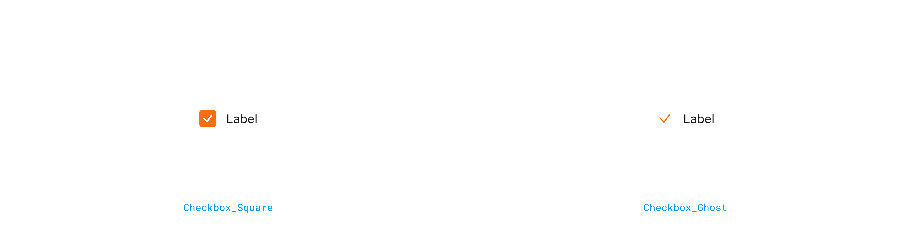

## Visual guide

### Style variants

<FullCard>
	<FullCardImageCell>
		
	</FullCardImageCell>
</FullCard>

### Size variants

<FullCard>
	<FullCardImageCell>
		
	</FullCardImageCell>
</FullCard>

### Overflow

<FullCard>
	<FullCardImageCell>
		
	</FullCardImageCell>
	<FullCardDescription>
		label이 2줄을 초과할 경우 텍스트 시작점을 기준으로 위와 같이 개행처리됩니다
	</FullCardDescription>
</FullCard>

## Visual states

### Checkbox_Square

<FullCard>
	<FullCardImageCell>
		
	</FullCardImageCell>
</FullCard>

### Checkbox_Ghost

<FullCard>
	<FullCardImageCell>
		
	</FullCardImageCell>
</FullCard>
