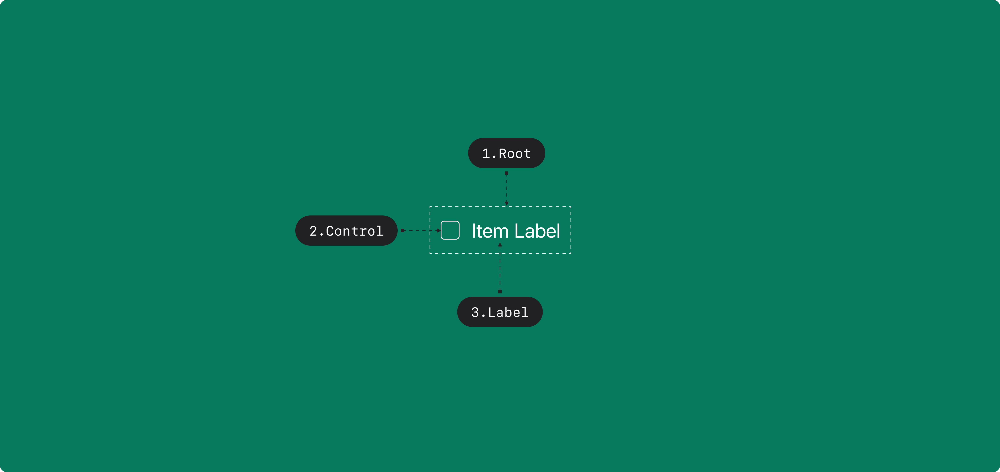

## Anatomy

1. Root : Checkbox 컴포넌트를 감싸는 컨테이너 영역
2. Control : Checkbox의 상태를 나타내는 시각 요소
3. Label : Checkbox에 대한 정보를 전달하는 라벨

## States

| State      | Values      | Default Value | Description                                       |
| ---------- | ----------- | ------------- | ------------------------------------------------- |
| isSelected | true, false | false         | Checkbox가 선택되었을 시 True로 전환              |
| isHovered  | true, false | false         | Checkbox 영역 내에 포인터가 존재할 시 True로 전환 |
| isFocused  | true, false | false         | Checkbox에 Focus가 잡혀있을 때 True로 전환        |
| isPressed  | true, false | false         | Checkbox 영역을 누르고 있을 때 True로 전환        |

## Contexts

| Context         | Values      | Default Value | Description                                           |
| --------------- | ----------- | ------------- | ----------------------------------------------------- |
| isDisabled      | true, false | false         | True일 경우, Checkbox가 유저와 상호작용하지 않음      |
| isReadonly      | true, false | false         | True일 경우, isSelected를 변경할 수 없음              |
| isIndeterminate | true, false | false         | True일 경우, isSelected를 결정할 수 없음을 나타냄     |
| isRequired      | true, false | false         | True일 경우, isSelected = true가 필수임을 나타냄      |
| isInvalid       | true, false | false         | True일 경우, isSelected가 유효하지 않은 값임을 나타냄 |

## Actions

| Action                 | From               | Condition                  | To                 |
| ---------------------- | ------------------ | -------------------------- | ------------------ |
| TOGGLE                 | isSelected = false | !isDisabled && !isReadonly | isSelected = true  |
|                        | isSelected = true  | !isDisabled && !isReadonly | isSelected = false |
| FOCUS                  | isFocused = false  | !isDisabled                | isFocused = true   |
| BLUR                   | isFocused = true   |                            | isFocused = true   |
| HOVER_IN               | isHovered = false  | !isDisabled                | isHovered = true   |
| HOVER_OUT              | isHovered = true   | !isDisabled                | isHovered = true   |
| PRESS_IN               | isPressed = false  | !isDisabled                | isPressed = true   |
| PRESS_OUT              | isPressed = true   | !isDisabled                | isPressed = true   |
| SET_IS_SELECTED(value) | \*                 |                            | isSelected = value |

## Triggers

| Part    | Event          | Action    |
| ------- | -------------- | --------- |
| Root    | PointerUp      | TOGGLE    |
| Root    | PointerOver    | HOVER_IN  |
| Root    | PointerDown    | PRESS_IN  |
| Root    | PointerUp      | PRESS_OUT |
| Root    | PointerLeave   | HOVER_OUT |
| Control | Focus          | FOCUS     |
| Control | Blur           | BLUR      |
| Control | KeyUp(Space)   | TOGGLE    |
| Control | KeyDown(Space) | PRESS_IN  |
| Control | KeyUp(Space)   | PRESS_OUT |
