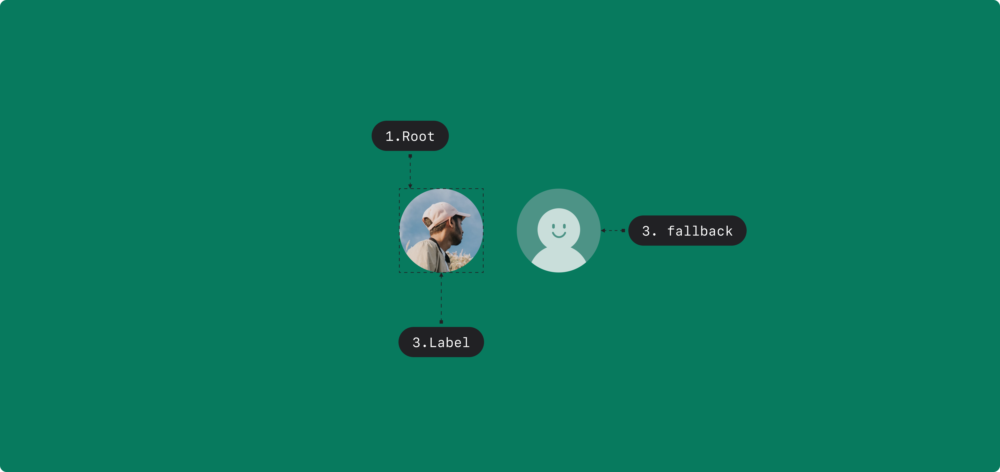

## Anatomy

1. Root
2. Image
3. Fallback

## States

| State  | Values                                   | Default Value |
| ------ | ---------------------------------------- | ------------- |
| `load` | `loading`, `loaded`, `fallback`, `error` | `loading`     |

## Contexts

| Context         | Values   | Default Value |
| --------------- | -------- | ------------- |
| `fallbackDelay` | `number` | `0`           |

## Actions

| Action                         | From                | Condition | To                  |
| ------------------------------ | ------------------- | --------- | ------------------- |
| `IMAGE_LOAD`                   | `load` = `loading`  |           | `load` = `loaded`   |
| `loading.after(fallbackDelay)` | `load` = `loading`  |           | `load` = `fallback` |
| `IMAGE_ERROR`                  | `load` = `loading`  |           | `load` = `error`    |
|                                | `load` = `fallback` |           | `load` = `error`    |
| `SRC_CHANGE`                   | `load` = `loaded`   |           | `load` = `loading`  |
|                                | `load` = `fallback` |           | `load` = `loading`  |
|                                | `load` = `error`    |           | `load` = `error`    |

## Triggers

### Web

| Part  | Event      | Action        |
| ----- | ---------- | ------------- |
| Image | `Load`     | `IMAGE_LOAD`  |
| Image | `Error`    | `IMAGE_ERROR` |
| Image | src change | `SRC_CHANGE`  |
